# Layouts

Modifying [Template UI](/in-game-ui/template) in the **ModioComponentUI** scene to suit your game is simple, assuming you are already familiar with UI Layouts in Unity.

This guide covers:

* [Layouts breakdown](#layouts-breakdown)
* [Managing layouts & prefabs](#managing-layouts--prefabs)
* [Layouts interaction states](#layouts-interaction-states)
* [Localization](#localization)

## Layouts breakdown

Here's a brief breakdown of the main layouts and widgets that make the UI, and how to modify them to suit your needs.

### ModBrowser

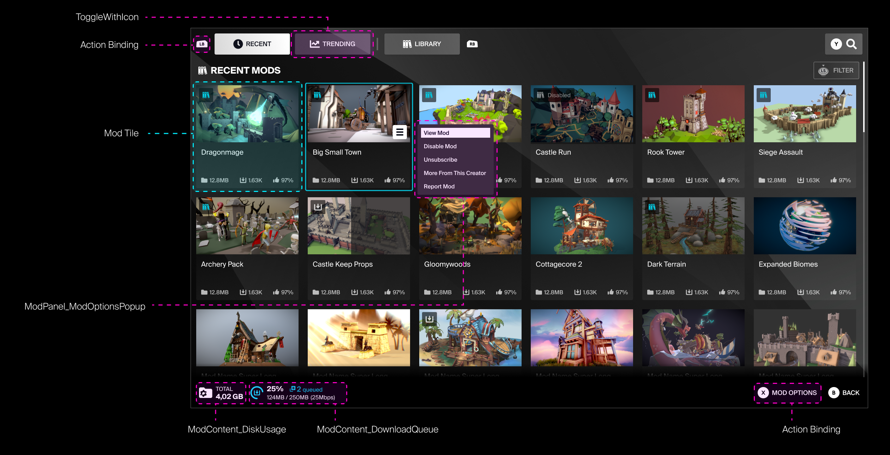

This is the main layout for the Mod Browser. The layouts are built to be navigable on both Keyboard & Mouse and Gamepad, and the layout should scale responsively to different screen aspect ratios.
 \
&nbsp;

### Mod Tile

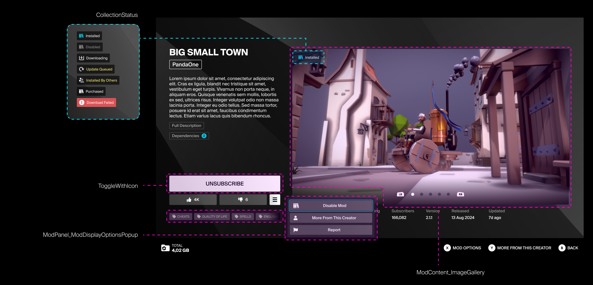

This is the main layout for the Mod View.\
While the thumbnail Gallery should be kept at a consistent aspect ration of 16:9, the rest of the layout & widgets can be scaled to suit your current layout.
\
&nbsp;

### ModPanel_ModDisplay

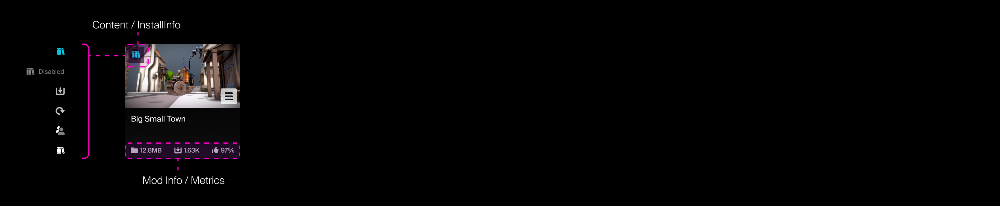

The Mod Tile that will populate the browser. Their scale and padding in the Mod Browser can be set via the ModBrowser_GridView prefab in ModBrowser.
\
&nbsp;

### SortAndFilter

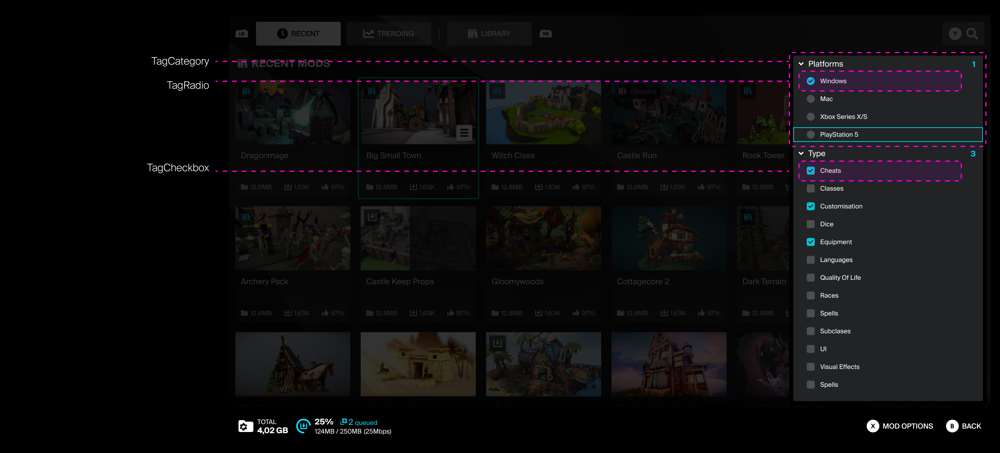

The filter panel uses both Radio and Check boxes for filter and sort options, broken down into sub-categories that can be expanded or collapsed.
\
&nbsp;

## Managing layouts & prefabs

Main scene for the Mod Browser can be found in **Plugins/ModioUI/ExampleScenes/ModioComponentUI**\
Layouts can be found in **Plugins/modioUI/Prefabs**, with the base prefabs for elements like buttons and input fields being in **Widgets/UIBasics**, and the unique widgets for specific cases are in **Widgets/Specific**.

### ModBrowser

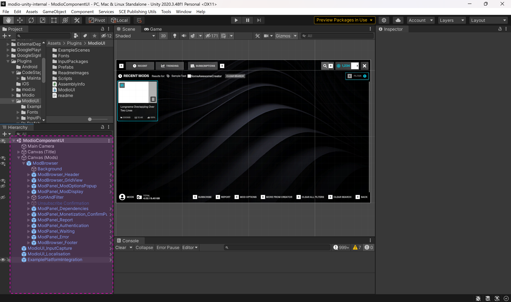

ModBrowser contains the Grid View for the scrolling list of mod tiles. It also houses most of the main panels and modals that will be called in the UI.
\
&nbsp;

### ModPanel_ModDisplay

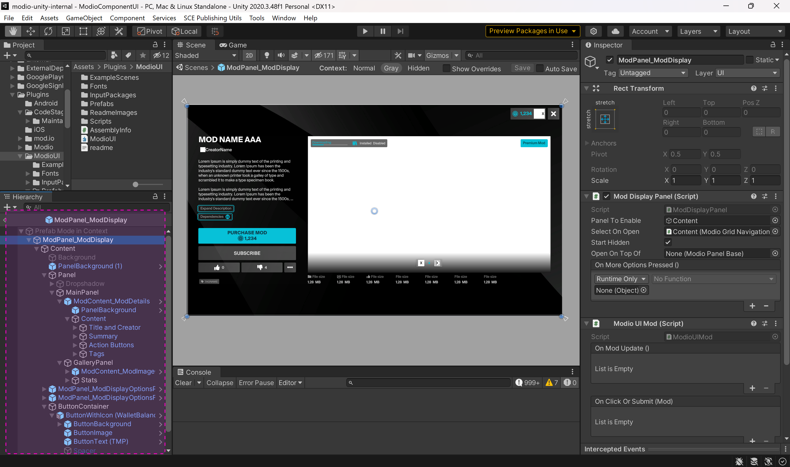

This layout will scale vertically to fit the display, but remain centered at a fixed width.
\
&nbsp;

### ModBrowser_GridView

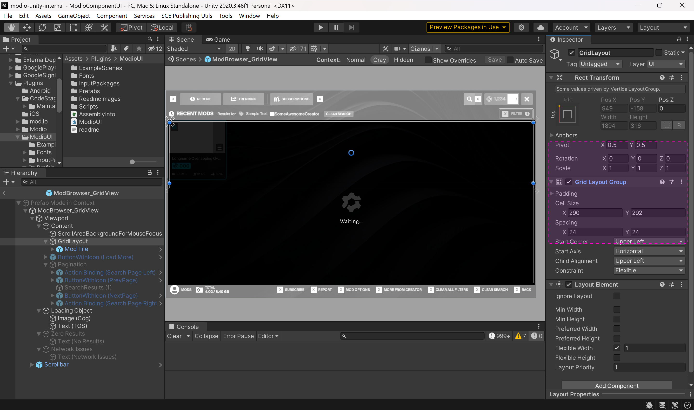

The list of UGC is populated in GridLayout inside Modbrowser_GridView, with the UGC's size and padding being set by its Grid Layout Group component.\
&nbsp;

### Mod Tile

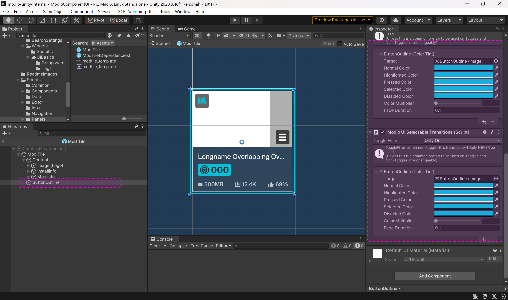

The Mod Tile Thumbnail **Image (Logo)** has its size, reference image and loading overlay controlled by **Modio UI Mod Properties**

Marketplace Cost is controls by the **NameInfo** Modio UI Mod Properties component, letting the name text field scale down to fit the price/purchased state if the UGC is Premium UGC.
&nbsp;

## Layouts interaction states

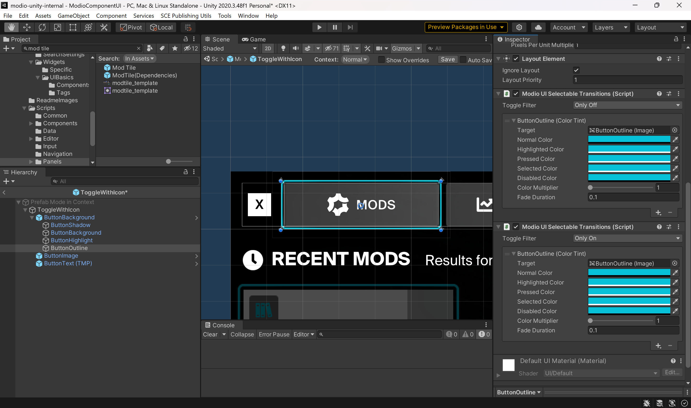

### Modio UI Selectable Transitions

Buttons, Mod Tiles and other interactable/navigable elements have their states controlled by the **Modio UI Selectable Transitions** component.

An instance of the component can control the standard button states (Normal, Highlighted, Pressed, Selected, Disabled) for one visual element (eg, an outline image). 

If the interactable object is a standard UI button, then the Toggle Filter setting can be set to Any.
If the interactable object has toggle states (eg, on/off), then the Toggle Filter setting will need to be set to Only Off on the first component, and a second instance component will need to be added to control the visuals of the button, and its Toggle Filter set to Only On to set the visuals of its Toggle On state.

### Modio UI Input Prompt component 

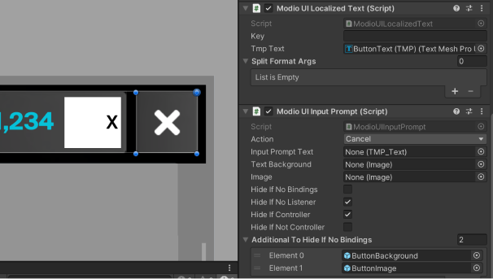

Controls button actions, icons, and conditions (eg, hid if no bindings, hide if gamepad detected)

## Localization

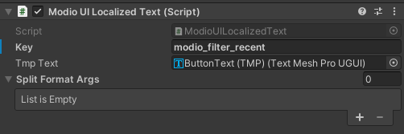

Template UI's core strings come localized in 18 languages: <i>English, German, Italian, French, Polish, Portuguese, Japanese, Korean, Russian, Spanish, Chinese (Simplified), Chinese (Traditional), Ukranian, Bulgarian, Thai, Hungarian, Indonesian, Turkish & Latin American.</i>

The strings for Localisation can be found in **Prefabs/ModioUnityLocalisation.csv**

## Next steps

Check out the [Template UI Functionality](/unity/template-ui) guide for a full look at what Template UI has to offer. If you're ready to setup Template UI, your next stop is the [Template UI Integration](/unity/template-ui/integration) guide.