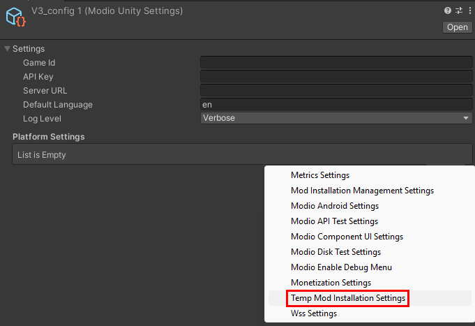
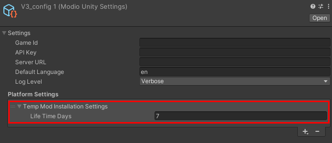

# Temporary Mods for Unity

There are situations where you may want UGC to exist on a temporary basis. For instance, in Multiplayer environments you may want users to see another player's UGC even if they don't own it.

Temporary Mods allow management of these more transient pieces of content separately from subscriptions. Temporary Mods do not require authentication to be used, however the Unity Plugin must still be initialized to use temporary mods.

## How it works

Temporary mods are downloaded in the same place locations as other mods. If a user is already subscribed to a requested temporary mod, that mod wont be installed again. Instead the already installed mod will be returned.

Temporary mods have two systems that work together: sessions and lifetimes.

### Temporary Mod Sessions

Sessions are how temporary mods are installed in the first place. Without a lifetime specified (we'll go over lifetimes soon) then mods installed during this session will be removed when the session concludes or when the game is next launched, whichever comes first. You can start a Temporary Mods Session by calling `ModInstallationManagement.StartTempModSession`:

```C#
// These are not real mod ids
List<ModioId> modsToInstall = new List<ModioId>
{
    new ModioId(123),
    new ModioId(456),
    new ModioId(789)
}

async Task ExampleInit()
{
    await ModioClient.Init();
    
    Error error = ModInstatllationManagement.StartTempModSession(modsToInstall);
    
    if (error) 
        Debug.LogError($"Error installing temporary mods: {error}");
}

void OnMatchEnded()
{
    ModInstallationManagement.EndCurrentTempModSession();
}
```

If you've already started a session and want to install mods, you can either pass the `appendCurrentSession` parameter as true into `StartTempModSession` or call `ModInstallationManagement.AddTemporaryMods`:

```C#
// These are not real mod ids
List<ModioId> modsToInstall = new List<ModioId>
{
    new ModioId(222),
    new ModioId(333),
    new ModioId(444)
}

async Task AddMoreMods()
{
    Error error = ModInstatllationManagement.AddTemporaryMods(modsToInstall);
    
    if (error) 
        Debug.LogError($"Error adding temporary mods to current session: {error}");
}
```

:::note[Lifetime Override]
There is an additional parameter on `AddTemporaryMods` called `lifeTimeDaysOverride`. Use this to manually set the amount of days a given set of temporary mods should last in the user's file system.
:::

### Temporary Mod Lifetime

As touched on in the note above, temporary mods can also have lifetimes. Lifetimes are useful if it's expected a player may encounter the same piece of UGC frequently, such as in a dedicated server environment where the server has a set of mods installed.

To configure, edit your mod.io Unity Plugin config object and add the `Temp Mod Installation Settings` object to `Platform Settings`:



Set the lifetime (in days) you want your mods to last for on the user's file system:

