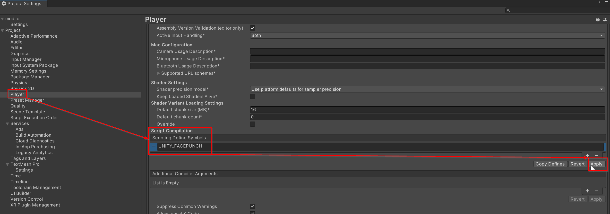

# User Authentication for Unity

Most of the API’s functionality requires player authentication. The Unity Plugin offers a range of SSO (single-sign on) authentication options, including *Steam, Meta, Epic Games, Apple, Google, Xbox, PS4™/PS5®, Nintendo Switch/2,* and more. 

We strongly recommend using these options as they provide a frictionless user experience and don't require multiple steps. You can further explore these options below and in our [Authentication Guide](https://docs.mod.io/authentication).

This guide covers:

* [Email authentication](#email-authentication)
* [Single Sign-On](#single-sign-on)
* [Custom Authentication Service](#custom-authentication-service)

## Email authentication

For now, let's start with a simple email authentication to allow us full access. To do so we need to bind the Email Authentication service so that it's chosen as the auth service for the plugin.

The `ModioEmailAuthService` class is provided for convenience. It requires an async task or object implementing `IEmailCodePrompter`. This is to tell a UI implementation when the email authentication process is ready to accept the code.

:::note
While creating the UI layout referenced below is outside the scope of this guide, there are great Unity UI tutorials available.
:::

With your UI created, let's add our authentication functionality:

```csharp
using UnityEngine.UI; // Add these to the top of your class
using Modio.Users;
using Modio.Authentication;

[SerializeField] InputField authInput;
[SerializeField] Button authRequest;
[SerializeField] Button authSubmit;

// Services should be bound in the Awake event. 
// Services bound in Start aren't guaranteed to bound in time for initialization.
void Awake()
{
    // This enforces email auth to be used, a higher priority can be used if needed
    ModioServices.Bind<IModioAuthService>()
                      .FromInstance(new ModioEmailAuthService(GetAuthCode));
}

// Start method...

async Task InitPlugin()
{
    // Initialization ...

    OnInit();
}

async Task OnInit()
{
    if (User.Current.IsAuthenticated)
    {
        OnAuth();
        return;
    }
    
    // You can assign these using the Inspector if you prefer
    authRequest.clicked += async () => await Authenticate();
}
   
async Task Authenticate()
{
    Error error = await ModioClient.AuthService.Authenticate(true, authInput.text);
    
    if (error)
    {
        Debug.LogError($"Error authenticating with email: {error}");
        return;
    }
    
    OnAuth();
}

// This will be called by the ModioEmailAuthService object we constructed earlier
async Task<string> GetAuthCode()
{
    bool codeEntered = false;
    
    authSubmit.onClick.AddListener(() => codeEntered = true);
    
    while (!codeEntered)
        await Task.Yield();
    
    return authInput.text;
}
   
void OnAuth()
{
    Debug.Log($"Authenticated user: {User.Current.Profile.Username}");
}
```

:::important
Don't forget to assign the fields in the inspector!
:::

If you've implemented the above correctly, you should now be able to:

1. Start Play mode in Unity
2. Enter your email address in the input field and press the `authRequest` button
3. Retrieve the authorization code from your inbox
4. Enter the authorization code into the input field and press the `authSubmit` button
5. See the logged authentication message

:::note
If there is no mod.io account associated with the provided email address, one will automatically be created.
:::

There is something worth highlighting: if you restart Play mode, you'll see the logged authentication message again almost immediately. This is the result of two separate factors:

- The authentication service with the highest priority is the same as the one last used by the user to authenticate.
- At the beginning of `OnInit()`, we check to see if we are already authenticated, and if so move straight to `OnAuth()`.

If you change the highest priority auth service to another one, then the user won't be automatically logged in. This is to help facilitate both a silent log in and multiple users on the same device.

:::note
if your email provider supports it, you can use plus-addressing to test multiple users with a single email address:
:::
> ```
> john.smith+test1@gmail.com
> jane.smith+test2@gmail.com
> juanita.smith+test3@gmail.com
> ```

## Single Sign-On

:::important
The mod.io Unity Plugin comes with the below platform integrations already complete stored in .unitypackages for convenience. You can find each in `Modio/Modio/Additional Packages/` ready to be imported into your project.
:::

There are two types of SSO to consider:

1. [**Custom SSO**](https://docs.mod.io/authentication/openid): Custom SSO harnesses your studio's authentication process as the single point of authentication. 

2. [**Platform SSO**](https://docs.mod.io/authentication/platform): Platform SSO uses a given platform's authentication process as the single point of authentication. 

	The platforms included in this process are:

	* [Steam](https://docs.mod.io/platforms/steam/authentication)
	* [PlayStation™Network](https://docs.mod.io/platforms/playstation#authentication)
	* [Xbox Live](https://docs.mod.io/platforms/gdk#authentication)
	* [Nintendo Switch](https://docs.mod.io/platforms/switch#authentication)
	* [Apple (iOS)](https://docs.mod.io/platforms/apple/authentication)
	* [Google Play (Android)](https://docs.mod.io/platforms/google/authentication)
	* [Meta Quest](https://docs.mod.io/platforms/meta/authentication)
	* [GOG Galaxy](https://docs.mod.io/platforms/gog/authentication)
    * [Epic Online Services](https://docs.mod.io/platforms/epic/authentication)

Each platform has their own requirements and prerequisites for performing SSO.  Platform-specific authentication can be found in the respective [platform documentation](https://docs.mod.io/getting-started#expand-with-cross-platform-functionality).

### Steam Single Sign-On

:::note
Platform SSO will automatically bind and initialize itself in most circumstances. Please check the respective folders 
under `Modio/Unity/Platforms/<platform>` and `Modio/Unity/Examples/<platform>` to see how the plugin handles this for you.
:::

As an example, let's have a look at setting up your game to use *Steam's* authentication method. Here, we're going to use *Steam* with the [Facepunch Steamworks library](https://wiki.facepunch.com/steamworks).

Feel free to come back to this section later! Authentication is agnostic of the rest of this guide's behavior.

:::important
Before we can implement single sign-on, we need to configure Steam SSO for your game on the mod.io website. Please read our [documentation](https://docs.mod.io/platforms/steam/authentication) on how to do this before continuing with the implementation below.
:::

To perform our Single Sign-On we're going to use Facepunch's Steamworks C# library to authenticate using a Steam account. Similarly to the Email authentication, we need to bind a Facepunch Auth Service:

```csharp
using Modio.Platforms.Facepunch; // Add this to the top of your class

void Awake()
{
    // Email binding...
        
    // By passing in the DeveloperOverride priority with the + 10, this will take precedence over email auth
    ModioServices.Bind<IModioAuthService>()
                 .FromInstance(new ModioFacepunchAuthService(), ModioServicePriority.DeveloperOverride + 10));    
}
```

:::important
this next section requires the `SteamClient` to have been initialized before executing. this is out of scope for this guide, but you can find a convenient example of how to do this in `Modio/Unity/Examples/Steam/Facepunch/FacepunchExample.cs`.
:::

### Include Terms of Use

In order to authenticate a user with mod.io, they must agree to the mod.io Terms of Use. This differs from Email authentication as the Terms of Use is built into the email sign-up process, not requiring it in-game. You can learn more about this in our [Terms of Use](https://docs.mod.io/terms-user-consent) section. This window requires links to the mod.io Terms of Use &amp; the mod.io Privacy Policy to be valid.

:::note
While creating the UI layout referenced below is outside the scope of this guide, there are great Unity UI tutorials available.
:::

Using the above as a template, we'll want to modify the `OnInt()` method to display the Terms of Use if the highest priority auth service is Facepunch:

```csharp
async Task OnInit()
{
    // IsAuthenticated check...
    
    if (ModioClient.AuthService is ModioFacepunchAuthService)
    {
        tosContainer.SetActive(true);
        
        termsLink.onClick.AddListener(() => Application.OpenURL("https://mod.io/terms"));
        privacyLink.onClick.AddListener(() => Application.OpenURL("https://mod.io/privacy"));
        
        acceptButton.onClick.AddListener(() => Authenticate());
        denyButton.onClick.AddListener(() => tosContainer.SetActive(false));
        
        return;
    }
    
    // Attach authRequest click listener...
}
```

Then to trigger the authentication, we don't need to change anything from email authentication above:

```csharp
async Task Authenticate()
{
    Error error = await ModioClient.AuthService.Authenticate(true);
    
    if (error)
    {
        Debug.LogError($"Error authenticating with Facepunch: {error}");
        return;
    }
    
    OnAuth();
}
```

This works because the plugin will authenticate with the highest priority Authentication Service bound, which in this case is the Facepunch Auth Service. The same principle applies to all SSO services.

Lastly, we will need to add a compiler directive to your project settings in order for the Facepunch library to compile. In your Project Settings, under Player and the platform you're building for, add `MODIO_FACEPUNCH` to the `Scripting Define Symbols`:



And that should be it! Log into Steam, accept the Terms of Use and you should see your Steam account authenticated with mod.io! If you've initialized your Steam client with the correct AppId then the mod.io plugin will automatically detect the currently logged in user and authenticate using that user.


### Best Practice for SSO Authentication
Some platforms require that you do not show terms of use to a user that has previously accepted them.
To support this, it's possible to call `Authenticate` with `displayedTerms` as `false`. This will attempt to authenticate via SSO if the user has a linked mod.io account, but not create a new one.
If this SSO attempt returns `ErrorCode.USER_NO_ACCEPT_TERMS_OF_USE`, you must display the terms links as above and have the user agree, before authenticating with `displayedTerms` as `true`.

:::note
If you are using TemplateUI this will display the terms of use to the user if required and then authenticate them with mod.io automatically.
You don't have to do any additional logic to authenticate.
:::

```csharp
async Task OnInit()
{
    // IsAuthenticated check...
    
    //Authenticate without accepting terms, which will succeed if the user has previously accepted terms on this account
    Error error = await ModioClient.AuthService.Authenticate(false);

    if (error && error.Code == ErrorCode.USER_NO_ACCEPT_TERMS_OF_USE)
    {
        //await displaying/accepting terms, or call the next line in response to the user accepting the terms
            
        error = await ModioClient.AuthService.Authenticate(true);
    }

    if (error)
    {
        Debug.LogError($"Error authenticating user: {error}");
        return;
    }
    
    OnAuth();
}
```

## Email Linking
It's possible to link a users email to their SSO account by passing the email into the Authenticate call.
This is particularly useful when using an SSO platform that isn't able to sign in on the mod.io website.

```csharp
async Task OnAgreedToTerms(string email)
{
    error = await ModioClient.AuthService.Authenticate(true, email);
    //handle potential error
}
```
If supplied, and the respective user does not have an email registered for their account, we will send a confirmation email to confirm they have ownership of the specified email.

:::note
If the user already has an email on record with us, this parameter will be ignored.
:::

## Custom Authentication Service

It is also possible to create a custom authentication service for the Unity Plugin to use. This is useful for providing SSO support for platforms not already covered by the plugin, or when implementing custom studio SSO. This is achieved by implementing the `IModioAuthService` interface:

```csharp
public interface IModioAuthService
{
    public Task<Error> Authenticate(
        bool displayedTerms,
        string thirdPartyEmail = null,
        bool sync = true
    );
    
    public ModioAPI.Portal Portal { get; }
}
```

This implementation must:
1. Collect the necessary data to perform authentication (for example, a Steam Encrypted App Ticket)
2. Send it to mod.io via one of the available API Authentication methods found in `ModioAPI.Authentication`
3. Call `User.Current.OnAuthenticated` with the token received from mod.io

This implementation must collect the necessary data to perform authentication (for example, a Steam Encrypted App Ticket) and then send it to mod.io via one of our API Authentication methods found in `ModioAPI.Authentication`:

```csharp
public async Task<Error> Authenticate(
    bool displayedTerms,
    string thirdPartyEmail = null,
    bool sync = true
) {
    //----- 1. Get the required data -----\\
    byte[] encryptedAppTicket = await SteamUser.RequestEncryptedAppTicketAsync();

    if (encryptedAppTicket == null)
        return new Error(ErrorCode.BAD_PARAMETER);
    
    string base64Ticket = Convert.ToBase64String(encryptedAppTicket, 0, encryptedAppTicket.Length);

    //----- 2. Send the ticket to mod.io for authentication -----\\
    (Error error, AccessTokenObject? tokenObject) =
        await ModioAPI.Authentication.AuthenticateViaSteam(
            new SteamAuthenticationRequest(base64Ticket, displayedTerms, thirdPartyEmail, 0)
        );

    //----- 3. Give the returned token to the user -----\\
    if (!error)
        User.Current.OnAuthenticated(tokenObject.Value.AccessToken, tokenObject.Value.DateExpires, sync);

    return error;
}
```

:::note
You can find a list of supported authentication portals at our [Online Documentation](https://docs.mod.io/restapi/platforms#targeting-a-portal). Each of these supported platforms has an equivalent `AuthenticateVia<Platform>` method that would be used in the same way as the code above.
:::

To complete the implementation, you will need to return a `Portal` enum value with the `Portal` property:

```csharp
public ModioAPI.Portal Portal => ModioAPI.Portal.Steam;
```

Now, with our script ready, we have to bind this custom Auth Service in the same way we bound the Facepunch Auth Service:

```csharp
void Awake()
{
    // By passing in the DeveloperOverride priority with the + 10, this will take precedence over email auth
    ModioServices.Bind<IModioAuthService>()
                 .FromInstance(new MyNewCustomAuthService(), ModioServicePriority.DeveloperOverride + 10));    
}
```

And that's it! Our custom Authentication Service is ready to be used by the plugin, just call `ModioClient.AuthService.Authenticate` and this new service will be used.

## Next steps

Now that you've set up the authentication process, it's time to load UGC into your game by [Adding UGC](/unity/adding-ugc).

If you've already done this, we recommend working your way through the [Unity Getting Started Guides](/unity#unity-core-plugin-guides) as they will teach you how to implement the fundamentals before moving onto exploring our [Features](/features).