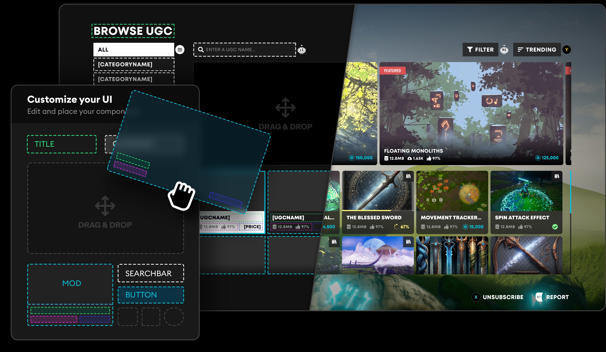

import Tabs from '@theme/Tabs';
import TabItem from '@theme/TabItem';

The Template UI is a working, fully featured mod browser.

:::note
The Temmplate UI is built using Component UI framework. For complete control over your UI implementation see the [**Component UI Documentation:**](/unity/component-ui/)
:::

It can act as a reference for experienced engineers to review when implementing the Components into their own UI, or it can be used as a functional template right off the shelf for developers who don't have the time/resources to build their own Mod Browser. 

It's designed to be a user friendly interface that can handle all the base functions required in a Mod Browser for Console and PC. It's visual design is clean and minimal, and it's built to be flexible enough for developers to easily modify to suit their needs.

**Documentation:**

- [**Template UI Features:**](/unity/template-ui/ui-features) A breakdown of the design and features of the Template UI.

- [**Layouts and Prefabs:**](/unity/template-ui/ui-layouts) A guide of the Template UI's core elements in Unity, and how to modify them to suit your UI.