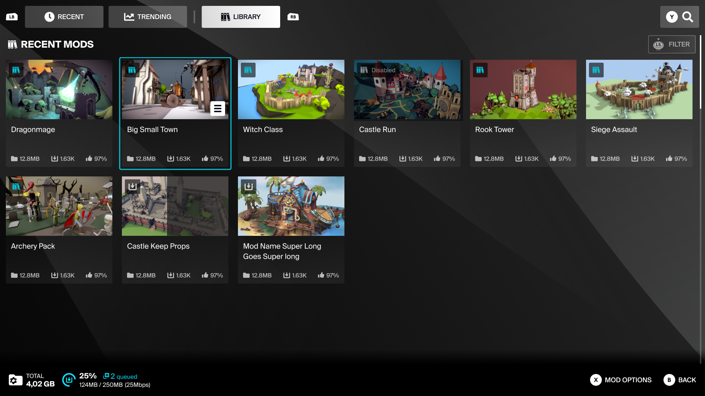

This is a breakdown of the Template UI's design and its main features.

### Mod Browser
This is the main portal for browsing and searching available mods, or managing subscribed & purchased mods. It's built to be responsive to scale to different screen resolutions and aspect ratios, such as Ultrawide displays, or the SteamDeck.

\
&nbsp;

The Mod Browser’s content is split into 3 main pages:\
**RECENT & TRENDING** for browsing your game’s mods with different sorting filters applied.\
**LIBRARY** for handling the users Subscribed & Purchased mods (Purchased Mods being available with Marketplace Features enabled).

On each page, the user can use the **Search** option for the content specific to that page, or **Filter** the mods listed to help browsing large amounts of content easier.
\
&nbsp;

The Browser’s footer has the **Storage Tracker** widget to show the total size of all installed mods. It also features the **Operation Tracker** widget to show the number of mods queued for download, and the progress of the mod currently being downloaded. \
The Operation Tracker will show the downloading & extracting operations in sequence, as the Plugin can not perform the download and extract actions simultaneously.
\
&nbsp;

### Mod Tile

The Mod Tile shows the base information on the Mod, including its thumbnail, name, metrics, and its current state (subscribed/unsubscribed, downloading, error, installed by another user).\
When highlighted it also includes a button for a Tooltip, featuring a set of **Mod Options**. This allows quick access to contextual actions such as Subscribing/Unsubscribing, Enabling/Disabling, or Reporting the mod.
\
&nbsp;
### Filter Panel
Filters can be applied when browsing any of the Mod Browser pages. Multiple filters can be applied at once to narrow down the list of mods shown, and these are grouped into Categories which can be expanded or minimized.
Navigating away from these pages will clear any sort settings currently applied.

Filter Categories can be:
- Check-boxes, where multiple options can be selected, with the total number of filters being counted in the Category header
- Radio buttons, where only one option can be chosen, and the filter count is only added next to the Category header when an option other than the default option is selected.
\
&nbsp;

### Mod View

The content of the Mod View page is as follows:

**Mod Name:** Concatenated to two lines

**Creator Name:** Showing the creators mod.io Username OR the Console Platform user name (with an icon as according to Xbox XR's). The name will be clickable with the Mouse, or accessed with a face button on Gamepad, and leads to a search of mods created by that user.

**Description:** The brief mod summary will be shown by default (250 characters). If a longer description is available on the Mod acccount then the Expand Description button will be shown, linking to a modal with the full description.

**Subscribed / Unsubscribed Toggle:** This will toggle the mod's state between Subscribed and Unsubscribed. Subscribing to a mod will Queue it for Download and Installation, and Unsubscribing will immediately uninstall the mod. If the mod has Dependencies, then a modal will first be shown after pressing Subscribe to list the required mods, and confirm if the user commits to downloading them. (If Marketplace features are enabled, the Subscribe button will be replaced by the Purchase Mod button for any Premium Mods).

**Like / Dislike Toggles:** Mods can be voted on with Likes or Dislikes. The buttons act as a toggle, and only one can be active at once. The total number of Likes/Dislikes will be shown on the button, and the values will update to reflect the users input.\
<i>(NOTE: while the total like/dislike values will update on the button for user feedback, the actual values aren’t updated on the server immediately, so you may not see changes reflected in the rest of the UI right away).</i>

**Mod Options:** The Mod Options button opens a Tooltip with a list of contextual options depending on the Mods current state.

**Dependencies:** If a mod has dependencies on other mods, then users will have the option to view the list of dependencies. This list won't be interactive, and will just list the names of each mod and their subscribed/downloaded states in a scrolling list.

**Metrics:** Showing the mods File Size, Downloads, Rating (%), Subscribers, Version No, Release Date & Date it was Updated

**Mod State:** Showing if the mod is Installed, Queued, Downloading (with %), In Error, Installed by Others, or Purchased.

**Gallery:** Showing a set of thumbnails will let the user browse through multiple thumbnails, and it will only show its navigation controls if the mod has more than 1 thumbnail uploaded.

**Category Tags:** These are navigable by kbm or gamepad, and selecting one will open a unique search based on the tag value.
\
&nbsp;
### Mod Dependencies
If a mod has Dependencies, then a list of the dependent mods can be accessed from the **Mod View** via the Dependencies button. \
This modal is intended to be a basic overview to list the number of dependents with their individual and total file size, and show if they are currently installed or not.

After pressing the Subscribe button on a mod with Dependencies, the list of dependent mods will be shown in a confirmation prompt, showing the number of dependents, their individual and total file size, and if they are currently installed or not. Pressing OK at this point will download the mod and all its dependencies.

:::note
This does not apply to Premium Mods, as only Free Mods can have dependencies, or be used as dependencies. 
:::
\
&nbsp;
### Mod Management

A feature developers can opt in to for their game is the ability for users enable or disable mods they have subscribed to, as a way of managing their Library. Separate to Unsubscribing, toggling a mod to be Disbled will keep the mod installed on the users hard drive, but just make it inactive in their game.\
The mods Enable/Disable state can be toggled via the **Mod Options** menu of the **Mod Tile** or **Mod View**. The visual indicator for this function co-opts the existing "Installed" Icon element used on the Mod Tile and Mod View, but adds an alternative "Disabled" state to it. 

If Marketplace Features are enabled, the Mods State indicator for a Purchased mod will show:\
**Subscribed/Enabled** = "Installed"\
**Subscribed/Disabled** = "Disabled"\
**Unsubscribed** = "Purchased"
\
&nbsp;
### Reporting

The Reporting Modal can be accessed via the Mod Options tooltip on the Mod Tile/View. 
It features:
Mod Name
The Mod Version number
Mod Thumbnail
Reporting Options List (Generic, Not Working, Illegal Content, False Information, DCMA, Rude Content, Stolen Content, Other)

Selecting any of the Reporting Options opens a Reporting Details modal.
The only required field on this screen is the Reporting Details, so the Submit UI Button should remain in a disabled state until any text has been typed into the field.
\
&nbsp;
### Keyboard & Mouse Inputs

The Template UI has been designed with a Console First mentality, making sure that all interactions and UX flows work well on gamepad, and then expanding them to suit keyboard & mouse interactions.

When any gamepad or keyboard & mouse input is detected, the UI will swap it's key bindings, and add or remove layout elements to suit the current platform - such as modals and screens having a Close button when using Keyboard & Mouse, or actions being assigned to a gamepad's face button rather than a UI button.

\
&nbsp;
### Marketplace features
If you have Marketplace Features enabled for your game’s mod.io account, then the Template UI will automatically toggle on the relevant UI Elements and modify the user flows to accommodate the addition of the Marketplace features.

#### Mod Tokens & Premium Mods
The main change Marketplace Features bring to the Mod Browser is the addition of **Mod Tokens**. This is a currency unique to each game, and as such should be represented by an icon and name unique to your game.

 

The users total Tokens are shown in the **Token Wallet** in the Mod Browser's header, and will be visible on any screen that relates to browsing or purchasing Mods.\
Any Premium Mods listed in the **Mod Browser** will adjust the standard **Mod Tile** layout to add the Token Price or Purchased tag.

Any mods that are Purchased can be found in the Library page, where new filter options will be available to let the user browse between Purchased and Installed mods.

\
&nbsp;
#### Mod View & Purchasing Mods
On the Mod View screen, Premium Mods will always be identified by a Premium Tag in the top right of the **Gallery Widget**.\
Any mods not yet purchased will have their Subscribe/Unsubthescribe toggle button replaced with the Purchase Mod button, showing its cost.

Pressing the Purchase button will show a confirmation modal, detailing the mod's details and its price. If the user has insufficient tokens to purchase the mod, the Confirmation Modal will communicate this and block the purchase.

Successfully purchasing a mod also subscribes the user to it in the same action, and once a user owns a Premium Mod, the Purchase button is replaced with the Unsubscribe/Subscribe toggle again.\
Once purchased, a mod will stay in the users library whether it is subscribed or not. Any purchased mods can be found in the Library page.
 /

When prompted to buy more Tokens on PlayStation, Switch or Steam, the Template UI will call on the native Platform Marketplace UI to handle all Token Purchases.\ 
However, when prompted to buy tokens on Xbox & Oculus platforms, an internal modal will be used to list available token packs.

All token pack purchases will sync with the users account and update their total Tokens immediately.

