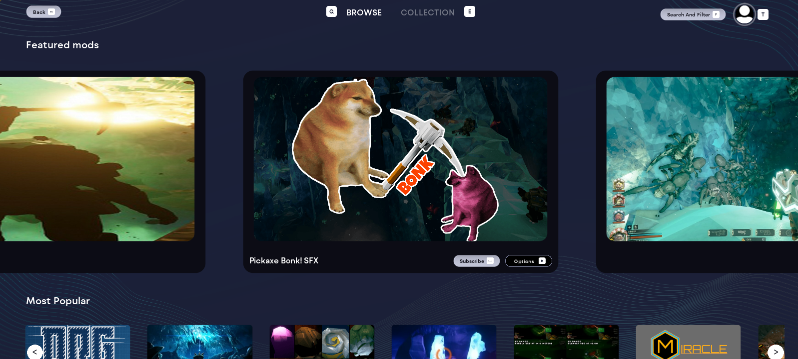
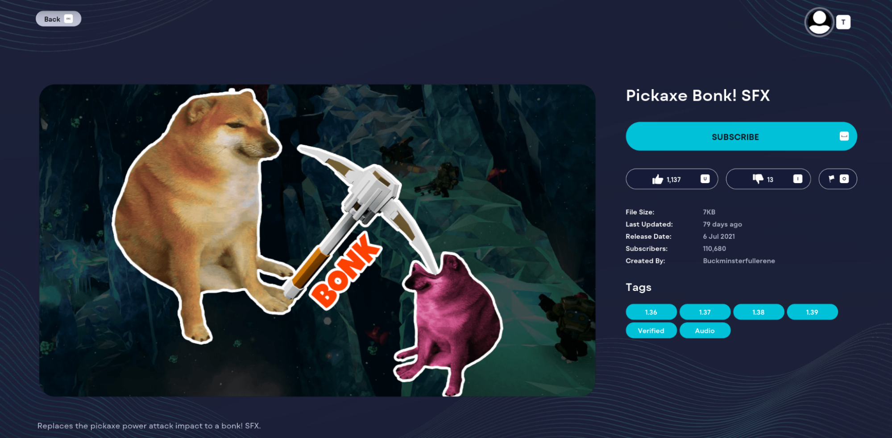
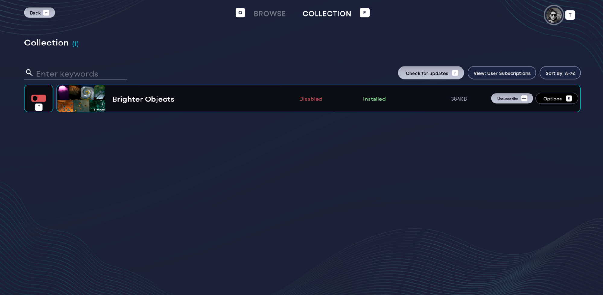
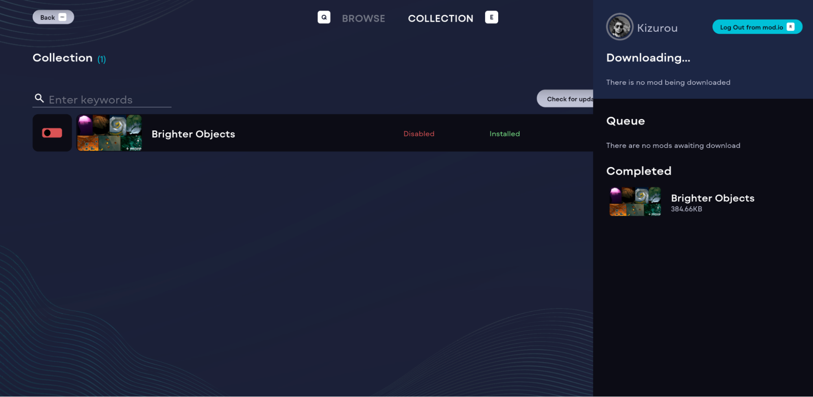

# Unreal Engine 4 Quicklook

While our Unreal Engine 5 plugin offers the most current and feature supported version of mod.io, those games using Unreal Engine 4 can still benefit from many of mod.io's features and functions.

Below is a quick guide for the Legacy plugin. If you need further support, reach out to us at [developers@mod.io](mailto:developers@mod.io).

## Legacy Plugin

Here is our GitHub page for a general overview: [UE Plugin GitHub](https://github.com/modio/modio-ue)

A content complete plugin which supports for UE4 projects (inclusive of UE4.26, UE4.27, and UE5.0) is available here: [Latest UE4 Release](https://github.com/modio/modio-ue/releases/tag/v2023.11)

Included within this release are:

- [Plugin](https://github.com/modio/modio-ue/releases/tag/v2023.11)
- [UI](https://github.com/modio/modio-ue/tree/v2023.11/Content/UI)

Note: The content complete UE4 plugin update was completed in November 2023. As a result, mod.io features more recent than this date are compatible, but not native to UE4 projects. Our UE5 docs repository for features and service can be found [here](/unreal)

## Sample project

A sample UE4 project showcasing a simple integration is available here: [UE4 Sample Game](https://github.com/modio/modio-ue4-sample)

## Example UE4 games live with mod.io

- Ready or Not (PC)
- Park Beyond (PC, Xbox, PlayStation)
- Homeworld 3 (PC)
- Deep Rock Galactic (PC)

## Approach to Mod Loading for UE

Guidance on best practice for mod loading with UE4 is provided. We recommend building for cross-platform file support and multi-platform (i.e. PC and Console SKUs). Even for UE4 projects where multi-platform mod support isn’t a focus, adopting best practice approaches will improve overall player experience when playing with mods. The document is available here: [UE Mod Loading](/unreal/mod-loading)

# UI compatible with UE4 plugin

Find our provided UI for the UE4 plugin [here](https://github.com/modio/modio-ue/tree/v2023.11/Content/UI). The supplied UI compatible with UE4 projects is designed for PC and console SKUs and includes console-compliant features:

- Rate
- Report
- Subscription management
- Configurable display filters (e.g., Recent, Best Rated, etc.)

By default, the background color is blue; however, we strongly recommend modifying this to match your main menu UI to provide player UX consistency. Our UE4 UI was designed as a drop-in solution, and modification is possible, though it requires some development work. Basic cosmetic changes (buttons, background colors, category filters) are very achievable with minimal resources.

## UI Showcase

:::note
Scrolling images mirror video streaming services, displaying the main mod image and data. Players can access and subscribe at each level of interaction.
:::
---

:::note
Clicking through to a piece of content provides the relevant details attached to the mod and includes console-compliant reporting functions.
:::
---

:::note
Collection management shows a player what is subscribed, enabled, and ready for use in their game.
:::
---

:::note
Download status and storage are also included within the UE4 UI.
:::