import Tabs from '@theme/Tabs';
import TabItem from '@theme/TabItem';

Component UI for Unreal Engine provides a framework that lets you integrate mod.io plugin data and events into your game's UI. The following documentation will give you the tools to create a seamless UGC experience for your game.

## UI framework for Unreal Engine

```mermaid
block-beta
    columns 4
    ComponentUIPluginLabel["Component UI Plugin"]
    block:ComponentUIPlugin:4
        columns 1
        block:TemplateGrp
        columns 4
            Template:1
            ModioModBrowser
            ModioModDetailsDialog
            ModioFilterPanel
        end
        block:ComponentGrp
        columns 4
        UIComponents["UI Components"]:1
            ModioDefaultButton
            ModioDefaultImage
            ModioDefaultModTile
        end
        ModioUISubsystem
    end

    CorePluginLabel["Core Plugin"]
    block:CorePlugin:4
        columns 1
        ModioSubsystem
        space
        ModioSDK["Modio C++ SDK"]
    end
ModioSubsystem-->ModioUISubsystem
ModioUISubsystem-->ModioSubsystem
ModioSDK---ModioSubsystem       
ModioSubsystem-->ModioSDK       

style CorePluginLabel stroke:#07C1D8
style ComponentUIPluginLabel stroke:#07C1D8
style TemplateGrp stroke:#07C1D8, fill:#2f2f2f
style Template stroke:#07C1D8
style ComponentGrp stroke:#07C1D8, fill:#2f2f2f
style UIComponents stroke:#07C1D8
style CorePlugin stroke:#07C1D8, fill:#1d1d1f
style ComponentUIPlugin stroke:#07C1D8, fill:#1d1d1f
```

*Of primary concern here is abstracting away as much plugin-specific code from the developer as possible while maintaining flexibility for developers to implement their UI in C++, UMG/Blueprint, or any combination of the two.*

## What's included

* **Default Components:** Default widget implementations conforming to the specifications and requirements of each component.
* **Component Interfaces:** A series of interfaces used for component-to-component communication, giving developers complete flexibility when creating custom component implementations.
* **Infrastructure Classes and Helper Functions:** A UI-oriented subsystem and interface classes allowing widgets to register for plugin events, facilitating widgets that react to plugin events triggered externally.
* **Template Implementation:** A full-featured implementation of a mod browser, featuring discovery and installation management, that can be copied into your own project as a template for customization or used as a reference for a custom implementation.

### Documentation

* [Framework Principles](/unreal/component-ui/principles/)
* [Building a UGC Browser](/unreal/component-ui/building-a-screen/)  
* [Substituting Components from Template UI](/unreal/component-ui/substitute-components/) 
* [Creating Custom Components](/unreal/component-ui/custom-components/) 
* [Detailed Framework Elements](/unreal/component-ui/architecture/)
* [Helper Functionality](/unreal/component-ui/helpers/)
* [Enable/Disable UGC](/unreal/component-ui/enable-disable/)
* [Gamepad Glyph Switching](/unreal/component-ui/gamepad-glyph-switching)
* [Reference & Specifications](/unreal/ui-refdocs/#ui-component-specifications) outlining the required interfaces for each component, the behavior that a custom implementation should include, and notes on the modio default implementations of each component.

