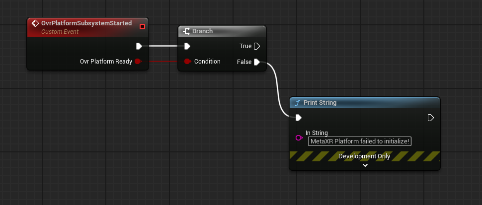
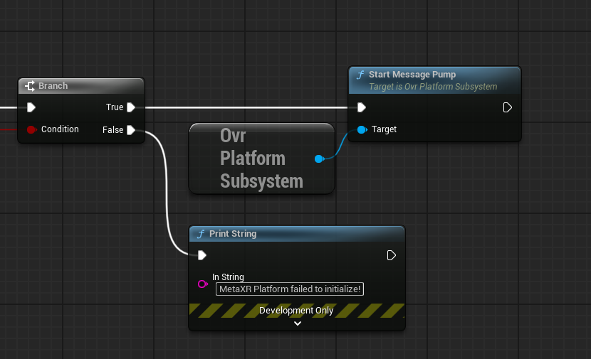
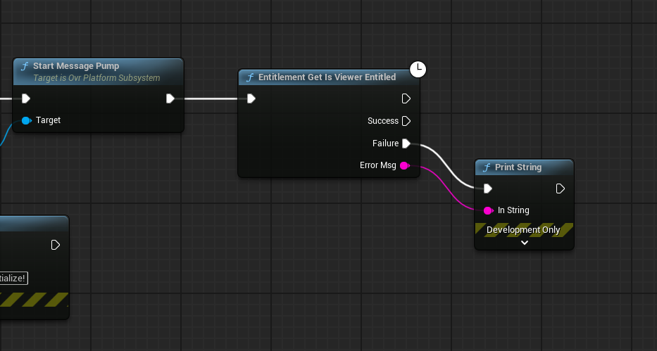
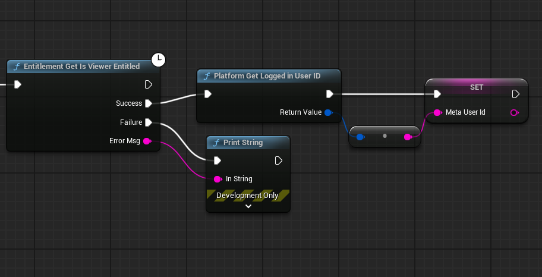
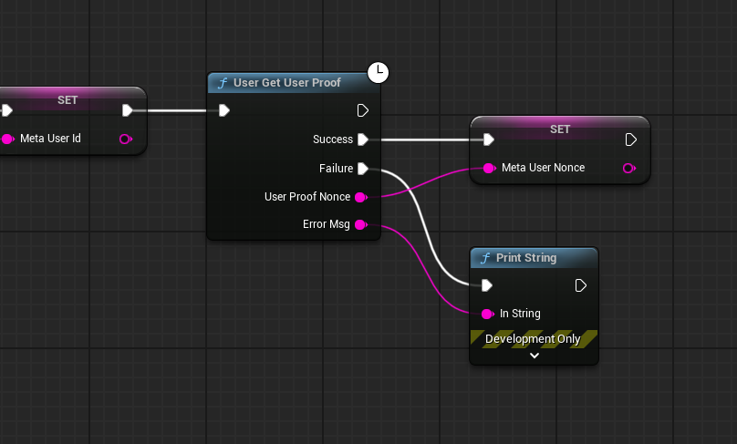
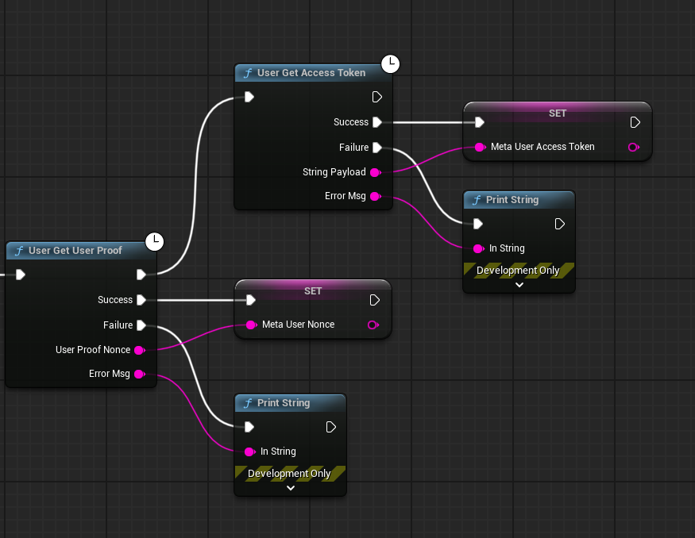
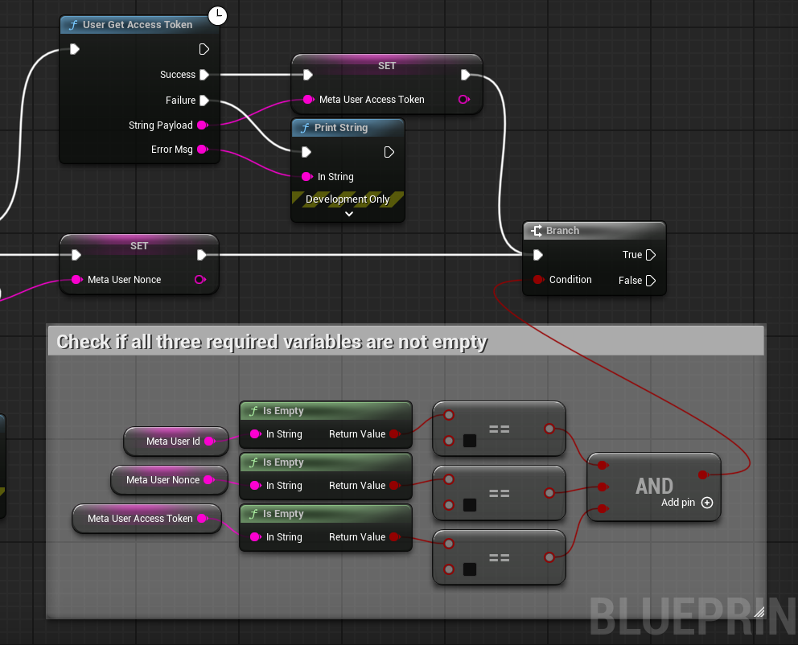
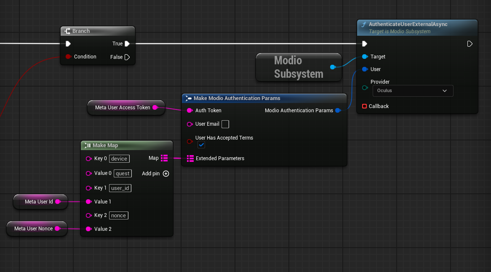

# Meta Quest Configuration

:::important[Find your guide]
This setup guide is intended for those building for Meta Quest. If that's not you, continue to work through the [Unreal Engine Getting Started Guides](/unreal#unreal-engine-core-plugin-guides) to implement mod.io's core functionality.
:::

### Configuration

To access Meta Quest-specific APIs, including authentication, you need to download and integrate the MetaXR and MetaXR Platform plugins into your Unreal Engine project. Follow these steps:

1. **Download the MetaXR Plugin**:
   - Visit the [Meta Unreal Engine 5 Integration](https://developers.meta.com/horizon/downloads/package/unreal-engine-5-integration) and download the plugin.
   - Extract the plugin into your project's `Plugins` directory.

2. **Download the Meta Platform SDK Plugin**:
   - Visit the [Meta Unreal Engine 5 Platform SDK](https://developers.meta.com/horizon/downloads/package/unreal-5-platform-sdk-plugin) and download the plugin.
   - Extract the plugin into your project's `Plugins` directory.

3. **Enable the Plugins**:
   - Open your Unreal Engine project.
   - Navigate to `Edit > Plugins` and ensure both **MetaXR** (under Installed/Virtual Reality) and **MetaXR Platform** (under Installed/Online Platform) plugins are enabled.

4. **Add Supported Devices**:
   - Navigate to `Edit > Project Settings`
   - Navigate to `Plugins > Meta XR`
   - Under `Mobile > Supported Meta Quest Device`, add `Meta Quest 3`
   - `File > Save All`, restart the Unreal Editor

These plugins provide access to Meta Quest-specific functionality, such as achievements, leaderboards, authentication, and so on.

### Authentication

Before Meta authentication with Modio can work, you must create an app on the [Meta Horizon Dashboard](https://developers.meta.com/horizon) and link it to an app on the mod.io dashboard. [Instructions on how to do this are here](https://docs.mod.io/platforms/meta/authentication). 

Once the apps are set up, add the following to `DefaultEngine.ini`, replacing `YOUR_META_APP_ID` with your Meta App Id from the Meta Horizon Dashboard: 

```
[OnlineSubsystemOculus]
MobileAppId=YOUR_META_APP_ID
```

You can now authenticate users via Meta. The authentication process involves obtaining an access token, retrieving a user proof, and also obtaining the user ID. After that, you can pass all of this information to mod.io for authentication.

Authentication can be implemented via C++ or Blueprint. 

#### C++

First, you must ensure that your game has a valid `UGameInstance`, as the MetaXR Platform does not initialize until the game instance has initialized. 

Once the game instance has  initialized, retrieve the `UOvrPlatformSubsystem` from it and start the message pump: 

```cpp
auto ovrSubsystem = GameInstance->GetSubsystem<UOvrPlatformSubsystem>();

// Check that it's valid
if (ovrSubsystem == nullptr)
{
	UE_LOG(Error, TEXT("Failed to get OvrPlatformSubsystem."));
	return;
}

// Start the message pump
ovrSubsystem->StartMessagePump();
```

The next step is to perform the entitlement check: 

```cpp
// Create a delegate
OvrPlatform_Entitlement_GetIsViewerEntitled_Delegate EntitlementDelegate =
	OvrPlatform_Entitlement_GetIsViewerEntitled_Delegate::CreateUObject(this, &ThisClass::OnIsViewerEntitled);

// Make the platform call. This is async so we pass the delegate to it. Could also use a lambda
OvrPlatform_Entitlement_GetIsViewerEntitled(GameInstance, MoveTemp(EntitlementDelegate));

// The callback
void UMyClass::OnIsViewerEntitled(bool isEntitled, FString errorMessage)
{
	if (isEntitled)
	{
		// Continue with next auth steps...
	}
	else
	{
		UE_LOG(Error, TEXT("Entitlement check failed: %s."), *errorMessage);
	}
}
```

Once the entitlement check is done, you can now make the three async calls to retrieve the User Id, User Proof (nonce), and Access Token. 

```cpp
// Get the logged in User Id from OVR
OvrPlatform_User_GetLoggedInUser_Delegate LoggedInUserDelegate = 
	OvrPlatform_User_GetLoggedInUser_Delegate::CreateUObject(this, &ThisClass::OnGetLoggedInUser);
OvrPlatform_User_GetLoggedInUser(GameInstance, MoveTemp(LoggedInUserDelegate));

// Get the nonce from OVR
OvrPlatform_User_GetUserProof_Delegate UserProofDelegate = 
	OvrPlatform_User_GetUserProof_Delegate::CreateUObject(this, &ThisClass::OnGetUserProof);
OvrPlatform_User_GetUserProof(GameInstance, MoveTemp(UserProofDelegate));

// Get access token from OVR
OvrPlatform_User_GetAccessToken_Delegate AccessTokenDelegate = 
	OvrPlatform_User_GetAccessToken_Delegate::CreateUObject(this, &ThisClass::OnGetAccessToken);
OvrPlatform_User_GetAccessToken(GameInstance, MoveTemp(AccessTokenDelegate));
```

In each of the delegate callbacks, store the data. Again, you could use lambdas instead of delegates if you want. 

```cpp
void UMyClass::OnGetLoggedInUser(bool success, FOvrUserPtr user, FString errorMessage)
{
	// Check that we successfully got a logged in user
	if (!success || !user.IsValid())
	{
		UE_LOG(Error, TEXT("Failed to get the logged in user: %s"), *errorMessage);
		return;
	}

	// Use this function to convert the FOvrId to an FString
	FString userIdStr = UOvrPlatformUtilsLibrary::Conv_OvrIdToString(user->ID);
}

void UMyClass::OnGetUserProof(bool success, FOvrUserProofPtr userProof, FString errorMessage)
{
	// Check that we successfully got a nonce
	if (!success || !userProof.IsValid())
	{
		UE_LOG(Error, TEXT("Failed to get user proof: %s"), *errorMessage);
		return;
	}

	FString userNonce = userProof->Nonce;
}

void UMyClass::OnGetAccessToken(bool success, FStringPtr accessToken, FString errorMessage)
{
	// Check that we successfully got an access token
	if (!success || !accessToken.IsValid())
	{
		UE_LOG(Error, TEXT("Failed to get access token: %s"), *errorMessage);
		return;
	}

	FString userAccessToken = *accessToken;
}
```

Once you have all three required bits of information, you can authenticate with Modio:

```cpp
FModioAuthenticationParams AuthParams;
AuthParams.AuthToken = userAccessToken;
AuthParams.bUserHasAcceptedTerms = false; // true if the user has accepted
AuthParams.ExtendedParameters.Add(TEXT("device"), TEXT("quest"));
AuthParams.ExtendedParameters.Add(TEXT("nonce"), userNonce);
AuthParams.ExtendedParameters.Add(TEXT("user_id"), userIdStr);

ModioSubsystem->AuthenticateUserExternalAsync(
	AuthParams, EModioAuthenticationProvider::Oculus,
	FOnErrorOnlyDelegateFast::CreateUObject(this, &ThisClass::OnAuthenticationComplete));
```

#### Blueprint

To implement Meta authentication in Blueprint, open the blueprint for your Game Instance. Create a custom event called `OvrPlatformSubsystemStarted`. 

> **Note:** The event name must be exactly `OvrPlatformSubsystemStarted` and within the Game Instance blueprint.

On the event, create a boolean variable called `OvrPlatformReady`. You can check this to see if the MetaXR Platform initialized successfully. 



Next, start the message pump. 



Next, perform the entitlement check. This is an async function, so you will need to handle both the Success and Failure callbacks. 



From the Success callback, call `Platform Get Logged in User ID` and store the return value in a variable. 



Now call `User Get User Proof` to get the nonce, which is another async function. Right click on `User Proof` and split the struct, then store the resulting string in a variable. Remember to handle the Failure callback. 



Using the main execution pin, call `User Get Access Token`. This is another async function and can be called in parallel with getting the user nonce, so you don't need to call this from a callback. Handle the Failure callback and set the access token to a variable in the Success callback. 



Next, you need to check if all three required variables are ready. Because the calls to get the nonce and access token are both async, they could finish in any order, so you need to do the check after both of these calls. 



Finally, we can send the request to `AuthenticateUserExternalAsync`. Ensure that all the parameters are set as per the screenshot below. Remember to change the Provider to `Oculus`. The `Extended Parameters` map must contain:

- `device`: `quest`
- `user_id`: *User Id variable*
- `nonce`: *Nonce variable*


