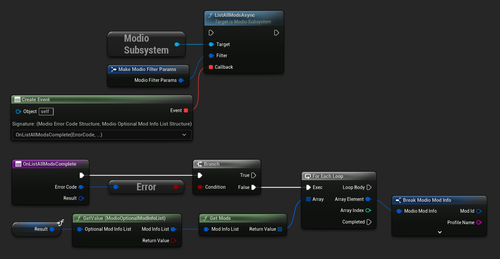
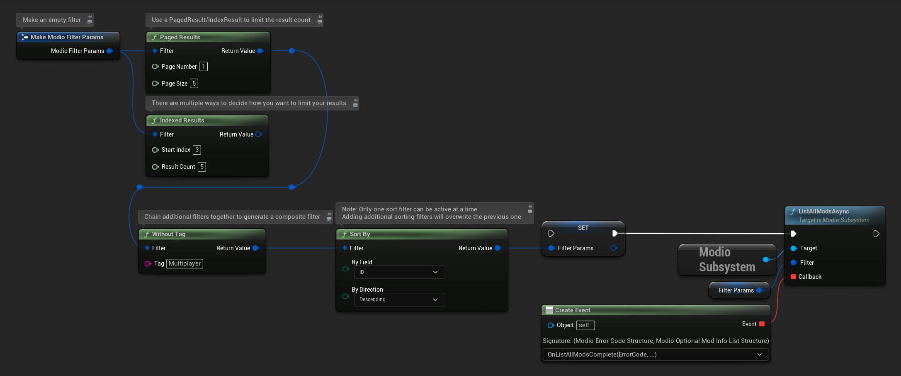
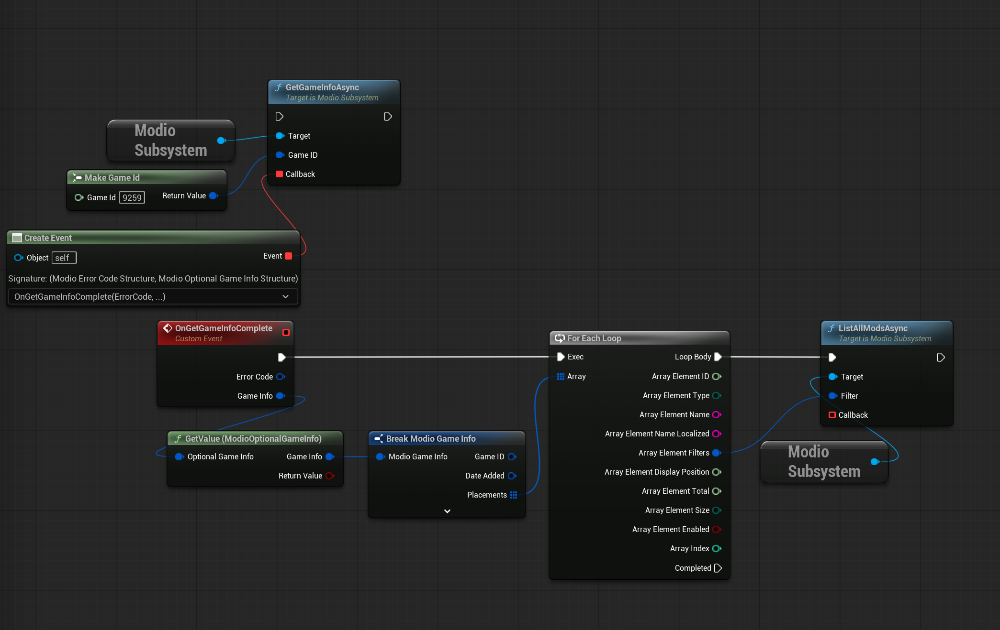

# Searching for UGC

When setting up UGC in your game, you'll want users to be able to search for UGC before they subscribe to and install it. This guide will run you through the basics on how to do so. 

This guide covers:

* [Browsing UGC](#browsing-ugc)
* [Featuring Content](#featuring-content)
* [Next steps](#next-steps)

## Browsing UGC

After [initializing the plugin](/unreal/initialization) and [authenticating a user](/unreal/user-authentication), you can query the available mods using [`ListAllModsAsync`](/unreal/refdocs#listallmodsasync). 

`ListAllModsAsync` supports filtering by name, tag, author, mature content, and more using [`ModioFilterParams`](/unreal/refdocs#modiofilterparams).  You can sort results as specified by `ModioSortFieldType`, and request paginated or indexed results. By default, `ModioFilterParams` asks for the first 100 results (the maximum number returnable in a query) sorted by `ModioModID`.

<Tabs group-id="languages">
  <TabItem value="blueprint" label="Blueprint">
The primary way this is done is through [K2_ListAllModsAsync](/unreal/refdocs#listallmodsasync).



To search for a specific query string, sort in a different order, or combine different filters, you can use a [ModioFilterParams](/unreal/refdocs#modiofilterparams) object like this:



  </TabItem>
  <TabItem value="c++" label="C++" default>
 ```cpp
void UModioManagerSubsystem::ListAllMods()
{
	if (UModioSubsystem* Subsystem = GEngine->GetEngineSubsystem<UModioSubsystem>())
	{
		FModioFilterParams Filter;
		// Build the filter by chaining together multiple calls
		Filter.PagedResults(1, 5).IndexedResults(3, 5).WithTags("Multiplayer").SortBy(EModioSortFieldType::ID, EModioSortDirection::Descending);

		Subsystem->ListAllModsAsync(Filter, FOnListAllModsDelegateFast::CreateUObject(this, &UModioManagerSubsystem::OnListAllModsComplete));
	}
}

void UModioManagerSubsystem::OnListAllModsComplete(FModioErrorCode ErrorCode, TOptional<FModioModInfoList> OptionalModList)
{
	// Ensure ListAllModsAsync was successful
	if (!ErrorCode)
	{
		// ModList is guaranteed to be valid if there is no error
		TArray<FModioModInfo> ModInfoArray = OptionalModList.GetValue().GetRawList();

		// Do something with ModInfoArray

		// You can use OptionalModList().GetValue().Paged related methods to make further paginated requests if required
	}
}

 ```
  </TabItem>
</Tabs>

## Featuring Content

Game admins can configure Featured Content on their game's Dashboard on the mod.io website. Featured Content lets you curate specific groups of UGC, such as "Trending this week", "Staff Picks", or themed event content such as "Top Halloween Content", that you can use to feature specific content in your game's UI, for example as carousels on a home or discovery screen. These curated groups (called Placements) are represented by [`ModioPlacement`](/unreal/refdocs#modioplacement), which contains a [`ModioFilterParams`](/unreal/refdocs#modiofilterparams) object you can pass directly to [`ListAllModsAsync`](/unreal/refdocs#listallmodsasync).

Each `ModioPlacement` carries everything you need to build and render one of these curated sections:

* `Name` (and localized variant `NameLocalized`), to use as a heading
* `DisplayPosition`, indicating the order Placements should be displayed in relative to each other
* `Size` (`Small`, `Medium`, or `Large`), a hint for how prominently the Placement can be displayed
* `Total`, the number of results the Placement should show
* `bEnabled` - disabled Placements should not be displayed
* `Filters`, a [`ModioFilterParams`](/unreal/refdocs#modiofilterparams) object describing which mods should populate the Placement

Placements are returned as part of [`GetGameInfoAsync`](/unreal/refdocs#getgameinfoasync), on the `Placements` field of the returned [`ModioGameInfo`](/unreal/refdocs#modiogameinfo).

<Tabs group-id="languages">
  <TabItem value="blueprint" label="Blueprint">
The primary way this is done is through [K2_GetGameInfoAsync](/unreal/refdocs#getgameinfoasync). Break the returned `ModioGameInfo` to access its `Placements` array, then for each enabled `ModioPlacement` you want to display, break out its `Filters` and pass that directly into [K2_ListAllModsAsync](/unreal/refdocs#listallmodsasync) to fetch the mods for that Placement.



  </TabItem>
  <TabItem value="c++" label="C++" default>
 ```cpp
void UModioManagerSubsystem::GetFeaturedContent()
{
	if (UModioSubsystem* Subsystem = GEngine->GetEngineSubsystem<UModioSubsystem>())
	{
		Subsystem->GetGameInfoAsync(UModioSDKLibrary::GetProjectGameId(),
			FOnGetGameInfoDelegateFast::CreateUObject(this, &UModioManagerSubsystem::OnGetGameInfoComplete));
	}
}

void UModioManagerSubsystem::OnGetGameInfoComplete(FModioErrorCode ErrorCode, TOptional<FModioGameInfo> GameInfo)
{
	// Ensure GetGameInfoAsync was successful
	if (!ErrorCode && GameInfo.IsSet())
	{
		CurrentPlacements = GameInfo->Placements;
	}
}
 ```

For each enabled Placement you want to display, pass its `Filters` to `ListAllModsAsync` to fetch the mods to show:

 ```cpp
for (const FModioPlacement& Placement : CurrentPlacements)
{
	if (!Placement.bEnabled)
	{
		continue;
	}

	if (UModioSubsystem* Subsystem = GEngine->GetEngineSubsystem<UModioSubsystem>())
	{
		Subsystem->ListAllModsAsync(Placement.Filters,
			FOnListAllModsDelegateFast::CreateLambda([Placement](FModioErrorCode ErrorCode, TOptional<FModioModInfoList> OptionalModList)
		{
			if (!ErrorCode)
			{
				TArray<FModioModInfo> ModInfoArray = OptionalModList.GetValue().GetRawList();

				// Use Placement.Name/NameLocalized as a heading and Placement.Size to size the section,
				// then populate it with ModInfoArray
			}
		}));
	}
}
 ```
  </TabItem>
</Tabs>

## Next steps

Now your users can find UGC in your game, it's time to set up the ability to subscribe to and download UGC by implementing the [Subscribing to UGC](/unreal/subscribing) guide.

If you've already done this, we recommend working your way through the [Unreal Getting Started Guides](/unreal/getting-started) as they will teach you how to implement the fundamentals of the Unreal Engine Plugin before moving onto exploring our [Features](https://docs.mod.io/features).