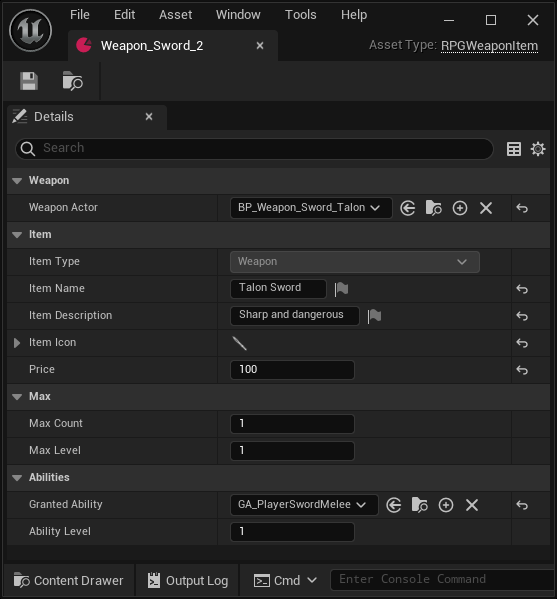
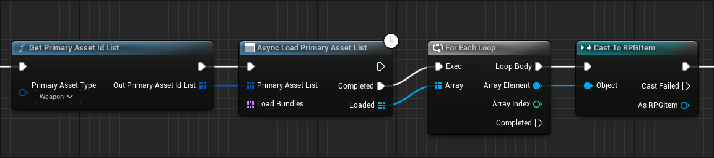
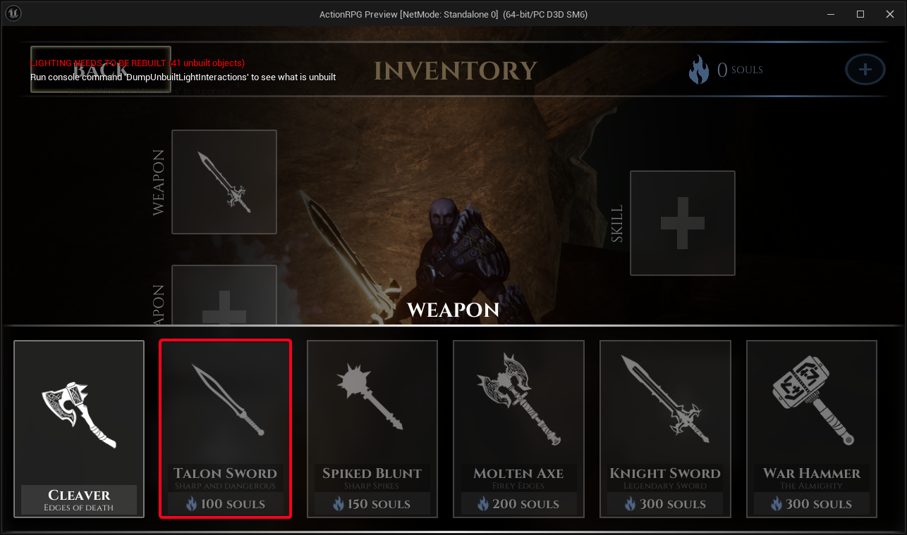

import Tabs from '@theme/Tabs';
import TabItem from '@theme/TabItem';

# Moddable Weapons

Each inventory item type in ARPG has their own native C++ class that inherits from **URPGItem** and are defined using lines in the AssetManagerSettings section of the DefaultGame.ini. In this case with weapons, the **URPGWeaponItem** exists as DataAssets, this defines base characteristics to display in UI, but more importantly what **PrimaryAssetType** the item is, and which Weapon actor to spawn when requested. 

This allows the ModioUGC integration to mount UGC, and register new weapons to the AssetManager and allow them to be loaded dynamically at runtime through the standard mechanics of the game - this enables the addition of new Weapons without requiring a full game update.



## Loading weapons into the game
The AssetManager is configured to recognize the **RPGWeaponItem** type, which means as soon as ModioUGC mounts and registers the new UGC, ARPG can automatically discover all instances of this type in the project.

The most common way (and current implemenation of this) is done by calling `UAssetManager::GetPrimaryAssetIdList` with the PrimaryAssetType of `URPGAssetManager::WeaponItemType`, returning a list of all weapons.

The list of valid item slots and default inventory are stored in the BP_GameInstance. The Player Controller native class provides an API for adding, removing, and querying inventory items, as well as interactions with the Ability System. ARPG needs to preload all items in the game at startup, which is done in the InitializeStoreItems event from the BP_GameInstance.

The following snippets demonstrate the standard Unreal method to load the weapons from the AssetManager and AssetRegistry.

<Tabs group-id="languages">
<TabItem value="blueprint" label="Blueprint">

</TabItem>
<TabItem value="c++" label="C++" default>
```cpp
	UAssetManager& AssetManager = UAssetManager::Get();
	TArray<FPrimaryAssetId> OutAssetIDs;
	AssetManager.GetPrimaryAssetIdList(URPGAssetManager::WeaponItemType, OutAssetIDs);

	for (const FPrimaryAssetId& AssetID : OutAssetIDs)
	{
		FAssetData AssetData;
		AssetManager.GetPrimaryAssetData(AssetID, AssetData);

		if (AssetData.IsValid())
		{
			const FSoftObjectPath& AssetPath = AssetData.ToSoftObjectPath();
			TSoftObjectPtr<URPGWeaponItem> SoftWeapon(AssetPath);

			// The weapon DataAsset can now be loaded
			URPGWeaponItem* WeaponItem = SoftWeapon.LoadSynchronous();
			if (WeaponItem)
			{
				UE_LOG(LogActionRPG, Display, TEXT("Loaded Weapon: %s"), *WeaponItem->ItemName.ToString());
			}
		}
	}
```
</TabItem>
</Tabs>


Alternatively, the AssetRegistry can be used to discover assets of a specific type. It provides a way to query assets based on their class and other properties.

<Tabs group-id="languages">
<TabItem value="c++" label="C++" default>
```cpp
	FAssetRegistryModule& AssetRegistryModule =
		FModuleManager::LoadModuleChecked<FAssetRegistryModule>("AssetRegistry");
	IAssetRegistry& AssetRegistry = AssetRegistryModule.Get();

	FARFilter ARFilter;
	TArray<FAssetData> AssetList;
	ARFilter.ClassPaths.Add(URPGWeaponItem::StaticClass()->GetClassPathName());
	ARFilter.bIncludeOnlyOnDiskAssets = true;

	FARCompiledFilter CompiledFilter;
	IAssetRegistry::Get()->CompileFilter(ARFilter, CompiledFilter);

	// Query for assets
	TArray<FAssetData> AssetDataArray;
	AssetRegistry.GetAssets(ARFilter, AssetDataArray);

	// Iterate through the found assets and print out their names (or do other logic)
	for (const FAssetData& AssetData : AssetDataArray)
	{
		if (AssetData.IsValid())
		{
			const FSoftObjectPath& AssetPath = AssetData.ToSoftObjectPath();
			TSoftObjectPtr<URPGWeaponItem> SoftWeapon(AssetPath);

			// The weapon DataAsset can now be loaded
			URPGWeaponItem* WeaponItem = SoftWeapon.LoadSynchronous();
			if (WeaponItem)
			{
				UE_LOG(LogActionRPG, Display, TEXT("Loaded Weapon: %s"), *WeaponItem->ItemName.ToString());
			}
		}
	}
```
</TabItem>
</Tabs>

