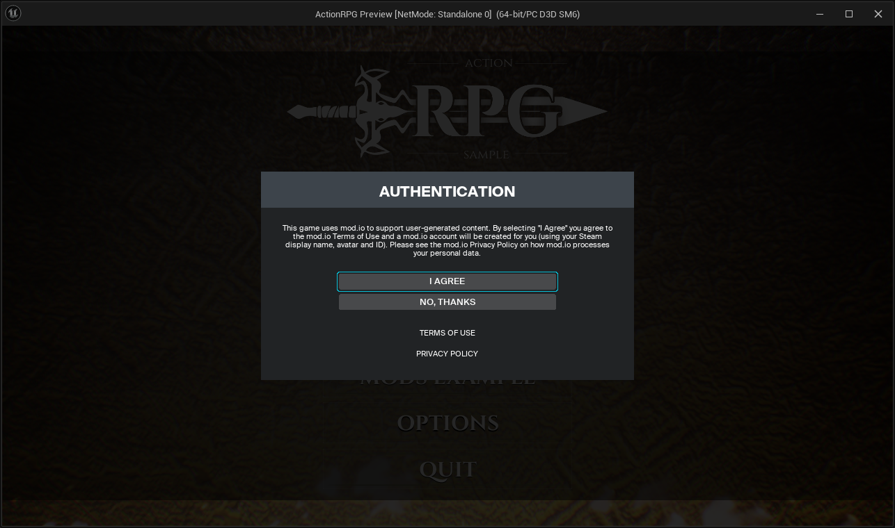
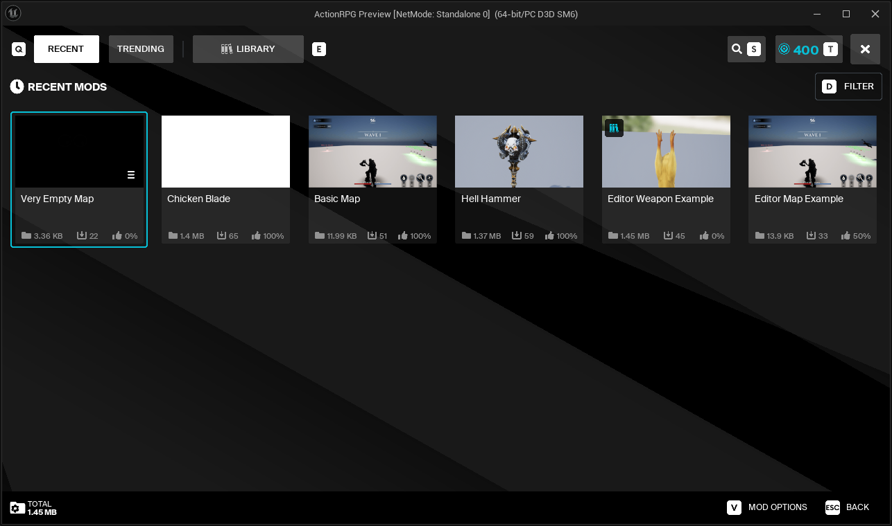
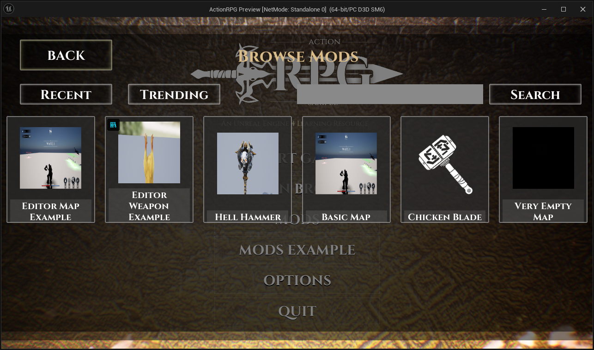

# mod.io Plugin Integration

## What has been integrated?

ARPG includes the following plugins:
- **Modio Core**: ARPG implements the core functionality for interacting with the mod.io service, including user authentication, subscription management, etc.
- **Component UI**: The template UI has been dropped into this project, as well as a custom built Mod Browser using components and functionality provided by the Component UI plugin.
- **ModioUGC**: Adding support for UGC to be authored specifically for ARPG, and then loaded at runtime by leveraging the AssetManager and AssetRegistry.

## mod.io Core Plugin

The mod.io Core Plugin is the core plugin that the rest of the mod.io product suite depends on. It provides functionality to interact with the mod.io services, such as user authentication, content searching & filtering, subscription management & downloading and more.

More information about the mod.io Core Plugin can be found in the [mod.io Core Plugin documentation](https://docs.mod.io/unreal/installation).

### Integration with Action RPG

Initialization of the mod.io Core Plugin has been implemented in the **ActionRPGModioSubsystem** class. This also handles the set up and initialization of the UGC Provider for ModioUGC, to discoverability and loading of UGC.

Additional heavy lifting is done by the **UModioAuthSubsystem** class, which handles the user authentication flow (SSO where supported, also by email).

:::note
This project does not include all platform-specific authentication methods where NDAs are required. 
:::

## mod.io Component UI Plugin

The mod.io Component UI Plugin is a framework providing a set of specifications, UI components, and editor tooling to allow UE developers to rapidly integrate mod.io plugin data and events into their game's UI, either directly into existing screens or in dedicated browser and discovery sections.

More information about the mod.io Component UI Plugin can be found in the [mod.io Component UI Plugin documentation](https://docs.mod.io/unreal/component-ui).

### Integration with Action RPG

Within the Component UI Plugin, there is a Template UI, which is a working, fully featured mod browser that can be dropped into projects. ARPG uses this Template UI as one example of how to interact with the Core Plugin and ModioUGC Plugin to provide a mod browser experience.

The Template UI is located in the following path:
`Plugins/ModioComponentUI/Content/UI/Templates/Default/WBP_ModioModBrowser.uasset`

The browser can be accessed from the main menu, under **Mods**.

It also includes a set of components that can be used to build custom UIs, which we've used to create a simple mod browser in the style of the existing Action RPG UI. 

The Template UI is located in the following path:
`Content/Modding/UGC_Dialogs/WBP_UGC_ModioModBrowser.uasset`

The browser can be accessed from the main menu, under **Mod Example**.

## ModioUGC Plugin

The ModioUGC Plugin is a plugin that provides functionality to create, manage, and load user-generated content (UGC) in Unreal Engine projects. It allows developers to create downloadable content (DLC) plugins that can be shared and loaded at runtime, enabling mod support in games.

More information about the ModioUGC Plugin can be found in the [ModioUGC Plugin documentation](https://docs.mod.io/unreal/modio-ugc).

### Integration with Action RPG

As mentioned earlier in the mod.io Core Plugin section, the ModioUGC Plugin is initialized in the **ActionRPGModioSubsystem** class. This subsystem is responsible for managing the UGC Provider, which is an implementation of the `IUGCProvider` interface that allows for loading and discovering UGC.

ARPG has it's own implementation of the UGC Provider, the **ActionRPG_UGCProvider** class. This class is an aggregate of the examples supplied by the ModioUGC Plugin - **ModioUGCProvider** and **ModioUGCProviderSideLoaded**. This allows loading UGC which has been authored and uploaded to the mod.io service, as well as side loading UGC from a specific folder for rapid iteration.

Beyond this, the usage of the ModioUGC Plugin is primarily in the rest of the ActionRPG project, where UGC can be consumed in their relevant areas. Read more about this in the [Moddable Weapons](/unreal/modio-action-rpg/moddable-weapons) section, which describes how weapons are loaded into the game using the AssetManager and AssetRegistry.

:::note
There are some settings that are required to be set in the project to enable the ModioUGC Plugin specifically for in-editor testing. These settings are documented in the [ModioUGC Plugin documentation](https://docs.mod.io/unreal/modio-ugc/getting-started#in-editor-testing).
:::