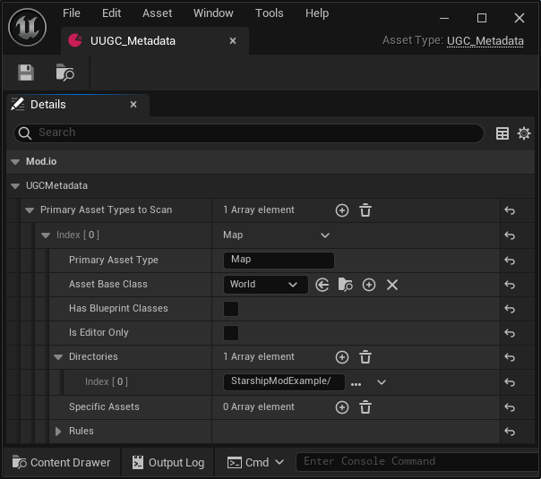

To create a new mod:

1. Click the **Create Mod** button in the top bar of the editor.

    

2. In the window that opens:
    - Select `Regular Content Only`.
    - Specify the mod name.
    - Click the **Create Mod** button.

    

This process generates a new plugin - avoid adding content with dependencies on engine content, as this may cause packaging issues.

After the mod is created, content can be added by creating new assets or importing existing ones. This process is assumed to be handled by modders using the editor.

Each UGC package requires a `UUGC_Metadata` Data Asset, which will automatically be generated for you. This metadata needs to define the primary asset type, the asset base class as well a the path of where the content of your UGC is located - typically the name of your UGC as all content will within this folder.

