This example demonstrates how to add a modding system to a game using the ModioUGC module. In this scenario, a new mod containing a static mesh and a sound wave will be created, packaged, and mounted in-game. The static mesh will be placed in a placeholder actor, and the sound wave will be played during the game. A simple FirstPerson template project will be used for demonstration purposes.

### Preparing a Mod

First, a new mod can be created by clicking the **Create Mod** button in the top bar of the editor.

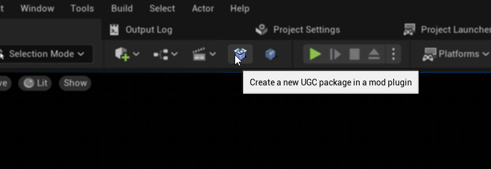

In the window that opens, select `Regular Content Only`, specify the mod name, and click the **Create Mod** button. The mod will be named `StarshipModExample`.

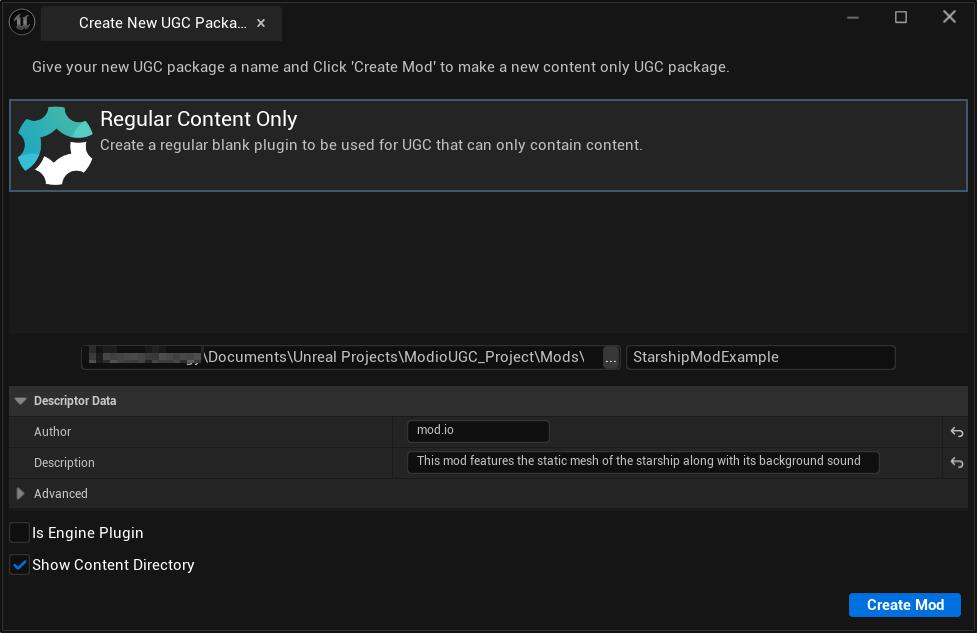

After the mod is created, content can be added by importing a static mesh of a spaceship (with its textures and materials) and a sound wave of background music.

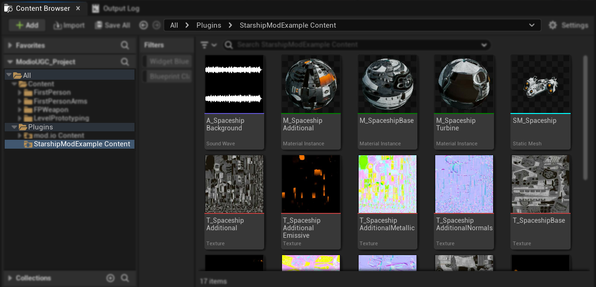

Once the content is added, click the **Package Mod** button in the top bar of the editor.

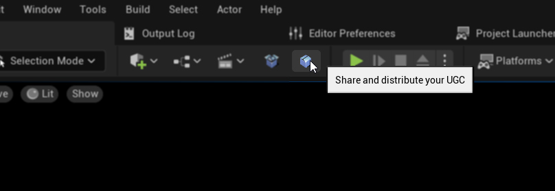

In the packaging window, select the UGC plugin, choose the platform, and specify the output path. The mod will be packaged for Windows and placed in the `C:\Mods` directory. Click the **Package Mod** button.

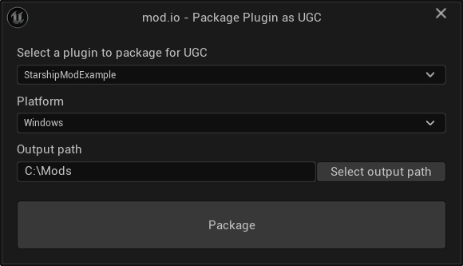

Now the mod is packaged and ready to be mounted in-game.

For the demonstration, the mod will be integrated manually using the same directory as the mod path, bypassing the need to upload and download the mod. 

It's important to delete the mod from the project, as it will be mounted as a pak (and `.ucas/.utoc` when Io Store is used) file and multiple instances of the same mod cannot be active simultaneously. Navigate to the project's `Mods` directory and delete the mod folder (in this case, `StarshipModExample`). The folder can be moved to another location for future use.

### Integrating the Mod

#### UGC Provider

First, a new UGC provider should be added, which will be responsible for providing information about the UGC to be mounted. This provider should be a subclass of `UObject` implementing the `IUGCProvider` interface. The following functions should be implemented: `InitializeProvider`, `DeinitializeProvider`, `IsProviderEnabled`, and `GetInstalledUGCPaths`.

To create a Blueprint subclass named **CustomUGCProvider**:

1. Create a new Blueprint class of type `UObject`.
2. Add the `IUGCProvider` interface to it.
3. For `InitializeProvider` and `DeinitializeProvider`, create two dispatchers: `InitializeProvider_Dispatcher` and `DeinitializeProvider_Dispatcher`:

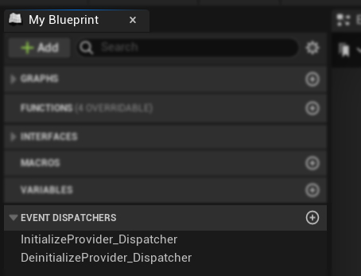

4. Bind these dispatchers and call them immediately:

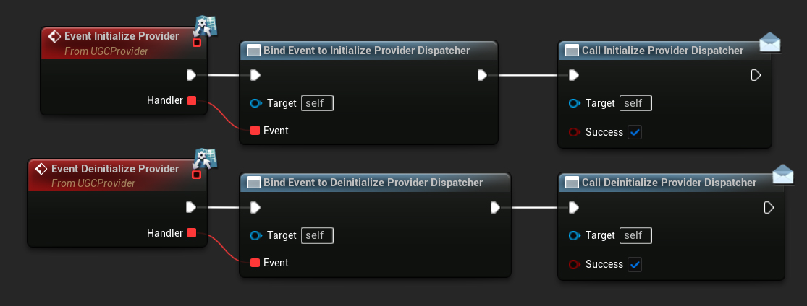

5. Implement `IsProviderEnabled` to simply return true for simplicity:

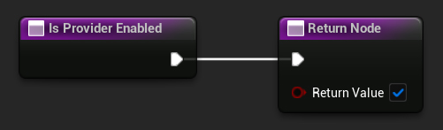

6. Implement `GetInstalledUGCPaths` to return the UGC path representing the packaged mod:

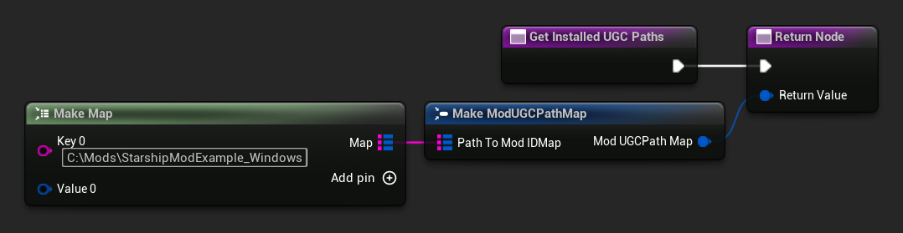

#### Blueprint Actor

Next, create a new Blueprint Actor asset in the project's `Content` directory to represent the spaceship and play the background music:

1. Name the asset `BP_PlaceholderStarship`.
2. Add a static mesh component named `PlaceholderStaticMesh`.
3. Add a text render component for easier identification of the actor in the scene.

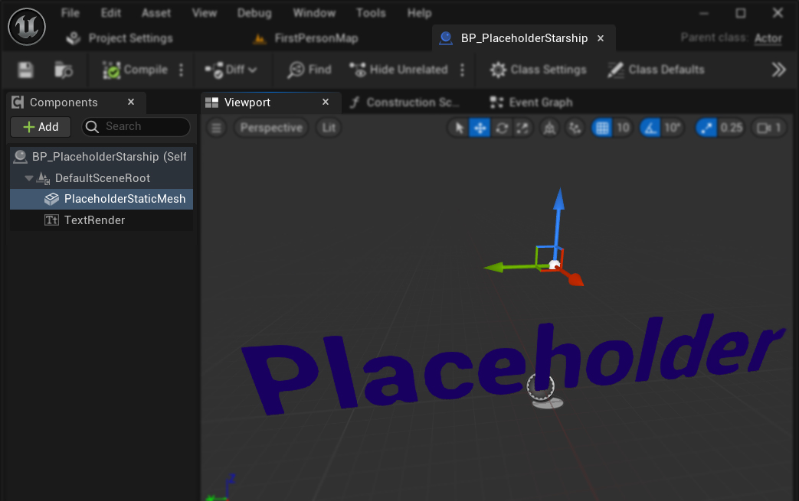

Place the actor in the scene:

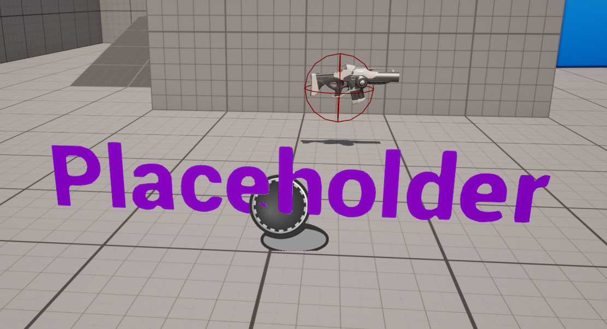

In the event graph, on begin play:

1. Call the `SetUGCProvider` function with the provider object created earlier:
   - Construct the `CustomUGCProvider` object from its class.
   - Call the `SetUGCProvider` function with the constructed object.

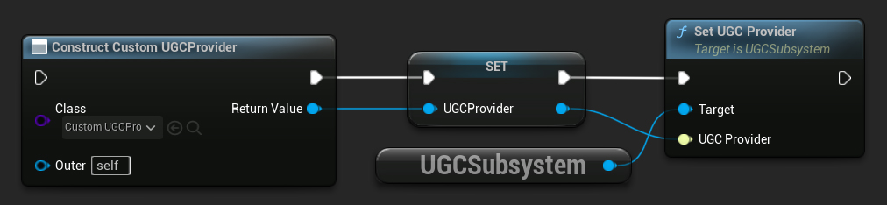

2. Call the `RefreshUGC` function to load the mod and add its content to the asset registry:

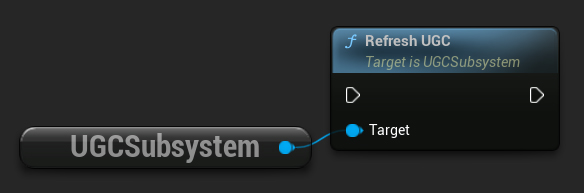

3. Use the `EnumerateAllUGCPackages` function to iterate through all available UGC packages and load assets:
   - Create a custom function named `OnEnumerateAllUGCPackages` using the `Create Event` node.
   - This function will be executed for each UGC package (in this case, just the `StarshipModExample` UGC package).

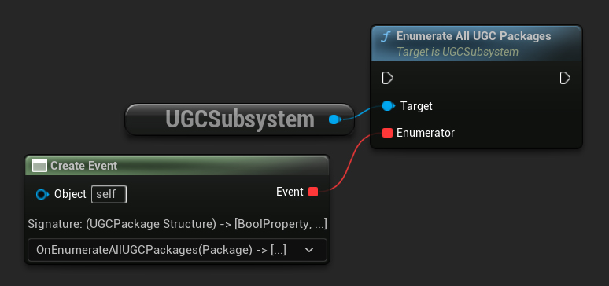

4. In the `OnEnumerateAllUGCPackages` function:
   - Use `GetPackageNamesFromUGCPackage` and `LoadObjectFromUGCPackage` to load the spaceship static mesh and sound wave.
   - Cast the loaded objects to Static Mesh and Sound Wave types.
   - Apply the static mesh to the static mesh component.
   - Play the sound wave during the game.

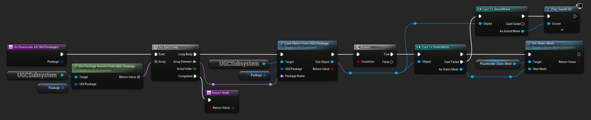

The complete event graph may look similar to this:

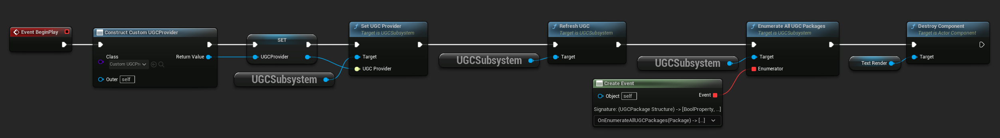

When the game is played, the spaceship will appear in the scene, and the background music will play. This will work both in the editor (following the steps in the **Integration** section) and in the packaged game.

Here are the final results, with the spaceship placed in the scene and the background music playing:

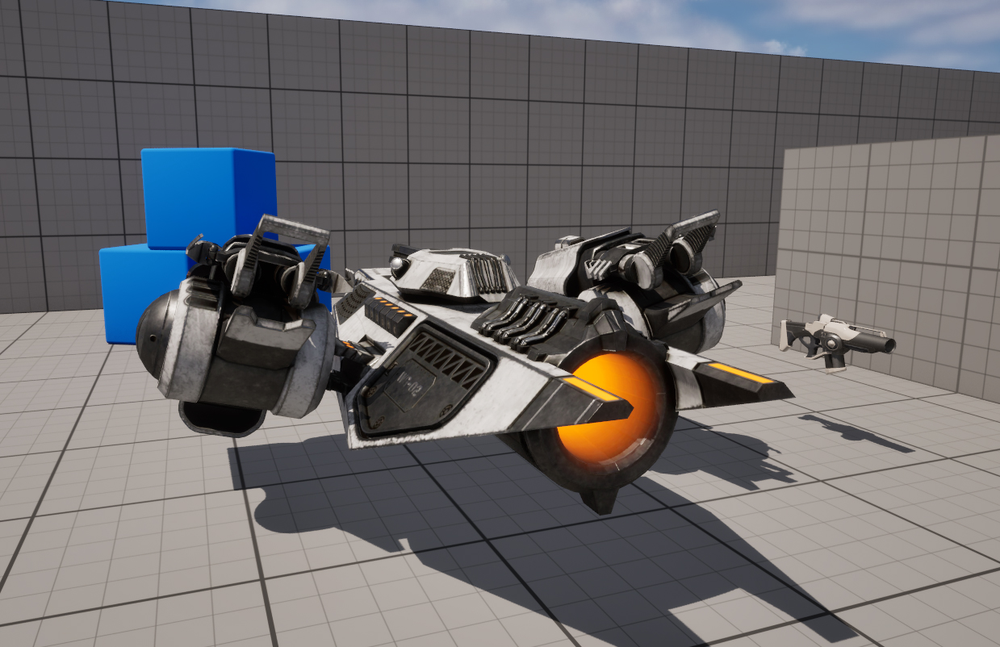