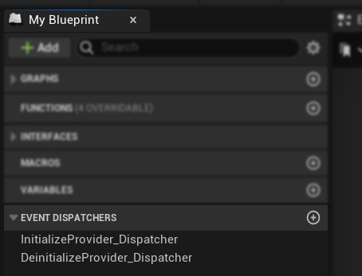
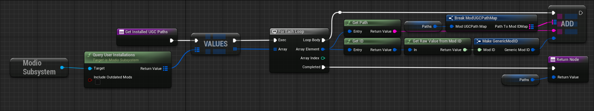
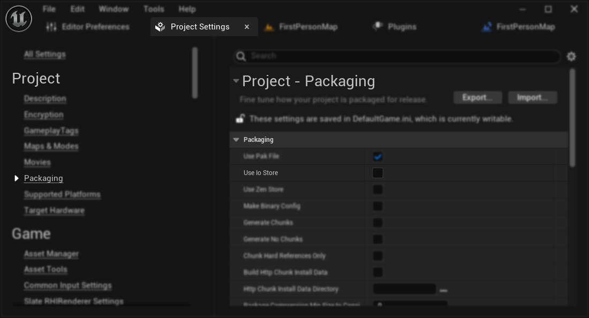

The mod.io UGC plugin consists of 2 core parts, the `UUGCSubsystem` managing all of the UGC discovery and loading, and then `IUGCProvider` which interacts with UGC providers to manage availability and the locations of UGC packages.


## UGC Subsystem

This is the main system which drives the mod.io UGC plugin. The lifetime of the UGC Subsystem is automatically managed by the engine and provides a convenient way to access the plugin's functionality. This is broadly grouped into the following categories:

- Plugin management (initialization, teardown).
- Setting and initializing the UGC Provider(s).
- Discovery and loading of UGC packages.
- Refreshing UGC availability by manual request.

The UGC Subsystem provides `SetUGCProvider`, `InitializeUGCProvider` and `RefreshUGC` to set up discovery and loading of UGC, as well other helper methods for various aspects of the system.

## UGC Provider

The `IUGCProvider` is an interface which is responsible for providing information about the UGC to be mounted. Depending on your game you may have a single provider, or multiple aggregated into one provider. 

The `GetInstalledUGCPaths` method is what defines the mod paths to be used when attempting to discover UGC. These paths would locate the `.uplugin` asset along with its corresponding mod files inside the `Content` directory. 

For example, if the `.uplugin` file path is `C:\Users\YourModFolder\Spaceship.uplugin` and the mod files (`.pak`, `.ucas`, `.utoc`) are in `C:\Users\YourModFolder\Content\Paks\Windows\`, the path to provide is `C:\Users\YourModFolder`.

Supplied in the plugin, we have 2 providers as examples:

- **UModioUGCProvider**

    - This is the out of the box provider which automatically initializes the modio service (if that option is enabled in the mod.io UGC settings), and queries the mod.io user installations for all mod paths within `GetInstalledUGCPaths`.

- **USideLoadUGCProvider**

    - This is an example of a provider which points to a specific directory for sideloading mods within `GetInstalledUGCPaths`. This can be a useful way to test UGC loading during development without the need to go through the mod.io initializatio and authentication flows.

### Blueprint Support

Alternatively a provider can be implemented in Blueprint. This provider should be a subclass of `UObject` implementing the `IUGCProvider` interface. The following functions should be implemented: `InitializeProvider`, `DeinitializeProvider`, `IsProviderEnabled`, and `GetInstalledUGCPaths`.

Ensure two dispatchers are created with appropriate checks for your provider, `InitializeProvider_Dispatcher` and `DeinitializeProvider_Dispatcher`. In this case we're just returning an immediate success.




Implement `GetInstalledUGCPaths` to return the UGC path representing the packaged mod. When implementing the mod.io service, you want to gather the paths based on the user installations.



Otherwise your provider can also side load from another directory, which is useful during development.


## Initialization

The general expectation is your game will handle the initialization of mod.io UGC providers when appropriate. 

```cpp
    UUGCSubsystem* UGCSubsystem = GEngine->GetEngineSubsystem<UUGCSubsystem>();
    if (UGCSubsystem)
    {
        UGCSubsystem->SetUGCProvider(NewObject<UMyCustomGame_UGCProvider>(this));

        FOnUGCProviderInitializedDelegate Handler;
        // Optionally bind a callback to handle the success/failure of the provider initialization
        Handler.BindDynamic(this, &UMyCustomGameSubsystem::OnUGCProviderInitialized);
        UGCSubsystem->InitializeUGCProvider(Handler);
    }
```

### Blueprint Support


However there is an option to automatically do this if desired. This will create and set a new `UModioUGCProvider` object when the UGC subsystem initializes.

Navigate to **Edit > Project Settings > Plugins > modio. UGC** and check the **Auto Initialize UGC Provider** option.


## Mounting and registering UGC assets

Once the UGC subsystem and your UGC Provider has been initialized, it will automatically attempt to discover UGC as soon as the Unreal Asset Manager has been spawned (or if it already has, it do this immediately).

This step will handle all of the discovery of UGC (based on the UGC paths of your UGC Provider), as well as find and mount the contained pak files.

`RefreshUGC` on the UGC subsystem is also available to be called manually to discover new UGC and unload old UGC no longer available. For example, after installing, or uninstalling UGC through your mod browser, or upon leaving the mod browser.

Once the UGC has been successfully loaded, you're free to access the assets within your UGC.

## Accessing assets

Once the UGC package is mounted, assets can be accessed using the following functions from the `UGCSubsystem`:

- **`EnumerateAllUGCPackages`**: Invokes the provided functor on every UGC package in the registry. This is the only way to access the UGC packages directly.
- **`GetUGCPackageByModID`**: Retrieves the mod package by mod ID.
- **`GetPackageNamesFromUGCPackage`**: Returns a list of package names from the mounted mod.

Additionally - the assets have now been registered to the AssetManager as well as appended to the AssetRegistry state which you can query for the type of assets you are after, for example if your UGC is a map, you'll be able to find it when querying for map assets:

**Asset Manager**
```cpp
	TArray<TSoftObjectPtr<UObject>> MapList;
	UAssetManager& AssetManager = UAssetManager::Get();
	TArray<FPrimaryAssetId> OutAssetIDs;
	AssetManager.GetPrimaryAssetIdList(FPrimaryAssetType("Map"), OutAssetIDs);
	for (FPrimaryAssetId AssetID : OutAssetIDs)
	{
		FAssetData AssetData;
		AssetManager.GetPrimaryAssetData(AssetID, AssetData);

		if (AssetData.IsValid())
		{
			MapList.Add(TSoftObjectPtr<UObject>(AssetData.GetAsset()));
		}
	}
```

**Asset Registry**
```cpp
	TArray<TSoftObjectPtr<UObject>> MapList;
	FAssetRegistryModule& AssetRegistryModule =
		FModuleManager::LoadModuleChecked<FAssetRegistryModule>("AssetRegistry");
	IAssetRegistry& AssetRegistry = AssetRegistryModule.Get();

	FARFilter ARFilter;
	TArray<FAssetData> AssetList;
	ARFilter.ClassPaths.Add(UWorld::StaticClass()->GetClassPathName());
	ARFilter.bIncludeOnlyOnDiskAssets = true; // This is important, otherwise UGC assets will not be found
    // Any other filter requirements

	FARCompiledFilter CompiledFilter;
	IAssetRegistry::Get()->CompileFilter(ARFilter, CompiledFilter);

	TArray<FAssetData> AssetDataArray;
	AssetRegistry.GetAssets(ARFilter, AssetDataArray);

	for (const FAssetData& AssetData : AssetDataArray)
	{
		MapList.Add(TSoftObjectPtr<UObject>(AssetData.GetAsset()));
	}
```

## In-editor testing

Testing can also be performed in-editor, although it is disabled by default. To enable it:

1. Navigate to **Edit > Project Settings > Engine -> Cooker** and check the **Allow Cooked Content In The Editor** option.

    

2. Navigate to **Edit > Project Settings > Plugins > UGC Settings** and check the **Enable UGC Provider in Editor** option.

    

3. Open up your DefaultEngine.ini config file and add allowing unversioned content in editor to the Cooker Settings"

```text
[/Script/UnrealEd.CookerSettings]
s.AllowUnversionedContentInEditor=True
```

Note: A current limitation for in-editor testing requires the project to have Io Store disabled both when creating the UGC, as well as when attempting to load it.

To disable the Io Store, navigate to **Edit > Project Settings > Packaging** and set the **Use Io Store** option to **False**.



Also, please note that it's not possible to run the project with mods packaged with Io Store enabled, and vice versa. Mods must be packaged with the same Io Store setting as the project.