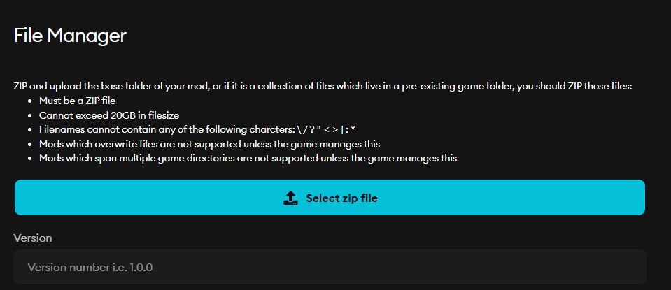

1. Click the **Package Mod** button in the top bar of the editor.

    

2. In the packaging window:
    - Select the UGC plugin.
    - Choose the platform and output path.

    

Once packaged, a folder containing the `.uplugin` and `.pak` (with `.ucas/.utoc` when Io Store is used) files will be generated. This represents the packaged mod that can be mounted by the ModioUGC runtime module.

## Uploading to mod.io

1. Compress the `.uplugin` and the `Content` directory (containing the `.pak` file and, if applicable, the `.ucas` and `.utoc` files) file into a `.zip` file.

    

2. Upload the `.zip` file to the **Files** section of the mod on the mod.io website.

    