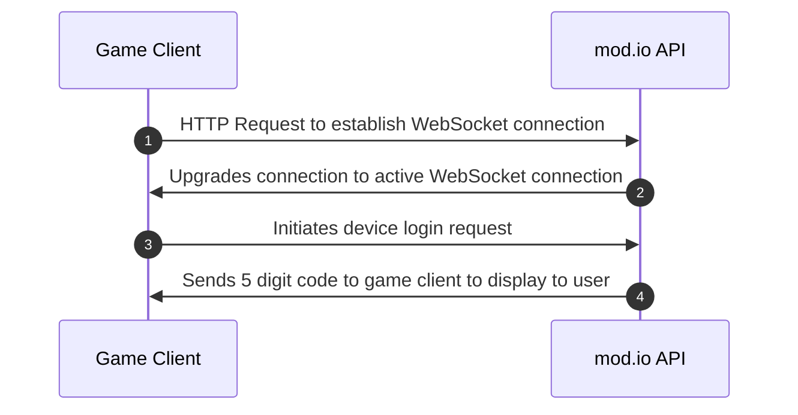
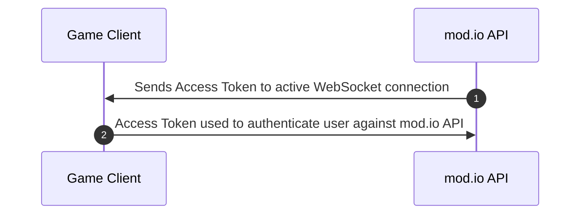
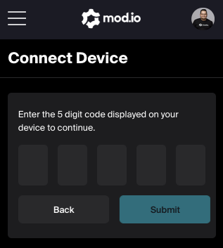

# Overview

Sometimes you may want to login in a player to mod.io using a different device than the one that is interacting with our service. For such scenarios, Device Login offers the flexibility for players to use a secondary device such as their desktop, mobile phone or tablet to login to the mod.io website which upon success, authenticates the player to mod.io within your game.

## Glossary

- WebSocket Connection: The bi-directional session between the game client and mod.io.
- Device: Any web-enabled device that is not the game client session.

## When to use?

The Device Login is strongest when your game is running in an environment in which it is a challenge to log the user into mod.io, this might be due to:
- Restricted input optionality, such as Meta Quest and other VR devices where prompting for login credentials is a challenge.
- The game client does not have the context in which to authenticate a user, and would prefer players to login via the website where a host of authentication options are available.

:::info
This documentation does not go into the low-level specification of the implementation of the WebSocket Protocol and instead is documented with the assumption that your game client is using a library that facilitates the establishing of the WebSocket connection and handshake. This documentation only focuses on the WebSocket schema that mod.io has adopted and what you need to implement to successfully interact with mod.io via the WebSocket standard.
:::

## Authentication Process

### Step 1. Game Client



### Step 2. On Another Device

Once a device login code has been request, the player navigates to `https://mod.io/connect` on any device and after logging in, submits the 5-digit authentication code.

### Step 3. Game Client



## Establishing a WebSocket connection from the game client

Within your game client using a [WebSocket compatible](https://datatracker.ietf.org/doc/html/rfc6455) library establishing a connection is as easy as initiating a request to the following URL:

```
wss://g-{your-game-id}.ws.modapi.io/
```

Once the handshake is complete and the bi-directional session is established. You can then use the request schema outlined below to initiate a Device Login request.

## Request Schema

There is no set standard for the payload in WebSocket communication and how it should be structured. We have opted for a lightweight structure that clearly defines:

- The type of operation to communicate.
- The context of such operation.
- The operation is a unique string that describes a message that the server understands, invalid messages will result in an error message being returned from the server.
- The context is an object that can be empty or omitted, and the key-value pairs of the context field will be attributed as context for the request.

### Root Object

| Field | Type | Required | Description
|------------|------------|------|---------------------------------------------------------------------------------------------------
| `messages` | `array`    | true | An array wrapped inside the root JSON object. All messages to transmit must be within this array conforming to the schema below. Any data sent outside of this specific field will be ignored.

#### Example

```javascript
{
    "messages": [
        {
            //
        },
        ...
    ]
}
```

### Nested Object Schema

| Field | Type | Required | Description
|------------------|---------------|-------|---------------------------------------------------------------------------------------------------
| `operation` | `string`| true | The type of operation being requested, such as `"device_login"`.
| `context` | `object` | true | A nested object containing additional details about the operation context.

#### Example

```javascript
{
    "messages": [
        {
            "operation": "device_login",
            "context": {}
        }
    ]
}
```

### Context Schemas

#### Device Login Message

| Field | Type | Required | Description
|------------------|---------------|-------|---------------------------------------------------------------------------------------------------
| `game_id` | `integer` | true | The unique ID of the game, this MUST be identical to the ID specified in the [Global WebSocket Endpoint](#global-websocket-endpoint).

#### Example

```javascript
{
    "messages": [
        {
            "operation": "device_login",
            "context": {
                "game_id": 3
            }
        }
    ]
}
```

#### Device Login Message Schema

| Field | Type | Required | Description
|------------------|---------------|-------|---------------------------------------------------------------------------------------------------
| `operation` | `string` | true | The unique identifier of the operation. Your game client should use this value to match up message replies against requests
| `context` | `object` | true | The response to the `device_login` message.

##### Device Login Context Schema

:::tip
The `context` object returned with the `device_login` operation is identical to our [Access Token Object](https://docs.mod.io/restapiref/#access-token-object).
:::

| Field | Type | Required | Description
|------------------|---------------|-------|---------------------------------------------------------------------------------------------------
| `code` | `integer` | true | The HTTP response code. Always 200.
| `access_token` | `string` | true | The user's access token.
| `date_expires` | `integer | true | Unix timestamp of the date this token will expire. Default is one year from issue date. See [Access Token Lifetime & Expiry](https://docs.mod.io/restapiref/#making-requests).

#### Example

```javascript
{
    "operation": "device_login",
    "context": {
        "code":200,
        "access_token":"eyJ0eXAiOiXKV1QibCJhbLciOiJeiUzI1.....",
        "date_expires":1718239757
    },
}
```

## Device Login Request Example

Now that it is understood how you can communicate with the mod.io WebSocket endpoint, let's step through a typical example where:

- A game client wants to display a device login code to a player
- The player will then use the mod.io website on another device to login to mod.io and enter the device code.
- The game client will then be authenticated to make requests to mod.io.

### 1. Establish and request device code

Game with ID 3 initiates a WebSocket Connection with mod.io

```
wss://g-3.ws.modapi.io/
```

**Connection is established**

```javascript
// game client sends the object as a message to request a device code

{
    "messages": [
        {
            "operation": "device_login",
            "context": {
                "game_id": 3
            }
        }
    ]
}

// mod.io returns device login code

{
    "messages": [
        {
            "operation":"device_login",
            "context":{
                "code":"347R7",
                "login_url":"https:\/\/mod.io\/connect"
            }
        }
    ]
}
```

### 2. Player exchanges code on another device

Player navigates to the device code exchange page, as defined in the `login_url` response field.



Upon a successful code exchange, the player is prompted to go back to their game client.

### 3. Game Client is authenticated

In the _existing_ WebSocket connection, mod.io sends an [access token reply](#device-login-context-schema).

```javascript
// game client waiting for message receives player access token for authenticating requests
{
    "messages": [
        {
            "operation":"device_login",
            "context": {
                "code":200,
                "access_token":"eyJ0eXAiOiXKV1QibCJhbLciOiJeiUzI1.....",
                "date_expires":1718239757
            }
        }
    ]
}
```

### 4. Game client makes requests on players behalf

Now that your game client has an access token for the authenticated user, you can now make requests [on their behalf](https://docs.mod.io/restapiref/#making-requests). For more information on using access tokens see our [REST API documentation](https://docs.mod.io/restapiref/). 
## Handling Errors

To promote interoperability with our REST API [error conventions](https://docs.mod.io/restapiref/#errors), whenever an operate triggers an error, whether client specific or otherwise, the `context` of the requesting operation will contain the `error` field following the same schema as our [Error Object](https://docs.mod.io/restapiref/#error-object) used by our REST API and SDK/Plugins.

## Recommendations

- Upon receiving the device login code, you should close the WebSocket connection immediately if you know it is no longer needed to avoid overhead to the players network traffic.
- A device login code is only useful if the underlying game client WebSocket connection remains established, if the connection is closed between the time mod.io returns the code and the player exchanging it, mod.io does not have a way to send the code back to your game client and you must begin the process again.
- If you can configure the heartbeat interval for keeping established WebSocket connections alive, it should be no less than 15 seconds with a maximum of 25.


