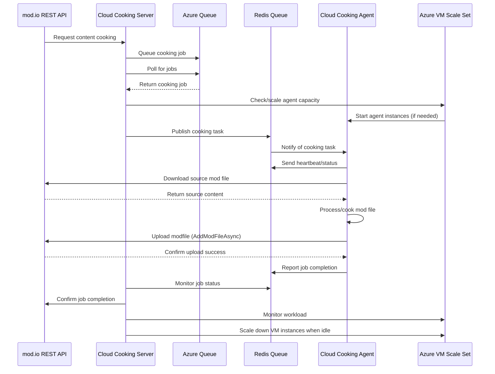

### How it works

The mod.io cloud cooking service is hosted inside Azure, with each customer having their own isolated resource group and network for security purposes. Below is a flow diagram that demonstrates how information flows from the mod.io REST API and between all of the individual components of the cloud cooking infrastructure.

The cloud cooking service will automatically scale the virtual machines up and down depending on the length of the job queue. If you find that your game's cook jobs are taking too long to get picked and processed, please reach out and we can work with you to modify these scaling parameters and rules.

:::note
Any logs or metrics related to agents, infrastructure etc are currently only available for mod.io staff. If you are interested in more insight into the performance of these components, please speak to your mod.io representative.
:::

