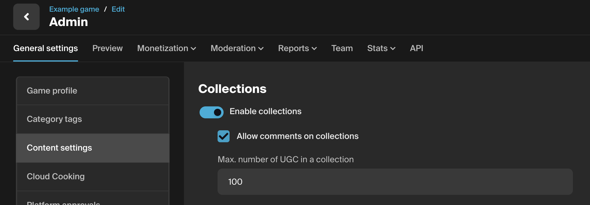
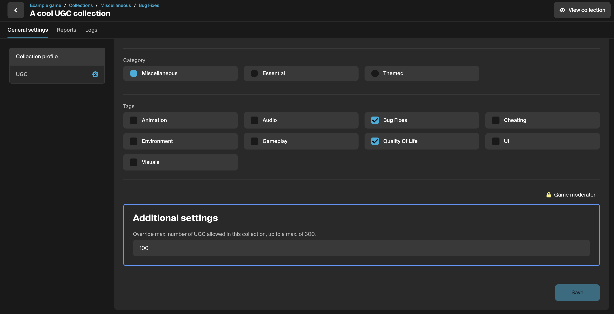
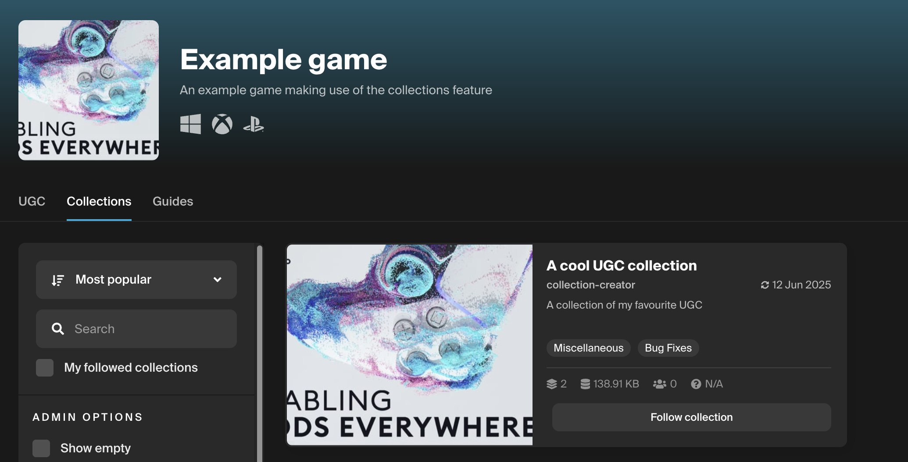
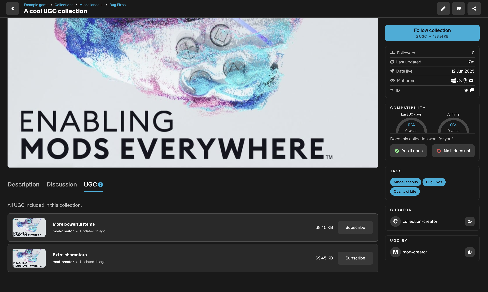

# Overview
Collections allow users to curate and organize their own lists of user-generated content (UGC) for players to discover and subscribe to. These collections are displayed on both the user's game profile and creator profile pages, making them easy to share. Users can follow a collection, and optionally subscribe to the UGC it contains.

## Features

Collections can be configured with the following settings:
* Can be enabled or disabled from the game admin content settings.
* Comments can be allowed or disallowed for collections added to your game.
* A UGC limit can be configured for your game to set a maximum limit for the number of UGC items that can be added into collections.
* The collection UGC limit can be overridden for selected collections from the collection settings dashboard. This setting is available to game administrators only, for any required special cases.

## Setup
Within your game's Admin Dashboard, you can manage collection settings via the Content Settings tab. Here, you have the ability to:

* Enable or disable collections.
* Allow or disallow comments on collections.
* Set a maximum limit for UGC items within a single collection.

## Additional settings
Users with moderation permissions for your game can allow a collection to exceed the game-wide UGC limit.
You can find the override setting for this in the collection admin dashboard via the Collection profile tab.

## How it works
When enabled, a Collections tab will appear on your game's mod.io profile page, allowing users to create and manage collections of UGC for your game directly on the mod.io website.

