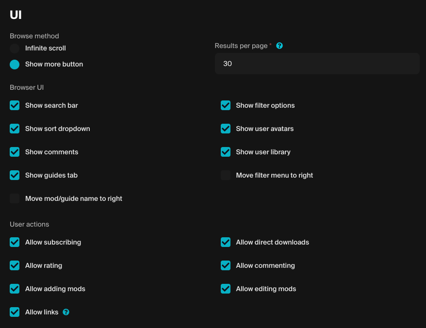

# Settings

## Visible when game is hidden

This checkbox will only appear if your game is not yet live. It must be checked in order for your Embed Hub to be accessible and previewable. Members of your game's team will be able to log in to view the hub.

## Allowed origins

In this section you must add the origins of the domains that will be embedding your Embed Hub. This is required in order to prevent unauthorized use of your Embed Hub. Enter your domains with the protocol but without any paths or query parameters. Eg. _https://example.com_.

## UI

Here you can customize various options such as:
* Allowed user actions within the Embed Hub
* Browse method and result limits for loading new content
* UI controls to match your desired use case.

## Authentication

You can choose whether your users log in to your Embed Hub using your studio/game's SSO or with their email. At least one option is required.

The minimum age is a required field and is shown as part of the mod.io terms agreement when logging in.

:::note
In order to use studio SSO, you must have configured this in your game's dashboard, as described [here](/authentication/website/).
:::

For other authentication methods initiated externally, see the [communication](../communication/) page.

## Agreements

This is an optional feature, which allows you to include a company name and up to three agreements to be displayed on the login popup for the Hub and accepted by the user upon logging in.
