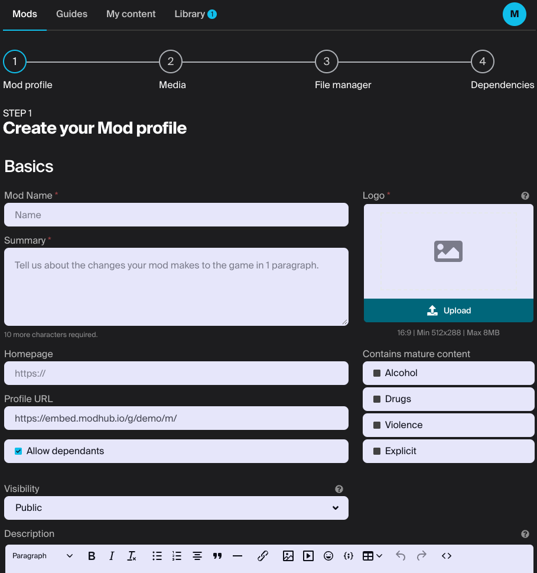
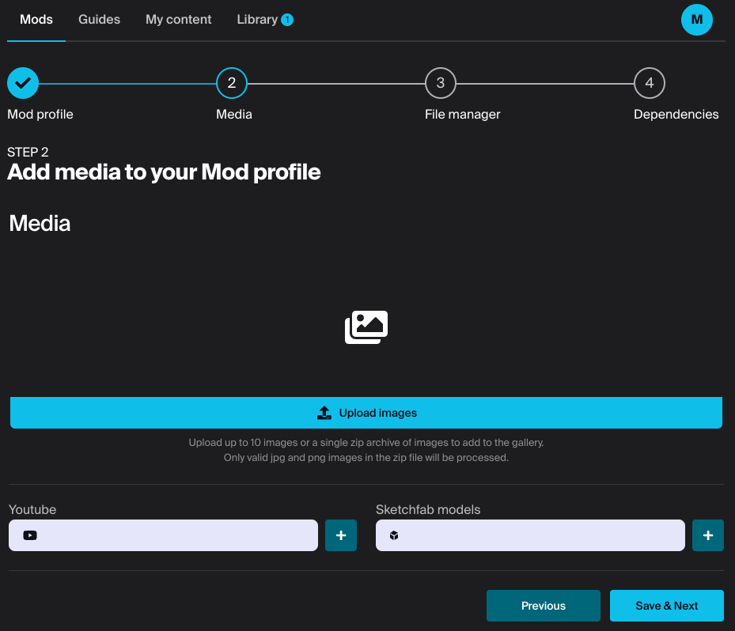
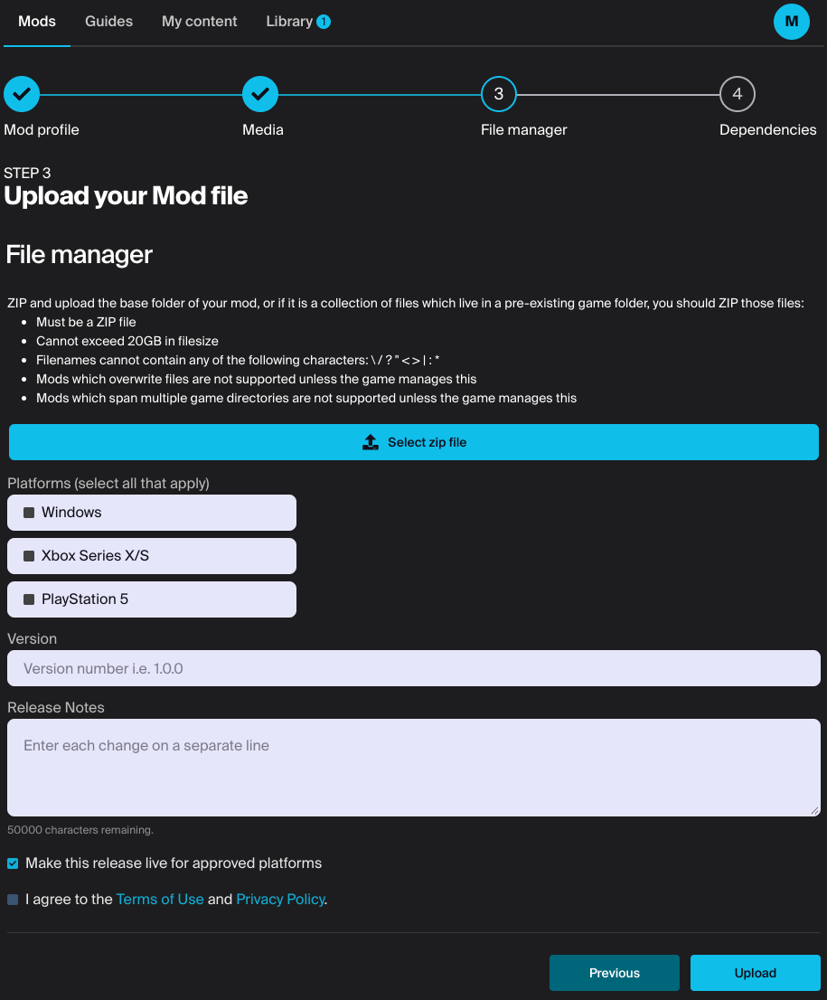
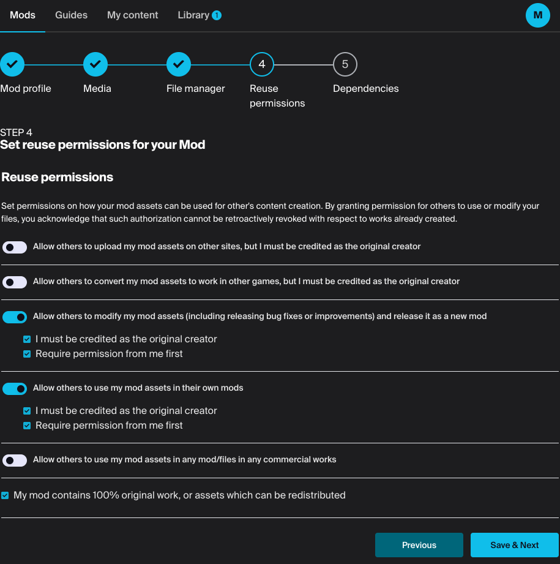
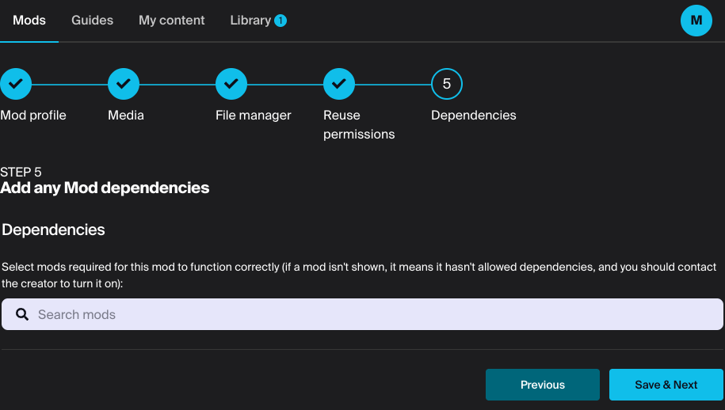

# Adding UGC through the Embeddable Hub

In addition to browsing content, users are able to add and edit UGC from within the Embeddable Hub. The [settings page](../settings) provides options to enable or disable this functionality.

:::note
The following pages can also be accessed after the creation process in order to update details or add/remove media or files.
:::

## Create your UGC profile

To get started, click the button in the top right corner of the UGC browse page. You will be presented with a form similar to the one below. Fill out the basic information for your UGC including its name, an image and summary, as well as any relevant tags. Save your changes when you are ready to proceed.

## Media

Here you can upload images or screenshots which showcase your UGC. You can provide a number of images in jpeg or png format, or upload a zip file containing your images. You can also add links to YouTube or SketchFab if you have them.

## File manager

On this page, it's time to add your UGC's file. Select a zip file to upload, paying attention to the maximum file size and file name restrictions. Select the platforms this UGC will target - if relevant to the game and then optionally provide a version ID and release notes.

## Reuse permissions (optional)

If enabled by the game, you have the option to set various permission that outline how other creators can use your content, and require credit or permission.

## Dependencies (optional)

If enabled by the game, you can specify other UGC that is required for your UGC to run properly. Users are prompted to subscribe to dependencies when subscribing to a piece of UGC.

## Wrapping up

With that complete, you will be redirected to your 'My content' page where you can view or edit all the UGC you have created.
