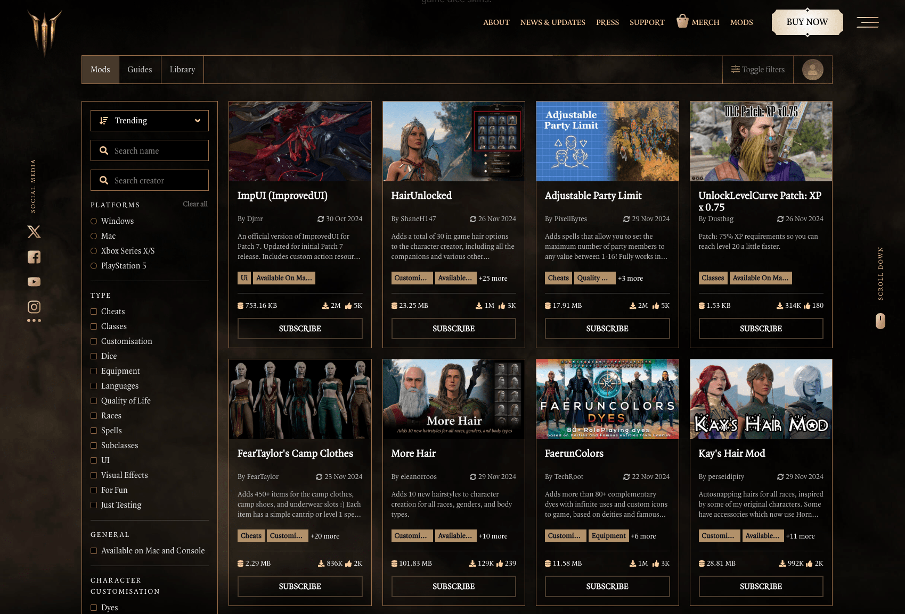
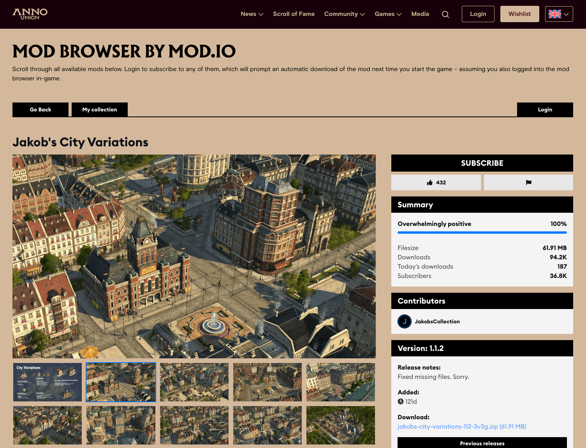

# Overview

The Embeddable Hub enables studios to embed the [mod.io](https://mod.io/g) browser into their own site or in-game. It is highly customizable, offering many style options and control over which features are enabled or disabled.

:::note
The Embeddable Hub is a premium feature. If you are interested in mod.io premium features, please contact developers@mod.io.
:::

## Setup

Once you've gained access to the Embeddable Hub, you'll find the settings in your game's Admin Dashboard. When you navigate to the page, you'll be prompted to set up a hub which takes a few minutes:

1. Name your hub and [configure the theme](https://docs.mod.io/embeddable-hub/theme/).
2. Adjust hub layout, enabled features and authentication method [via settings](https://docs.mod.io/embeddable-hub/settings/).
3. Make advanced changes by setting [custom CSS](https://docs.mod.io/embeddable-hub/custom-css/)
4. Copy the embed code or URL to [deploy the embed hub](https://docs.mod.io/embeddable-hub/deployment/).
5. Optional advanced features can be achieved by [communicating with the embed hub](https://docs.mod.io/embeddable-hub/communication/).

You can preview your hub at any time during the set up process. You can also create multiple hubs, if you want different designs for use in-game, on your homepage, corporate site, and launcher.

:::info
The mod.io team can be engaged to design the embed hub to match your homepage or style guide, and assist with advanced features such as SSO (single-sign on) support using your account system. If you are interested support, please contact developers@mod.io.
:::

## Demonstration

### On the Web

You can see a live example of the Embeddable Hub running on the [Baldur's Gate 3](https://baldursgate3.game/mods#/) official homepage. It shows the level of customization possible, to match the look and feel of the Baldur's Gate 3 site, and also uses Larian Accounts to sign in.

Another example is [Anno 1800](https://www.anno-union.com/mods/), a Ubisoft game.

### In-game

The Emdeddable Hub can also be used as an in-game UI or overlay for browsing and managing a user's UGC collection. The [Javascript API](../communication#javascript-api) can be used to communicate between the game client and the web UI. The Anno 1800 team also used the Embeddable Hub as their in-game UI, embedding it natively using the [Ultralight](https://ultralig.ht/) plugin, an HTML renderer. You can view the hub in your [browser here](https://anno1800.modhub.io/) and see how it looks in-game in the video below.

<video width="100%" height="auto" controls poster="/video/embeddable_hub_demo_anno_1800_poster.jpg">
  <source src="/video/embeddable_hub_demo_anno_1800.mp4" type="video/mp4" />
</video>
