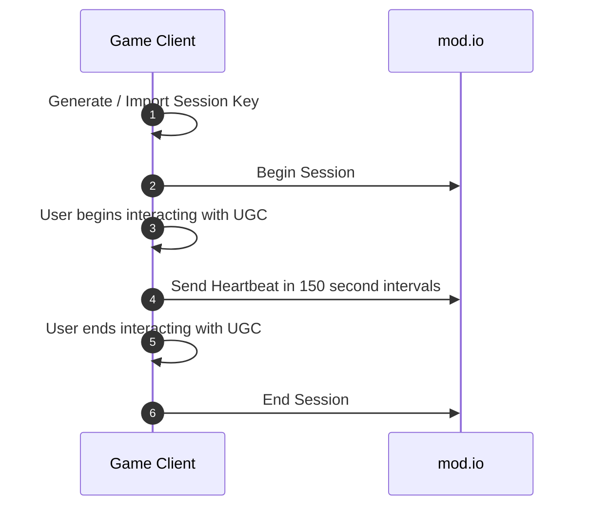
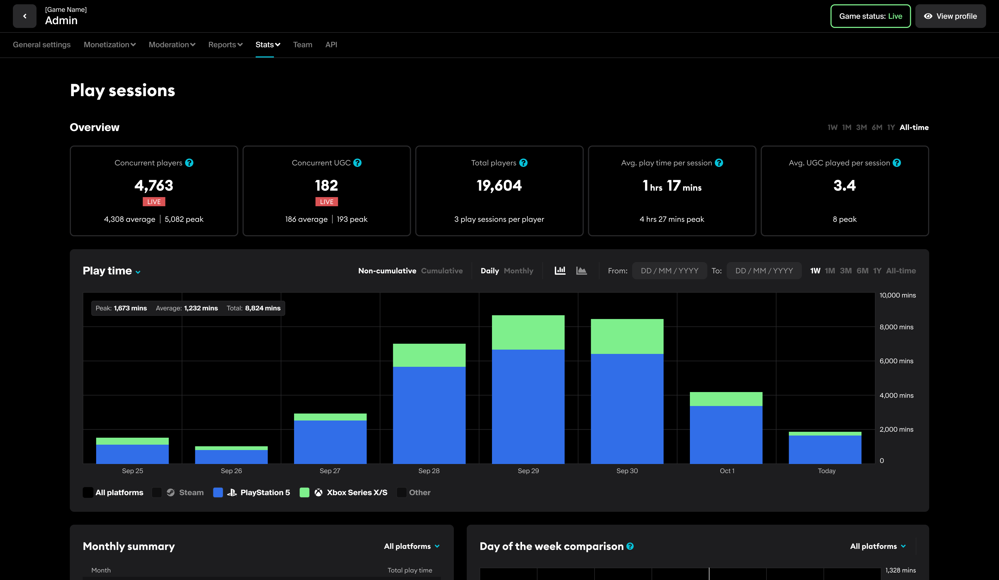

# Playtime Insights: Metrics Sessions

With Metrics Sessions, mod.io provides the ability for game studios & publishers to capture & analyze live data from your game to gain insights into how players are interacting with user-generated content within your title(s). Out of the box, the following insights are available: 

- Concurrent Players (CCU)
- Concurrent UGC
- Total Players
- Average Playtime per session
- Average UGC interacted with per session

:::info
Please note that Player Insights is a premium feature. If you are interested in accessing premium features via your games dashboard, please contact developers@mod.io.
:::

## Getting Started

Once you have enabled Playtime Insights: Metric Sessions via the Premium Features dashboard, you are ready to start implementing the feature. For the rest of this document we will be focusing on the REST API implementation of the feature if your game has not integrated our plugins. 

## SDK Support

If you are using the mod.io [Unreal Engine](https://docs.mod.io/unreal/getting-started/#metrics-play-sessions) / [C++ SDK](https://docs.mod.io/cppsdk/getting-started/metrics-play-sessions) or [Unity plugin](https://docs.mod.io/unity/getting-started/#metrics-play-sessions), this is an implemented feature and it is strongly recommended you use the functionality via the plugins as it abstracts away implementation complexity such as building the session hash.

## Capture Process

To capture insights, there are three steps that your game client must make:

1. Start the session
2. Periodically send a heartbeat whilst the session is active.
3. End the session.

See the diagram below for a typical session to demonstrate how a playtime session would be started, maintained and subsequently closed:



1. Game client generates or imports a unique session key.
2. Game client calls mod.io to [begin the session](#starting-the-session).
3. The user begins to interact with UGC within your game client.
4. Game client sends a [session heartbeat](#sending-heartbeats) request every 150 seconds to mod.io.
5. The user ceases interacting with UGC within your game client.
6. Game client sends a [session end](#ending-the-session) request to mod.io.

### Obtaining your metrics key

Once the feature has been enabled, you can find your _metrics key_ to include in your game client via the following steps:

1. Navigate to your game profile on mod.io
2. Click the admin button (pencil icon) in the top-right corner. If this is not visible please ensure you are logged into mod.io and a member of the game team.
3. Navigate to the _API_ tab.
4. Click the 'Generate a new key' button under the _Metrics Secret Key_ heading. If you cannot see the _Metrics Secret Key_ section, please ensure you have enabled the Playtime Insights premium feature.

### Building the session hash

To guarantee integrity, we require game clients to generate a session hash to be included on every Metrics Sessions HTTP request to mod.io. If you are using our plugins or SDK's, this is already done for you. In the event you are consuming our RESTAPI you must generate the hash yourself within your game client.

To build the hash, you only need to concatenate values together, in the order shown below, without any whitespace or padding between each fragment of data. 

Order of values to be concatenated:

1. Mod ID(s) included in the session.
2. Unix timestamp of the point in time you are building the hash.
3. The Session ID.
4. The Session Nonce.

Once all the values have been concatenated into a string, you must then hash the string using the HMAC-SHA256 algorithm with your [metrics key](#obtaining-your-metrics-key) to generate the `session_hash` parameter to include in requests.

#### Pseudocode Example

```
session_id: “bf7a0136-0087-4a77-8f10-d1f57089770a”
ids: [1,2,3,4,5],
session_ts: “1721714604802”
session_nonce: “13d7b51e-4183-4390-8c4e-cb028027ff9a”

concatenated_string: “1,2,3,4,51721714604802bf7a0136-0087-4a77-8f10-d1f57089770a13d7b51e-4183-4390-8c4e-cb028027ff9a”
secret: “982dcdd0-3802-4f1f-87b0-e32b06481f27”

// Assuming the hmac_sha256 function accepts your metrics secret key as the first argument and your string to be hashed as the second argument.
hmac_sha256(secret, concatenated_string)
// Output: “ffb0e4d9504f791a2484bce797e3c8d529d48461d30fe33ce54b11823f02793b”
```

### Starting the session

#### Request

`POST https://g-{your-game-id}.modapi.io/v1/metrics/sessions/start`

##### Headers

Header|Type|Required|Description
---|---|---|---|
Authorization|string|true|The access token of the authenticated user.
X-Modio-Platform|string|false|The [platform](https://docs.mod.io/restapiref/#targeting-a-platform) the session is originating from, highly recommended to enrich the fidelity of the session data captured.
X-Modio-Portal|string|false|The [portal](https://docs.mod.io/restapiref/#targeting-a-portal) the session is originating from. Highly recommended.

##### Path Parameters

Parameter|Type|Required|Description
---|---|---|---|
session_id|string|true|A identifier generated by the game client to uniquely fingerprint a session, whilst not enforced a GUID / UUID is strongly recommended.
ids|array|true|ID's of all the mods associated with the session.
session_ts|string|true|Unix timestamp of when the session begun.
session_hash|string|true|HMAC-SHA256 generated by the game client to enforce data integrity. See [building the session hash](#building-the-session-hash).
session_nonce|string|true|A nonce of no convention generated by the game client.
session_order_id|integer|true|An indicator of where this request belongs parsing of this session. This should always begin at 1 and increase incrementally until the session is terminated.

```
POST https://g-{your-game-id}.modapi.io/v1/metrics/sessions/start HTTP/1.1
Content-Type: application/json
Accept: application/json
Authorization: Bearer {access-token}

{
    "ids": [238219, 674839],
    "session_id": "a4c3fabb-d8e9-4e31-be1e-b5c397f2447a",
    "session_ts": 1727094362,
    "session_hash": "c30809b9ae978a44108cfe009a70c2b0ea8dccfdf64bc7fc7b1fa5124a6c6fe3",
    "session_nonce": "xUXCFDlz8C9RqeFhzU",
    "session_order_id": 1
}
```

#### Response

```json
204 No Content
```

### Sending Heartbeats

#### Request

`POST https://g-{your-game-id}.modapi.io/v1/metrics/sessions/heartbeat`

##### Headers

Header|Type|Required|Description
---|---|---|---|
Authorization|string|true|The access token of the authenticated user.
X-Modio-Platform|string|false|The [platform](https://docs.mod.io/restapiref/#targeting-a-platform) the session is originating from, highly recommended to enrich the fidelity of the session data captured.
X-Modio-Portal|string|false|The [portal](https://docs.mod.io/restapiref/#targeting-a-portal) the session is originating from. Highly recommended.

##### Path Parameters

Parameter|Type|Required|Description
---|---|---|---|
session_id|string|true|A identifier generated by the game client to uniquely fingerprint a session, whilst not enforced a GUID / UUID is strongly recommended.
session_ts|string|true|Unix timestamp of when the heartbeat was sent.
session_hash|string|true|HMAC-SHA256 generated by the game client to enforce data integrity. See [building the session hash](#building-the-session-hash).
session_nonce|string|true|A nonce of no convention generated by the game client.
session_order_id|integer|true|An indicator of where this request belongs parsing of this session. For heartbeats, this should always begin at 2 and increase incrementally until the session is terminated.

```
POST https://g-{your-game-id}.modapi.io/v1/metrics/sessions/heartbeat HTTP/1.1
Content-Type: application/json
Accept: application/json
Authorization: Bearer {access-token}

{
    "session_id": "a4c3fabb-d8e9-4e31-be1e-b5c397f2447a",
    "session_ts": 1727094362,
    "session_hash": "c30809b9ae978a44108cfe009a70c2b0ea8dccfdf64bc7fc7b1fa5124a6c6fe3",
    "session_nonce": "xUXCFDlz8C9RqeFhzU",
    "session_order_id": 2
}
```

#### Response

```json
204 No Content
```

### Ending the session

#### Request

`POST https://g-{your-game-id}.modapi.io/v1/metrics/sessions/end`

##### Headers

Header|Type|Required|Description
---|---|---|---|
Authorization|string|true|The access token of the authenticated user.
X-Modio-Platform|string|false|The [platform](https://docs.mod.io/restapiref/#targeting-a-platform) the session is originating from, highly recommended to enrich the fidelity of the session data captured.
X-Modio-Portal|string|false|The [portal](https://docs.mod.io/restapiref/#targeting-a-portal) the session is originating from. Highly recommended.

##### Path Parameters

Parameter|Type|Required|Description
---|---|---|---|
session_id|string|true|A identifier generated by the game client to uniquely fingerprint a session, whilst not enforced a GUID / UUID is strongly recommended.
session_ts|string|true|Unix timestamp of when the session ended.
session_hash|string|true|HMAC-SHA256 generated by the game client to enforce data integrity. See [building the session hash](#building-the-session-hash).
session_nonce|string|true|A nonce of no convention generated by the game client.
session_order_id|integer|true|An indicator of where this request belongs parsing of this session. This should be the highest value of the Session Order ID your application has been building for the duration of the session.

```
POST https://g-{your-game-id}.modapi.io/v1/metrics/sessions/end HTTP/1.1
Content-Type: application/json
Accept: application/json
Authorization: Bearer {access-token}

{
    "session_id": "a4c3fabb-d8e9-4e31-be1e-b5c397f2447a",
    "session_ts": 1727094362,
    "session_hash": "c30809b9ae978a44108cfe009a70c2b0ea8dccfdf64bc7fc7b1fa5124a6c6fe3",
    "session_nonce": "xUXCFDlz8C9RqeFhzU"
    "session_order_id": 8
}
```

#### Response

```json
204 No Content
```

## Handling Errors

See [Error Responses](https://docs.mod.io/restapiref/#errors) documentation.

## Viewing Insights

Now that all the plumbing has been established and your game is live, you can then view your Session data via the _Playtime Insights_ dashboard!

1. Navigate to your game profile on mod.io
2. Click the stats button (chart icon) in the top-right corner. If this is not visible please ensure you are logged into mod.io and a member of the game team.
4. Under the _Stats_ tab, click _Player Insights_ from the dropdown.



## Exporting your data

The insights that you see are able to be exported by clicking the _Export Data_ button in the top-right corner of the Player Insights Dashboard. 

Please note however that the data export is an opinionated representation of what is displayed on the dashboard and in the future we intend on enabling the automatic pushing of playtime metrics ingested by mod.io to your S3 datastore under your control in [Parquet](https://parquet.apache.org/) format. Such functionality allows you to leverage mod.io for the Player Insight Dashboards whilst giving you optionality to dive deeper into the data to gain insights your studio deems valuable. 

If data exporting to an S3-compatible interface is a priority for your team please [reach out to us](mailto:developers@mod.io?Playtime%20Insights%20-%20Export%20Enquiry).

## Recommendations

- To get the most valuable insights possible from your integration, mod.io **strongly recommends** ensuring that your implementation is passing the `X-Modio-Platform` and the `X-Modio-Portal` request headers to observe granular insights and correlate platforms and store's to playtime metrics.
    - [Platform Header Documentation](https://docs.mod.io/restapiref/#targeting-a-platform)
    - [Portal Header Documentation](https://docs.mod.io/restapiref/#targeting-a-portal)