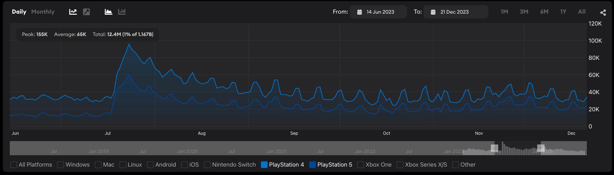
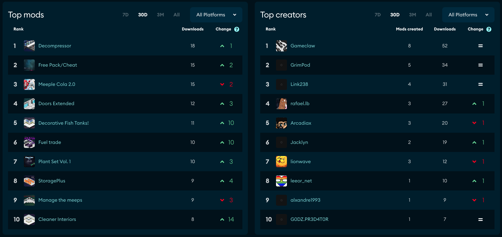
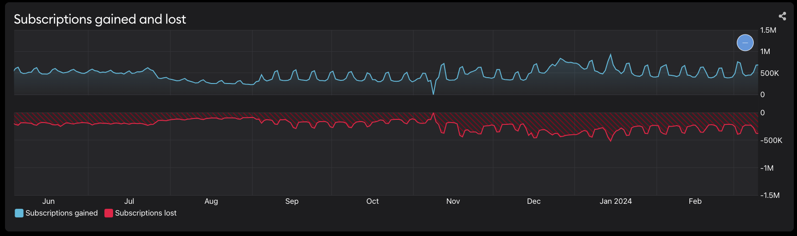

# UGC Metrics

The UGC dashboard reports six data sources:

* Downloads
* Subscriptions
* UGC added
* UGC updated
* Files added
* Bandwidth

## Downloads

‘Downloads’ measure the number of times UGC has been downloaded for your game in the selected time period. This number is simply the sum of all download events for UGC in your game from all sources, including the in-game browser and the mod.io website, from both authenticated and unauthenticated users. 

Downloads have the additional dimensions of platform and location. 

### Trending UGC

When ‘Downloads’ is selected as the data source for the UGC dashboard, you will be able to see the most popular UGC and creators in the last week, month, three months and all time. Additionally, you can also see how much the UGC and creator rankings within the top 100 have changed in the selected time period. This gives you insights on not just what are the most popular UGC and creators, but which have experienced the most recent growth, giving a more accurate picture of what is popular right now. 

Trending UGC and creators have the additional dimension of platform. 

## Subscriptions

‘Subscriptions’ measure the current number of subscribers. When a player wants to download a UGC from the in-game browser, they subscribe to it, which then triggers a download. Therefore, subscriptions are closely correlated with downloads. However, there are two important differences.

First, subscriptions are calculated per player, so will not show if a player downloads a UGC more than once. For example, if the same UGC is updated, and the player downloads it again to get the latest version, the subscription number will not change, since they stay subscribed. 

Second, subscriptions is the net total of subscriptions minus unsubscriptions. Therefore, total subscriptions may not always increase if UGC in your game is getting more unsubscribes. To help visualise this, subscriptions has a positive and negative subscriptions graph:

Subscriptions have the additional dimensions of platform and location. 

## UGC Added

‘UGC added’ measures the number of UGC uploaded to mod.io by your game’s creators. UGC added increases every time a creator uploads a new UGC, but not when they add different versions of the same UGC. Tracking this metric is a great way to see how active your UGC community is. 

UGC added does not have additional dimensions. 

## UGC Updated

‘UGC updated’ increases whenever a creator edits their UGC. For example, both editing the description as well as uploading a new version will increase the UGC updated count. 

UGC updated does not have additional dimensions. 

## Files Added

‘Files added’ increases every time a creator adds a new file. This can be combined with ‘UGC added’ to calculate how many files on average each UGC has. It can also be subtracted from ‘UGC updated’ to calculate how many updates are the result of uploading new versions of a UGC, vs just updating the description. 

Files added does not have additional dimensions. 

## Bandwidth

‘Bandwidth’ measures the calculation of ‘Downloads’ multiplied by file size. Bandwidth has the additional dimensions of platform and location. 