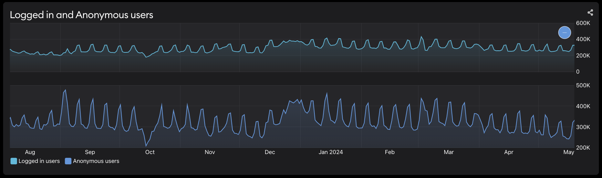

# User Activity Data

The User Activity dashboard reports five data sources:

* Active users
* UGC comments
* Guide comments
* Creators joined
* API key requests

### Active Users

‘Active users’ measures the number of unique users viewing or accessing your game’s UGC through all sources, including your in-game browser, the mod.io website and any embeddable hub on your website that  connects to mod.io. Active users is the total of authenticated users plus unauthenticated users. An additional graph demonstrates this visually:

The active user count is deduped by user ID (for authenticated users) or IP address (for unauthenticated users) to ensure the count is of unique users within the chosen time period. For example, when viewing daily active users, as in the graph above, the same user ID will only be counted once in a single 24 hour period. When viewing monthly active users, the same user ID will only be counted once in that calendar month. 

:::note
Due to the uncertainty of measuring users by IP address, ensuring players are authenticated in your mod.io implementation will give more accurate active user counts.
:::

Active users have the additional dimensions of platform and location. 

### UGC Comments

‘UGC comments’ measures the total number of comments that players leave on UGC in your game. This metric does not have additional dimensions. 

### Guide Comments

‘Guide comments’ measures the total number of comments that players leave on guides for your game. This metric does not have additional dimensions. 

### Creators Joined

‘Creators joined’ measures the number of creators who have uploaded UGC for your game. Each creator is only counted once. This metric does not have additional dimensions. 

### API Key Requests

‘API key requests’ measures the total number of API key requests your game makes to the mod.io API. This will usually correlate with with active users. API key requests has the additional dimensions of platform and location. 
