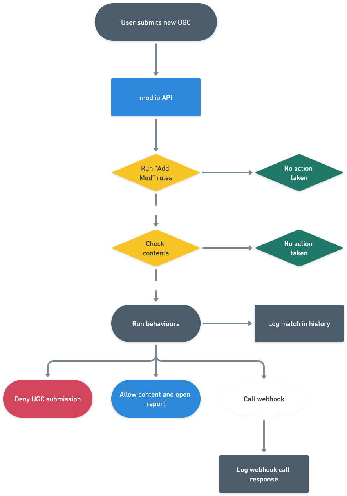
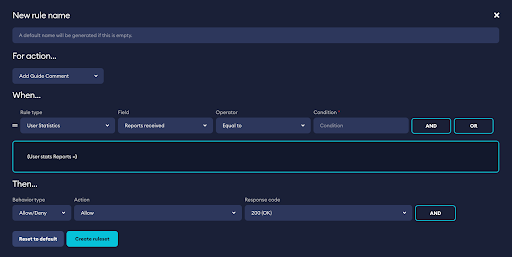

# Setup

The Rules Engine works by automatically running all content submitted through a series of checks defined by you. If the checks match, then action(s) will be taken, as defined by you. Content can match multiple rules and run multiple actions, unless it encounters a Deny which will return an error to the user and stop processing further rules.

This applied to a game, impacts the outcome of user behaviors. Example being, a user who submits a piece of UGC which is declined due to a rule, won’t be able to submit this piece of content. They will receive an error message explaining the reason for the content being refused submission. Collectively, all of the rules you define are grouped as rulesets under each of the actions (endpoints) they are targeting. Get started by following the instructions in Creating a Rule. Active rules you have created can be enabled or disabled, and you can view the last 24 hours of history which is explained in Monitoring Rules.

## Creating a Rule

The four parts to every rule are:

1. Name of rule - So you can identify it in your logs.
2. For action - What user action (endpoint) is this rule monitoring (i.e. Add Mod, Post Comment, Edit Guide).
3. When - What series of checks need to match, for the rule to take effect.
4. Then - The behaviors and actions which run on a match (i.e. Allow / Deny, Open a Report, Call a Webhook).



### Name of Rule

Explain the purpose of the rule, so it’s easy to identify in logs, particularly if you have a lot of rules.

### For action

What user action is this rule monitoring. Each of these actions match with endpoints from the mod.io REST API.

| Action / Endpoint | Explanation |
|--------------|-------|
| Add Mod | When a user creates a new mod profile (name, description, preview image, settings, tags) |
| Edit Mod | When a user edits an existing mod profile (name, description, preview image, settings, tags) |
| Add Mod Media | When a user updates their mods preview image, or adds screenshots or links to Youtube or Sketchfab |
| Add Mod Tags | When a user adds or removes tags connected to their mod |
| Add Mod KVP Metadata | When a user adds or removes metadata (organized in key value pairs) connected to their mod |
| Add Mod Dependencies | When a user adds or removes dependencies on other mods |
| Add Modfile | When a user adds a new file (release) to their mod |
| Add Mod Comment | When a user comments on a mod |
| Edit Mod Comment | When a user edits an existing comment on a mod |
| Add Guide | When a user publishes a guide |
| Edit Guide | When a user edits a published guide |
| Add Guide Comment | When a user comments on a guide |
| Edit Guide Comment | When a user edits an existing comment on a guide |

:::note
Add Modfile is an important action, because if you have “No Curation” enabled in your games settings, the mod will automatically go live once the first modfile is submitted.
:::

### When

This is the complex part, where you define the check(s) a rule needs to pass, which will determine if the “Then” behaviors get executed.  Many checks can be chained together using a series of AND and ORs. For example if you have a spam issue originating from new user accounts posting links, you might write a rule which checks if the users Account Age (in hours) is < 24 AND if the payload contents indicate their post contains a URL.

When you select any of these fields, you have to pick the operator and define the condition which determines if there is a match. For example you may have received a DMCA takedown from a particular brand, i.e. “ACMECO”. To catch future submissions, you could setup a rule similar to:

* __For Action:__ Add Mod
* __When:__ Payload -> Name -> Contains -> ACMECO
* __Then:__ Open Report

See Operators and Conditions for a more detailed explanation of their usage.


#### Payload

Check the contents of the data being submitted by the user. The fields available to check depend on the action selected. For example if you are checking the “Add Mod” action, the contents will be the mods Name, Description, Tags etc, but if you are watching the “Add Mod Comment” action, the contents will be the comment. 

:::note 
If the content being submitted is connected to a game, UGC or guide, you can also check the connected profiles contents as well.
:::

#### Request 

Request header's (HTTP headers which can be used to determine where the request is coming from) include:
* User-Agent
* Content-Type
* Content-Length
* X-Modio-Portal (Apple, Xbox Live etc)
* X-Modio-Platform (Windows, PS4, PS5 etc)
* X-Modio-Origin (web indicates mod.io site)
* X-Forwarded-For

#### User

If problematic content is originating from users from certain countries, or new user accounts, you can use these fields to target the rule:

* Country
* Team Access Level (set to “Any” if you want game admins to be exempt)
* Account Age (hours)
* Username
* Email
* Name ID
* IP address

#### User Statistics

Target rules against a users reputation and connected accounts. For example a user with many UGC created is likely to be trusted. User statistics include:

* Reports Received
* Mods Uploaded
* Guides Created
* Comments Posted
* Connected Accounts (you could require users have connected a certain account before doing actions using this check for example)

### Then

Finally, after all of the checks above are complete, if they evaluate to __TRUE__, this is where you define the behavior(s) that should be performed in response.

#### Allow / Deny

Deny will return an error to the user (which you define), and will prevent their request from being processed, as well as any further behaviors from being invoked. Errors will be returned as an [Error Object](https://docs.mod.io/restapiref/#error-object), with [Error Ref of 29200](/api/error-codes/) and the response code you specify. This is an example:

```
{"error":{"code":403,"error_ref":29200,"message":"Your error message goes here."}}
```

Allow results in no action, but can be useful to log and monitor matching requests from users (note: logs only persist for 24 hours).

#### Open a Report
This action doesn’t stop the content from being processed, but will result in a Report being automatically generated and assigned to the content, which will show up in your games dashboard for your admins to check.

#### Webhook

This action doesn’t stop the content from being processed, but it will result in the URL endpoint you define being sent information automatically about the request. This can be used to connect any AI, CRM, communication, file, content or malware vendor you are using. For example if you are using Two Hat for content moderation, you could plug them in here. If you are using JIRA or  Zendesk for CRM / support, you could plug them in here to automatically open a ticket.

See [Webhooks](/moderation/rules-engine/webhooks/) for details on how to use this advanced feature.



_UI for creating a rule looks like this on your games dashboard_

## Operators and Conditions

Operators and conditions are what determine if the content being checked matches what you are looking for. These can be numeric checks, string checks or fixed checks.

### Numeric Checks

These are all checks applicable to numeric fields, to determine if the number is within the range you expect. For example, to check a user's Account Age (hours) is within the first day, you would use “Less than 24”. Numeric checks include:

* Equal to
* Not equal to
* Greater than
* Less than
* Greater than or equal to
* Less than or equal to

### String Checks

These are all checks applicable to textual fields, to determine if the text contains what you would expect. As Regular Expression is the most powerful and also the most complex to use, it is explained below. Be aware that all checks are case insensitive so “Hello World” will match “hello world” or “HELLO WORLD”. For example, to check if a user has included the word “SPAM”, you would use “Contains SPAM”.

String checks include:

* Equal to
* Not equal to
* Contains
* Does not contain
* Matches regular expression
* Does not match regular expression

### Fixed Checks

Some fields like “Country” have a fixed set of values. In these instances you pick the options from the dropdown provided.

## Regular Expression

When checking textual content, advanced pattern matching can be achieved using regular expressions. All regular expressions should follow the syntax supported by Javascript, [explained in detail here](https://developer.mozilla.org/en-US/docs/Web/JavaScript/Guide/Regular_expressions/Cheatsheet) (or refer to this handy [cheat sheet](https://cheatography.com/davechild/cheat-sheets/regular-expressions/)). Note that string replacement and pattern modifiers are not supported. Basic examples of different regular expressions are provided below.

All regular expression checks should begin and end with `//`, and any metacharacters like `[](){}.*+?|<>\/` will likely need to be escaped by `\`. We recommend you use [Regex101](https://regex101.com/) to test your regular expression rules. 

For example:

* Detect email: `/\S+@\S+\.\S+/`
* Detect URL: `/https?:\/\/(?:www\.)?[-a-zA-Z0-9@:%._+~#=]{1,256}\.[a-zA-Z0-9()]{1,6}/` 
* Detect any of the words separated by `|`: `/(hello|world|foo|bar)/`