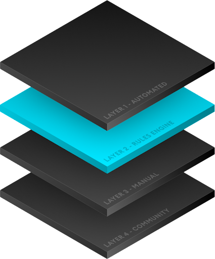

# Rules Engine

The Rules Engine is a powerful tool that can enable you to effectively manage high volumes of UGC content, in a fully automated manner.  It is:

* Proactive - Run automated actions based on user activity
* Flexible - Approve or deny content, or log and hold for review
* Smart - Connect any AI, file, content or malware vendor to run checks
* Efficient - Observe and deploy rules instantly, no development required
* 24/7 monitoring - Runs around the clock, view outcomes in real time

It forms one layer of our four layer moderation system, all of which are configured and managed via your games admin dashboard.

Together, the four layers combine to give you 100% coverage and control over UGC appearing in your game. The goal is to automate the approval of as much content as possible with minimized human intervention, no matter how strict or sensitive your content safety requirements are.

