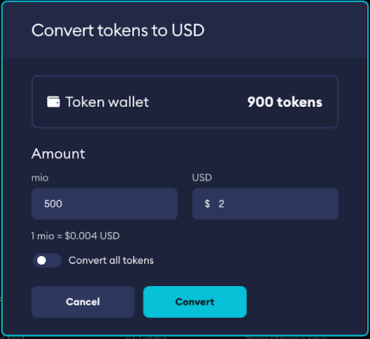
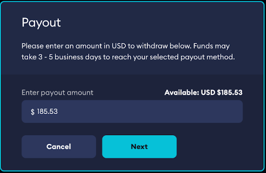

# Earnings and Payouts

## Virtual Currency Credit Conversion

Any earnings received as part of a sale of premium UGC transactions will be earned as virtual currency credits. Credits received are held for 30 days from the time of transaction, this is to account for any potential refund. If a piece of content was purchased on external platforms, then credits are held until the [Invoice is paid](/monetization/invoices/) by the studio or publisher.

Once credits are available, you are able to convert these credits to your USD wallet through your Game Admin Dashboard (if you onboarded via KYB) or through your Account (if you onboarded via KYC).

Credits convert at a fixed rate of USD$0.004 per credit as explained in [How it Works](/monetization/how-it-works/). Once a credit is converted to USD it will be available to be paid out from your account.

:::note
Available credits can be converted at any time to USD.
:::

## Payouts

If you have onboarded your game through KYB, any funds marked as available in your USD wallet will be paid out automatically every month via wire transfer by our payment partner, Tilia.

A representative from Tilia will reach out to the Financial Contact marked in your Monetization Settings to obtain the information needed.

You will be able to see your balance at any time through your Game Admin dashboard on mod.io.

If you have onboarded your game through KYC, you will be able to see your balance through your Account on mod.io.

:::note
Available and any pending balances are visible on your dashboard.
:::

Additionally, you will be able to request funds to be paid out to a PayPal account of your choosing through an integrated payout process. Additional payout methods will be available in the near future.

:::note
You are able to cash out any available USD funds to a specified PayPal account.
:::