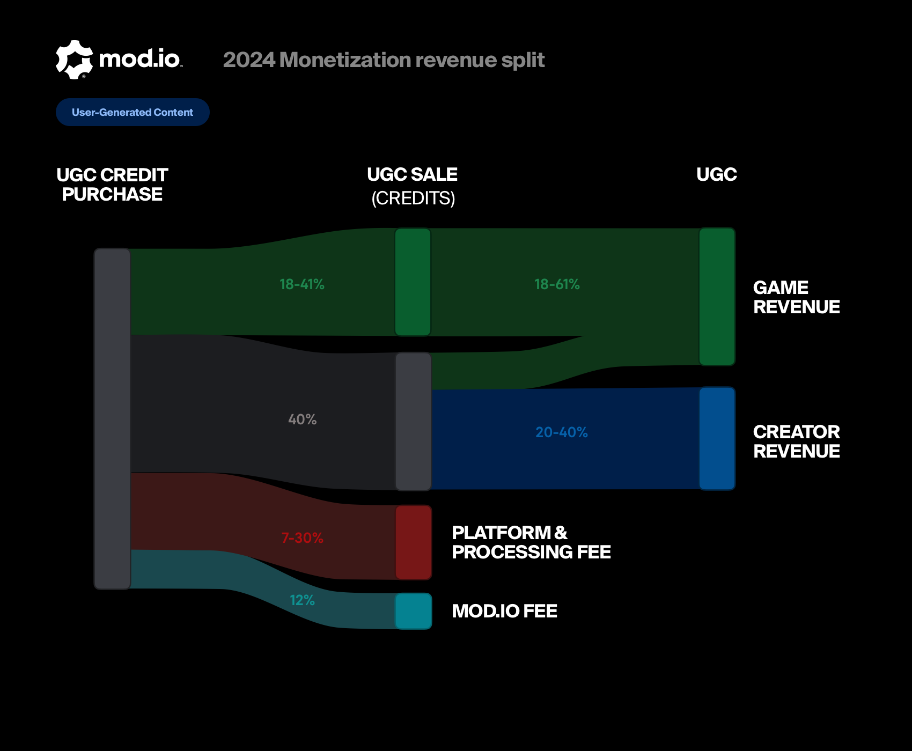
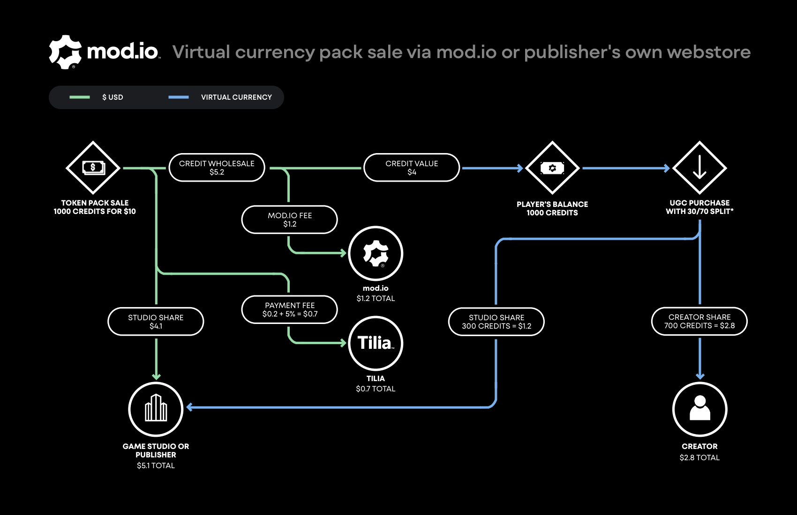
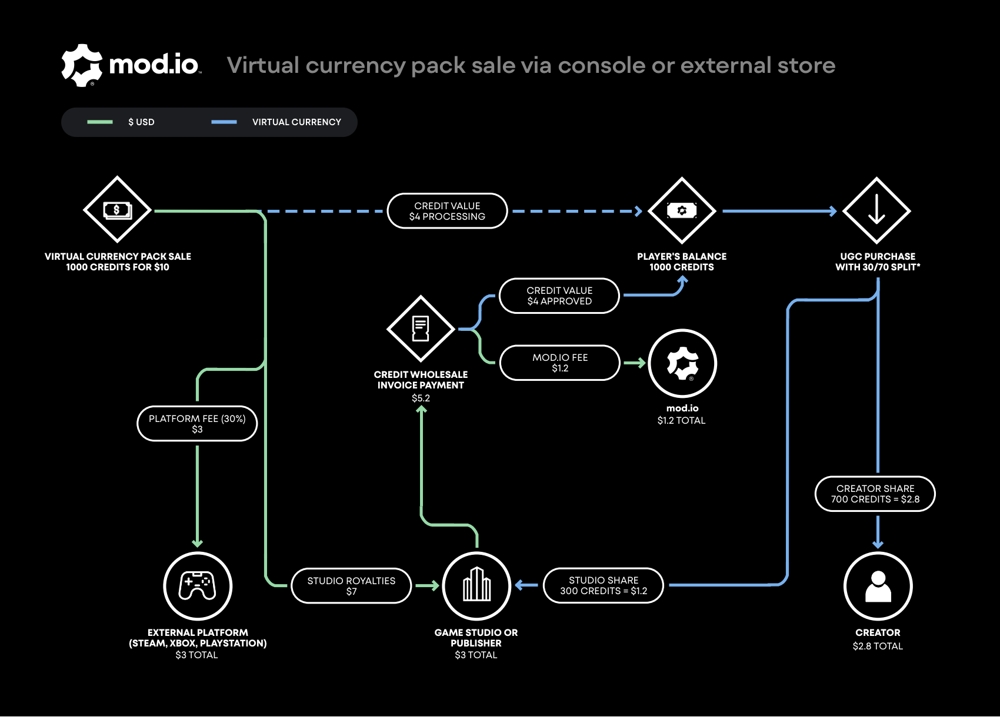

# How it Works

Our system is built to support cross-platform payments on web, in-game and console, allowing content creators and studios or publishers to earn revenue no matter where the purchase is made.

Players are able to purchase Virtual Currency Packs, either directly through your game page on mod.io or any platform you wish to make this available on (PC storefronts, console stores, or your own). Players can then use this currency to purchase premium UGC, the currency is paid to creators and the game publisher, in the form of credits, based on the revenue split you set in the [Monetization settings](/monetization/onboarding/#monetization-settings).

## Wholesale Virtuazl Currency Price and Fees

Virtual Currency Packs are sold at a price of USD$0.01 per-credit, so $1 for 100, on which we charge a fixed wholesale rate of USD$0.0052 per-credit which covers our fee and payouts to creators which we manage for you. The remaining USD$0.0048 per-credit goes to the game publisher after payment processor fees are applied.

### Detailed Breakdown

When $1 is spent to purchase 100 credits, and this virtual currency is then used to purchase a piece of content:

* USD$0.48 (48%) is used to cover the payment processor fee (e.g. Steam, PlayStation™Store, Xbox, iOS, Android, or Tilia on Web), and the remainder is profit for the game studio
* USD$0.52 (52%) is used to cover the fixed wholesale rate of the virtual currency, broken down as follows:
    - USD$0.4 (40%) is allocated to the virtual currency earnings pool (i.e. the Marketplace economy)
        - When these 100 credits are spent, the default is for 70% of the currency to go to the creator, and 30% go to the studio (this split can be adjusted in your dashboard)
    - USD$0.12 (12%) is charged as a fee by mod.io

A studio can expect a 20% to 61% share of the revenue from UGC sales, depending on the payment processor fee, and the revenue split configured. Creators can expect from 40% to 20%. Standards for creators’ payouts vary, but the industry norm from games like Roblox and Counter-Strike 2 is established around 25%.

### Fees

For sales happening on the mod.io platform, the fees described above are applied directly, and the game publisher receives their share of the revenue immediately.

However, sales made through external platforms (e.g. Steam, PlayStation Store, iOS) are paid as royalties directly to the studio; in that case, mod.io’s fee is paid by the publisher retroactively with a monthly invoice (see details below).

mod.io's fee is always a fixed $0.0012 per credit, taken from the virtual currency wholesale rate.

Our payment processing partner; Tilia’s fees are 5% plus $0.20 for transactions made directly through the mod.io web app.

### Invoices

Invoices will be issued at the start of the next calendar month for all virtual currency purchased on external platforms during the previous month. Because proceeds from sales on external platforms go directly to the game studio, we need to invoice back our fee and the value of the virtual currency in the Marketplace. Virtual currency is charged at the wholesale virtual currency price, which is $0.0052 for every credit sold.

## Examples

Here are some more detailed examples and illustrations of both sales originating from the mod.io web app, and sales originating from external platforms.

### Sales originating from mod.io web app

Player purchases virtual currency directly on mod.io (or using our web site or embedded web app). The price is $0.01 per credit. In this example, we’ll assume the sale of a currency pack of 1000 credits for $10.

From there Tilia will charge their fee, which is 5% of the total amount + $0.20 flat fee for each transaction. In this example, Tilia's fee is $0.7, leaving $9.3. 

We charge the virtual currency wholesale amount ($0.0052 per credit sold). The virtual currency wholesale amount covers mod.io's fee, and the value of the currency in the economy.

Mod.io gets $0.0012 per credit of the wholesale amount. In this case, this would be $1.2. The virtual currency pool gets $0.004 per credit of that wholesale amount. In this case, that would be $4. This is the value of the virtual currency in the Marketplace economy.

In this scenario, this leaves $4.1 that goes directly to the studio.

**Additional examples for virtual currency packs sales, via mod.io:**

|            | **fee**           |**100 credits for $1** |**500 credits for $5** |**1000 credits for $10** |
|------------|-------------------|-----------------------|-----------------------|-------------------------|
| Tilia      | 5%+$0.2           | $0.25                 | $0.45                 | $0.70                   |
| mod.io     | $0.0012 / credit  | $0.12                 | $0.60                 | $1.20                   |
| VC pool    | $0.004 / credit   | $0.40                 | $2.00                 | $4.00                   |
| Studio     | What's left       | $0.23                 | $1.95                 | $4.10                   |

The above covers the transaction for the purchase of virtual currency packs. Following this, when the player purchases a piece of content using their virtual currency, we apply the revenue split set by the studio. So if a premium UGC item was sold for 1000 credits and the studio had 70% go to the Creator and 30% go to the Studio then the Creator would get $2.8, and the Studio would get a further $1.2 on top of the money they’ve already earned from the currency pack sale.

So in total, the studio share after the sale of this virtual currency pack, and its use to purchase premium UGC, would amount to $5.3.

*Overview of the system for a virtual currency pack sale of $10 happening via the mod.io web app.*

### Sales originating from external platforms (Steam, PlayStation, Xbox, etc.)

Player purchases virtual currency from an external platform (Steam, PlayStation Store, Microsoft Store, etc). The price is still $0.01 per credit. In this example, we’ll again assume the sale of a currency pack of 1000 credits for $10.

The external platform would charge 30% of that, leaving $7. Platforms rate vary, for example Epic Game Store would only charge 12%, but for this example we’ll assume a 30% rate which is the standard for Steam, PlayStation or Xbox. The studio will then get the remaining $7 paid directly to them by the platform as royalties.

mod.io will issue an invoice at the start of the following month to charge back the virtual currency wholesale amount for those 1000 credits sold. We would charge the same virtual currency wholesale charge of $0.0052 per credit. The invoice total would amount to $5.2, leaving $1.8 to the studio.

Mod.io gets $0.0012 of the whole sale amount - which would be $1.2.
The virtual currency pool gets $0.004 of that wholesale amount - which would be $4.

**Additional examples for virtual currency packs sales, via external platform:**

|            | **fee**           |**100 credits for $1** |**500 credits for $5** |**1000 credits for $10** |
|------------|-------------------|-----------------------|-----------------------|-------------------------|
| Platform   | 30%               | $0.30                 | $1.50                 | $3.00                   |
| mod.io     | $0.0012 per credit| $0.12                 | $0.60                 | $1.20                   |
| VC pool    | $0.004 per credit | $0.40                 | $2.00                 | $4.00                   |
| Studio     | What's left       | $0.18                 | $0.90                 | $1.80                   |

The above covers the transaction for the purchase of virtual currency packs. Following this, when the player purchases a piece of content using their virtual currency, we apply the revenue split set by the studio. If a UGC item was sold for 100 credits and the studio had 70% go to the creator and 30% go to the studio then the creator would get $2.8 and the studio would get $1.2 on top of the money they’ve already earned from the currency pack sale.

So in total, the studio share after the sale of this virtual currency pack, and its use to purchase premium UGC, would amount to $3.

*Overview of the system for a virtual currency pack sale of $10 happening via the mod.io web app.*
