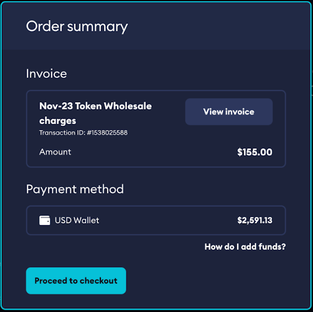

# Invoices

For any Token SKU sales made on external platforms (ex: Steam, Microsoft Store, PlayStation™Store), the game publisher or studio will be issued an invoice at the start of the next month, for all sales made through that previous month.

Studios will have the ability to pay the invoice through their game admin dashboard. Please note you will need to have sufficient funds in your game or individual wallet in order to pay the transaction.

In order to top up your wallet you will be able to wire funds directly to our payment partner, Tilia. Wire details are available to be viewed on your game admin dashboard on mod.io.

:::note
Invoices are due 30 days from issuance and any tokens earned during that time frame by creators or the game studio are marked as pending, and cannot be paid out, until the invoice payment has cleared.
:::

:::note
Studio is able to view and pay any outstanding invoices directly from their dashboard.
:::