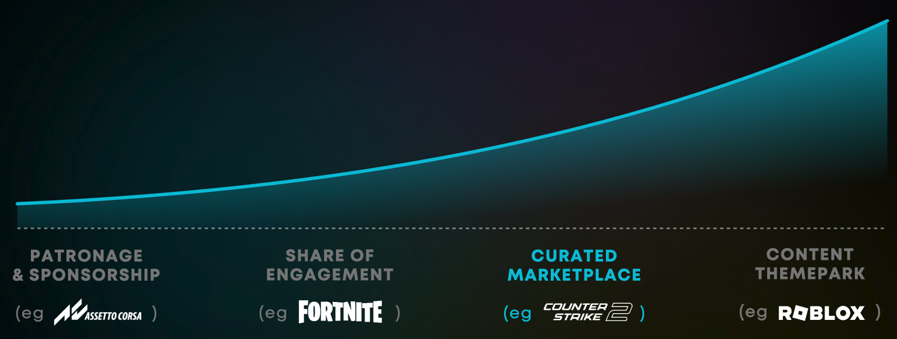

# Next Steps

If you require assistance setting up and running your Marketplace, please contact any of our experts at developers@mod.io.

## Best Practices

There are many ways to approach the creator economy in your game. Our goal at mod.io is to provide a versatile solution, which allows you to implement and optimize the marketplace for your game.

The approach explained above is our Premium UGC Curated Marketplace solution, which is similar to the system used by Counter-Strike 2, Minecraft and Microsoft  Flight Simulator. You can choose to make it available for all creators and content, or you can choose to turn on the Partner Program and Premium UGC approval systems to manage the cadence and content your creators can monetize.

This approach works strongly where you consider and present Premium UGC in a similar way you would DLC, focusing on themes and events (i.e. encourage and showcase spooky content during Halloween). Done well, Premium UGC can offer your players a more diverse, creative and compelling range of new content, which can sit alongside and complement, or entirely replace the need for in-house content creation - which is how Roblox grew so rapidly from 2016 onwards, once they introduced their DevEx (Developer Exchange).

## Future Features

For the Premium UGC Curated Marketplace solution, we are exploring a wide range of new functionality, such as supporting ways to showcase creators, allow influencers to set up and sell collections, limit the time or quantity UGC is available for, or let player voting decide what goes into the marketplace.

We are also exploring supporting new approaches to run a creator economy, such as adding the ability for creators to trigger IAP purchases within their experiences, which is how Roblox works (i.e. buy a power-up, custom outfit, or food for your digital pet).

If you have recommendations or ideas to discuss, please get in touch, and we shall invite you to participate in the release of new functionality as it becomes available.