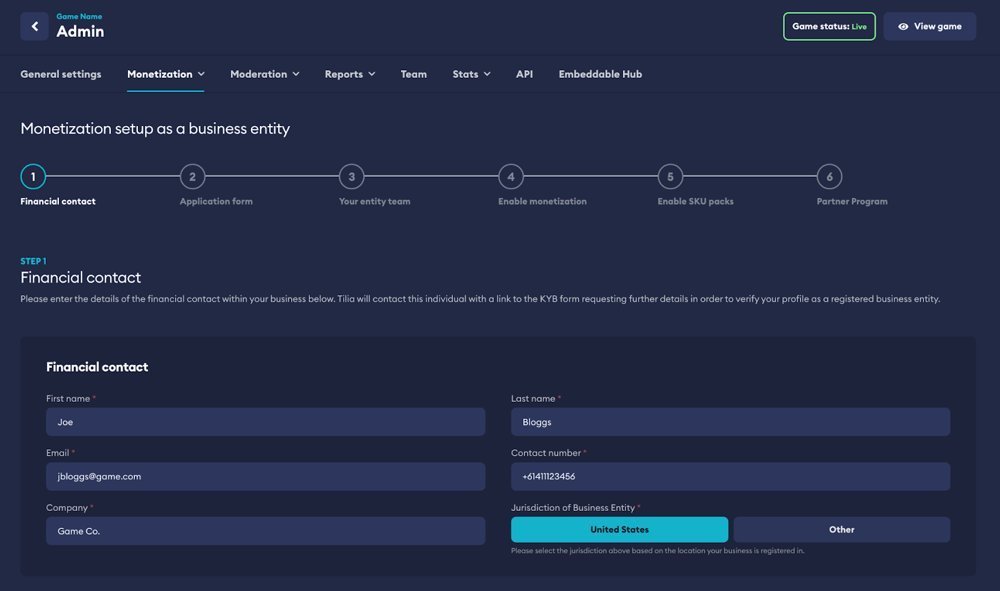
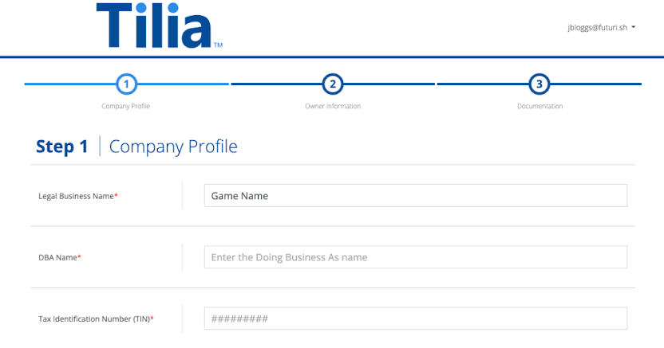
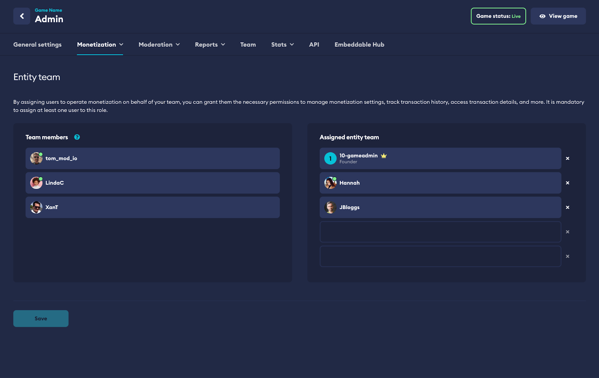
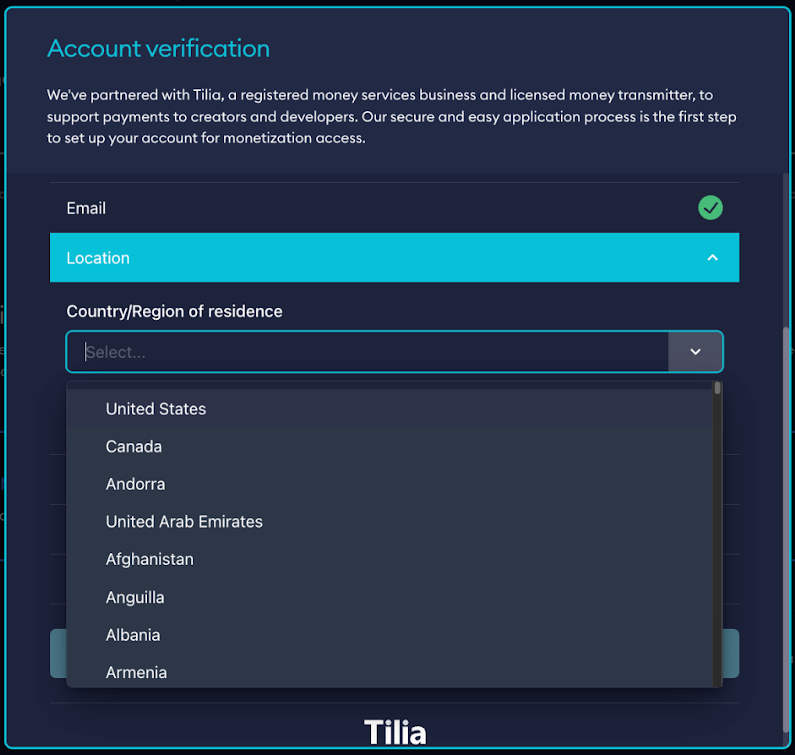
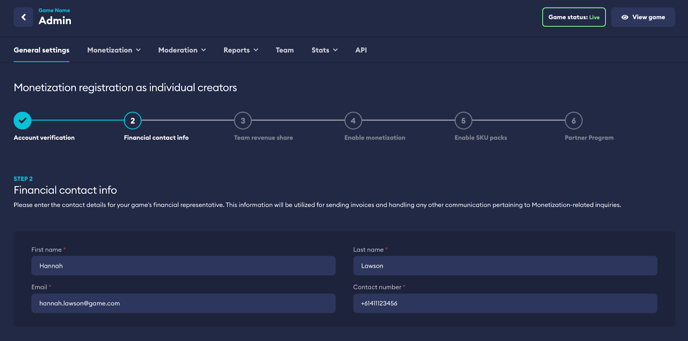
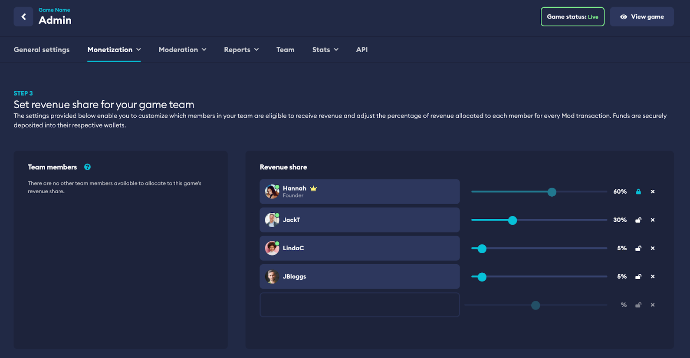
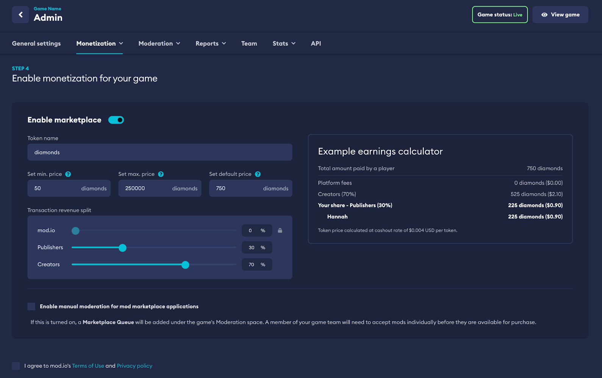
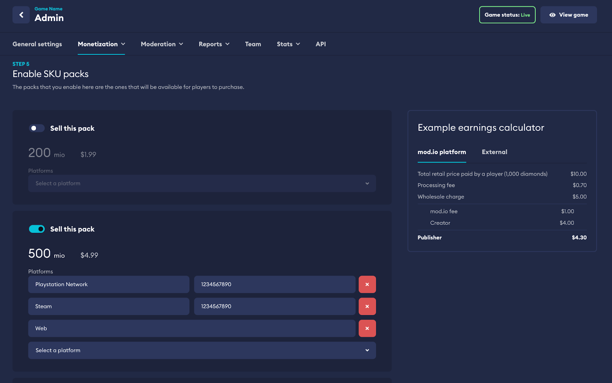
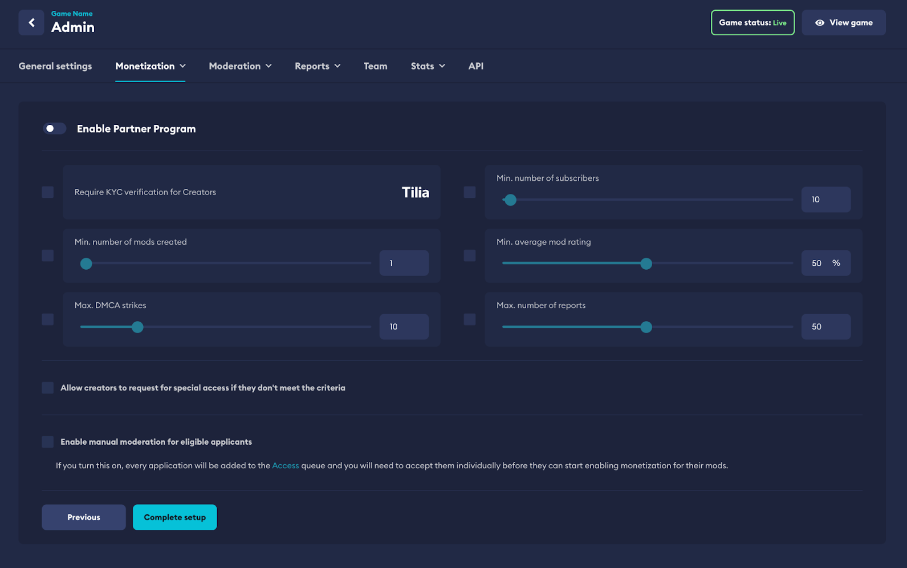
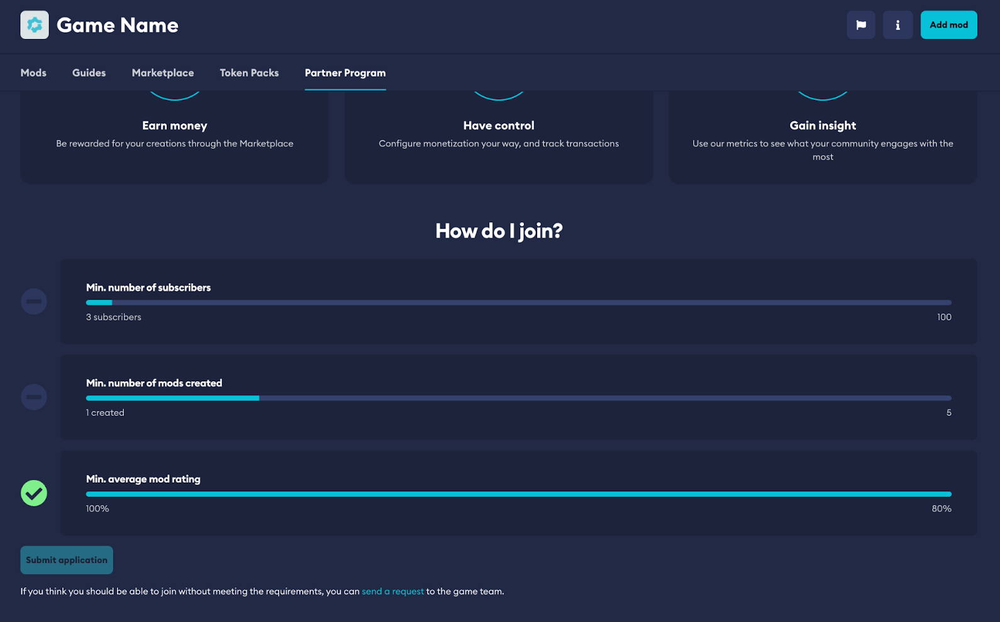

# Onboarding

## Verification

In order to meet global financial regulations and compliance requirements and ensure a secure ecosystem, we require all publishers to verify through one of two methods: as a business entity or as individual creators. 

### As a business entity

Our business entity flow is used when you’re setting up your studio for Monetization services as a business and ensure payments get made directly to the business itself. 

This uses the Know Your Business (KYB) financial verification process and will collect information about your business entity, such as its legal structure, registration details, ownership information, and any other relevant details. This is to prevent businesses from engaging in illegal or unethical activities.

### As individual creators

Our individual creator flow is used when you’re setting up your studio for Monetization services as an individual or group of individuals and ensure payments can be made directly to each individual. 

This uses the Know Your Customer (KYC) financial verification process and will collect information such as your name, address, date of birth, taxation and other relevant details. You will also need to provide supporting documentation like government-issued IDs, utility bills, and more, to verify your identity.

## Business Entity Onboarding

If you choose to onboard as a business entity, you will see the following steps in your onboarding process that are unique to setting up your business for monetization.

### Financial Contact

You have the ability to designate someone within your organization as the financial contact.

This individual will be able to provide the required financial information about your business and also act as the billing contact. We will use this information to send the application form and any eventual invoices. 

:::tip
You can change this contact at any time through your monetization settings.
:::

:::note
The financial contact will be used for invoicing and onboarding purposes.
:::

### Application Form

Once you’ve entered the details of the financial contact, a KYB application form will be generated and emailed directly to the contact you entered. This form will need to be filled out with all the required information in order to verify your business. Once filled out, it needs to be sent to Tilia for processing.

:::note
This process is manual and can take up to 3 business days. At times a representative from Tilia may reach out by email to gather new information or clarify information you have provided as part of the application process.
:::

:::note
The verification services are provided by our partner Tilia.
:::

### Setup Entity Team

You will have the ability to define from your game team on mod.io who will have full access to functions such as payouts, transaction details, and history. You will be able to adjust this at any time through your monetization settings.

:::note
Anyone on your entity team will have full access to operate Marketplace functionality.
:::

## Individual Creator Onboarding

If you choose to onboard as (an) individual(s), you will see the following steps in your onboarding process.

### Team Leader Account Verification

In order to start, we first need to verify your identity. We provide an easy-to-use automated solution with the help of our payment partner, Tilia. The verification process will ask you for information such as your email, location, tax and contact information. 

This information is stored confidentially and the process is automated, though in some cases, it can take up to 48 hours if a manual verification is required.

:::note
The verification services are provided by our partner Tilia.
:::

### Financial Contact

You have the ability to specify a separate individual as the financial contact or fill this information in with your own details. We will use this information to send invoices. You will be able to change this contact at any time through your monetization settings.

:::note
The financial contact will be used for invoicing purposes.
:::

### Team Revenue Share

You are able to specify what portion of revenue goes to each individual member of your game team (if applicable). This split is applied on the revenue going to the game studio (after creator share, and other fees are applied), and will be received directly to your own personal wallet(s).

:::note
Revenue share splits can be adjusted at any time and will affect all future transactions.
:::

## Monetization Settings

Now that you’ve verified and onboarded your team, you are able to turn on and adjust the marketplace functionality for your game:

- **Virtual Currency name** - This defaults to ‘creator credits’ but allows you to change the name of your virtual currency. This name will be shown anywhere the virtual currency is referenced within your marketplace.
- **Minimum and maximum price** - These values restrict content sold in the marketplace to be limited to prices within this range.
- **Default price** - Sets the default/recommended value populated in the price field when creators set up their content for sale.
- **Transaction revenue split** - Allows you to change the default revenue share split between creators and you as the game publisher. You can see which share each party will get in the split calculator on the right side.
- **Enable manual moderation** - Activating this will require all content added to the Marketplace by creators to be [manually approved](/monetization/approving-premium-ugc/) by your team.

:::note
Marketplace setting can be adjusted at any time through your dashboard.
:::

## Virtual Currency Packs

You are able to set up virtual currency packs for users to purchase. Virtual currency amounts and prices are predefined to prevent any possibilities of arbitrage within our platform, external platforms, and any games utilizing our Monetization services.

You can define the availability of each individual predefined virtual currency pack, in addition to defining what platforms these virtual currency packs are available on.

:::warning
You must ensure that the virtual currency packs you make available on mod.io match the SKUs of any platforms you wish to make the virtual currency pack available for purchase. We provide a way for you to map these virtual currency packs with the ability to enter the SKU id provided by external platforms.
:::

This ensures we are able to correctly reconcile funds received on external platforms and pay out Creators. An example earnings calculator is visible to see what is received by whom on a sale of a Virtual Currency Pack.

:::note
Virtual currency packs can be mapped to virtual currency pack SKUs sold on external platforms.
:::

## Partner Program

We provide the ability to vet content creators through the use of a Partner Program. The Partner Program allows you to define criteria required for creators to be able to monetize their content for your game. These are the criteria you’re able to use:

- **Creator must be verified** - By toggling this requirement, it will force every creator to onboard via KYC. By default, KYC verification is only required for cash-out to prevent any hurdles to earning on the platform.
- **Min number of mods created** - Requires a creator to have this many mods uploaded to mod.io in order to apply. Mod counts are platform-wide and not game-specific.
- **Min number of subscribers** - Requires a creator to have this many subscribers on mod.io in order to apply. Subscriptions are platform-wide and not game-specific.
- **Min average mod rating** - Requires a creator to meet this minimum average rating for their content in order to apply.
- **Max DMCA strikes** - Defines the maximum amount of DMCA strikes a creator has had before they can be rejected. DMCA strikes are platform-wide and not game-specific.
- **Max number of reports** - Defines the maximum number of reports a creator can have before they can be rejected. Count is platform-wide and not game-specific.
- **Allow creators to request for special access** - Toggling this will allow creators to manually apply even if they don’t meet the pre-set criteria. Applications will go to the Partner Program queue under Moderation and need to be approved by the game team. This is helpful if you want to allow established creators to be able to apply to be a Monetization Partner.
- **Enable manual moderation** - Toggling this will require all applicants who have met the above criteria to be manually approved as the final step by the game team before they can be in the Partner Program (by default, applications meeting your set criteria are approved automatically). Applications will go to the Partner Program queue under Moderation and need to be approved by the game team.

Used effectively, the Partner Program allows you to set the right bar for your content creators to be able to monetize on your game, and manage the flow of premium UGC through your ecosystem.

:::note
The Partner Program is entirely optional and can be enabled or disabled at any time.
:::

:::note
Creators are able to see real time progress towards the criteria defined on the game’s profile page on mod.io.
:::