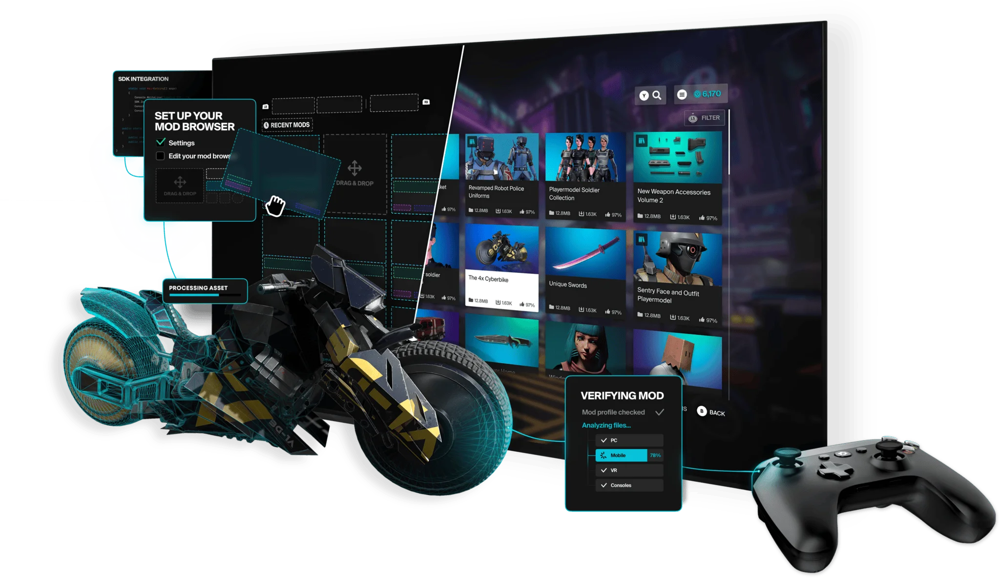

# Welcome to mod.io

We're here to enhance your game by unlocking mods or **user generated content (UGC)**. Whether it's empowering players to create new skins, game modes, VFX, SFX or anything else, our service provides the framework for player customization and creativity within your game without jeopardising security and stability.

## Why include UGC?

User-generated content and modding have been a staple of the games industry for some time. It's a way of fostering community, connecting passionate players and discovering new and exciting ways to play.

For some games, UGC has helped extend the overall lifespan, for others, it's unlocked new possibilities inside the gamespace. UGC can be a powerful tool that adds more personal and customized journeys in an already interactive medium.

## mod.io for studios

mod.io provides a seamless experience for you and your users, making it easy for creators to upload (and players to download) UGC for your game. No two games are the same, which is why we offer a variety of different tools, plugins and solutions to help tailor our service to your needs. 

mod.io is a UGC middleware solution that offers:

* **Security**: Enabling UGC without compromising safety or security.
* **Seamless Content**: Streamlined cross-platform hosting and asset creation.
* **Features**: Discover UGC's potential with analytics and monetization.
* **Customization**: White label functionality to suit your brand.

## Let us be your guide 

The following documents will guide you through your mod.io journey, from the early stages of setting up an account to in-depth features such as Cloud Cooking and Monetization. 

The best place to begin is with our [Getting Started](/getting-started) guide.

:::tip[quick navigation]
Looking for something specific? Use the **search bar** in the top right to navigate the mod.io docs!
:::
