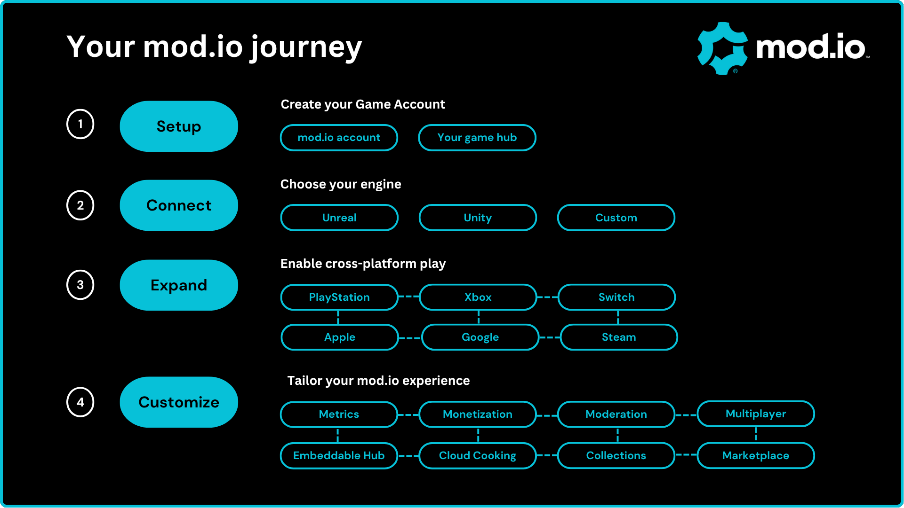

# Getting Started

Starting your journey with mod.io is easy. This documentation will help you curate a seamless **user-generated content (UGC)** experience for your game on any platform.

### Your mod.io journey

1. [Set up a game account](#set-up-a-game-account)
2. [Connect to mod.io](#connect-to-modio)
3. [Expand with cross-play functionality](#expand-with-cross-platform-functionality)
4. [Customize your experience](#customize-your-experience)

## Set up a game account

Your **game account** acts as the hub for all user-generated content. To create an account, click the “get started” button on the [mod.io](https://mod.io) homepage where you'll be prompted to sign up and add your game.

You'll then be able to configure your games UGC settings, including moderation rules, content tagging, platforms supported and links for creators to get started. As you set up your profile, use the (?) tooltip buttons for more information. With mod.io, you have full control over what content your users can create and experience within your game.

:::tip
You can change your settings (including game name) at any time via your **game admin settings** on the [My Content](https://mod.io/content) page.
:::

**Invite team members**: The teams feature allows multiple people to work on a game with varying levels of access. Before you can invite them, each team member will first need to create a profile by clicking the “Log in” button on the [homepage](https://mod.io/). You can also invite team members at a later date using the **Team** tab in your game admin settings (found on the [My Content](https://mod.io/content) page).

**Preview system**: Your game will be hidden automatically when you first create your Game Account. This is done to give you time to prepare and test your mod.io settings ahead of launching your game with UGC. We recommend keeping your game hidden until it is ready to launch. To give UGC creators, testers and collaborators access to a hidden game, see the [Preview System](/launch-checklist#test-with-preview-system) guide. If your title is already released and you require a private environment for testing purposes, you can also set up a second hidden game profile.

## Connect to mod.io

To unlock UGC in your game, the next step is to integrate mod.io. All games are designed differently, and we offer support for a variety of builds. 

First, you'll need the keys to the kingdom. Locate your API Key in the “API” section of your Game Admin Settings (or via the [API Access](https://mod.io/me/access) page), as this will ensure the API can identify your title. 

From here, select one of three pathways to begin integration:

  <SimpleCard
    shadow="tl"
    title="Unreal Engine"
    image="/img/icon_ue.svg"
    text="For UE builds, this plugin connects your game with our API to unlock user-generated content."
    moreLink="/unreal"
  />
  <SimpleCard
    shadow="tl"
    title="Unity"
    image="/img/icon_unity.svg"
    text="For Unity builds, this plugin connects your game with our API to unlock user-generated content."
    moreLink="/unity"
  />
  <SimpleCard
    shadow="tl"
    title="Custom"
    image="/img/icon_modio.svg"
  text="For custom builds, the C++ SDK connects your game with our API to unlock user-generated content."
    moreLink="/cppsdk"
  />

:::note[REST API]
The [REST API](/restapi) powers all our UGC functions. The three options above use the API as a base to provide the mod.io UGC experience.
:::

## Expand with cross-platform functionality

Our service is a recognized middleware solution that spans a variety of platforms. To add a platform, you'll first need to gain approval from your platform's account manager. Once you're connected, our service works behind the scenes to streamline the cross-platform UGC experience. 

* **[PC](/platforms/pc)**: Set up UGC for *Steam*, *GOG Galaxy*, *Epic Games* and *PC Games Pass* on desktop or handheld devices.
* **[Console](/platforms/console)**: Set up UGC for *PlayStation®4*, *PlayStation®5*, *Xbox One*, *Xbox Series X*, *Nintendo Switch* and *Nintendo Switch 2*.
* **[VR](/platforms/vr)**: Set up UGC for *Meta Quest*.
* **[Mobile](/platforms/mobile)**: Set up UGC for *iOS* and *Android* devices.

## Customize your experience

mod.io offers a variety of options to enhance and optimize your UGC experience. Whether you are looking to hone your strategy, streamline the player experience, or increase revenue, we've got you covered. Explore our list of [Features](/features) to learn how to get the most of UGC in your game. 