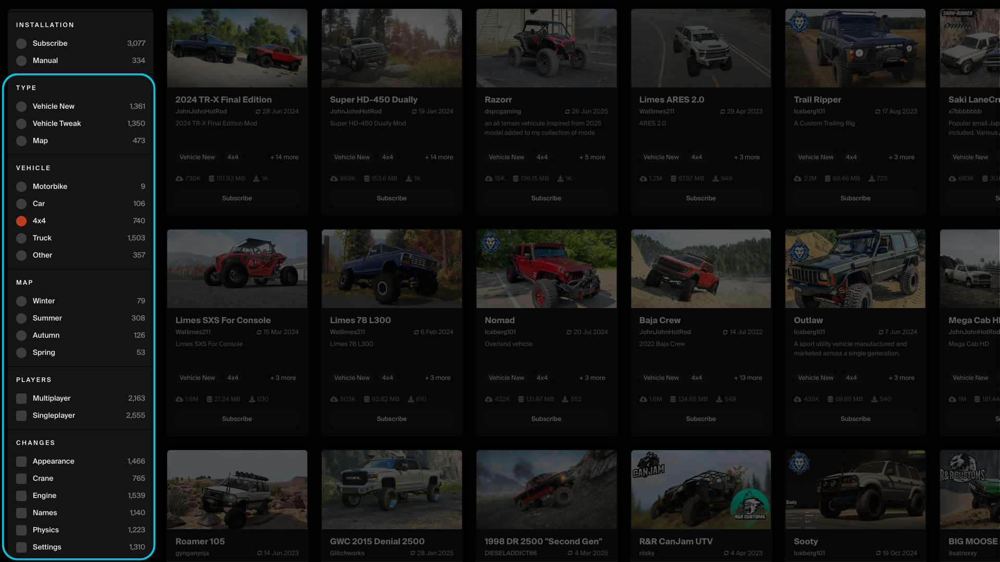
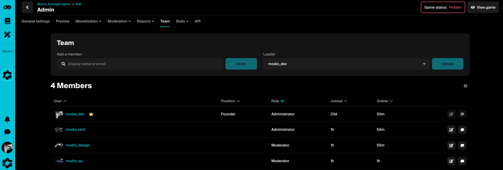
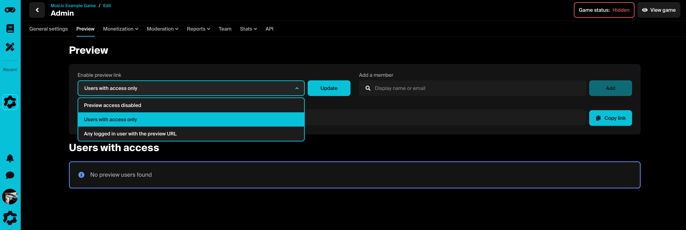

# Launch Checklist

There are a few things to keep in mind before officially launching UGC in your game, all of which can be actioned and tested while your game remains hidden from the public. 

Below is a checklist of tasks you may want to action before launching your game:

* [Refine your game's tags](#refine-your-games-tags)
* [Enable platform support](#enable-platform-support)
* [Include Terms & User Consent](#include-terms--user-consent)
* [Choose your features](#choose-your-features)
* [Test with Preview System](#test-with-preview-system)
* [Launch](#launch)

## Refine your game's tags 

Categories and tags are a way of sorting and identifying the different types of UGC that you offer in your title. Users will be able to upload and search for UGC within these tags in the [Game Portal](https://mod.io/g). Launching with a baseline of key categories and tags is a great way to set up a smooth UGC experience for your players, and these can always be built upon after your game has launched.

A category tree may look like the following:

* Type [Category]
    * Vehicle [Tag]
    * Map [Tag]
    * Gameplay [Tag]
    * UI [Tag]
    * QoL [Tag]
* Vehicle [Category]
    * Motorbike [Tag]
    * 4x4 [Tag]
    * Trucks [Tag]
    * Other [Tag]

You can also setup private tags, which are not shown to end users or creators, and admin-only tags which can only be set by game moderators. These are useful for featuring content.

*Example: SnowRunner using UGC tags on the mod.io Game Portal.*

## Enable platform support

If your game uses [cross-platform UGC](/getting-started#expand-with-cross-platform-functionality), make sure you have activated these platforms in **General settings** > **Platform approvals**. You will need authorization from each platform to do so. This allows users to upload UGC for your game's supported platforms.

## Include Terms & User Consent

Before downloading UGC, players are required to give consent to both the mod.io terms of use as well as any applicable platform-specific terms. The simplest way to ensure this is to use our Unreal Engine or Unity plugins, which include acceptance dialog functionality that meets the required standards.

For more information, check out our [Terms & User Consent](/terms) guide. 

## Choose your features

As you test your game, you may want to explore some of our [UGC Features](/features). These are designed to make sure you get the most out of your UGC experience. Things like the Embeddable Hub, a browser-based UGC hub that can be customized to suit your brand; Monetization, enabling users to sell premium mods; or Multiplayer functionality, to ensure UGC is experienced by all users in the same game.

## Test with Preview System

While your game is hidden, you can have multiple people working on and testing your game using our Preview System. By default all game profiles are hidden and accessible only by users who you add to the games team, or invite using the 'Preview' panel. 

### Test game profiles

To ensure your game is battle-hardened and operating as intended, you can create [test game profiles](https://mod.io/g/add) on mod.io, which will appear on the [My Content](https://mod.io/content) page. By default all game profiles are hidden and accessible only by users who you add to the games team, or invite using the preview system. This is until you set a game live, which will make it accessible for everyone.

Each game added will be assigned its own <code>api_url</code>, <code>api_key</code> and <code>game_id</code>. When switching between game builds (i.e. production, test, staging) you will need to ensure each build is pointing to the right game profile on mod.io.

:::important[Hidden Content]
While hidden, we recommend using codenames and non-descriptive screenshots when uploading content. Content connected to your game may appear in user profiles you have given permission to access it.
:::

### Invite team members

If you skipped this step when setting up your game, you can grant your team access to work on and test your game ahead of launch via the **Team** tab in your game admin settings (found on the [My Content](https://mod.io/content) page). Team members can be assigned roles depending on the permissions you wish to grant.

:::tip[Can't find your team?]
Any team members or collaborators will first need to create a mod.io profile by clicking the “Log in” button on the mod.io homepage. 
:::

### Invite collaborators

You can also invite non-team members to preview or help test your game by using the **Preview** tab in your game admin settings.  

## Launch!

Once you're satisfied that your game is ready to go live, simply click ‘Publish' in the ‘General settings' tab of your game admin settings. 

Congratulations! Your game now supports UGC, and your creator community is live on mod.io!
