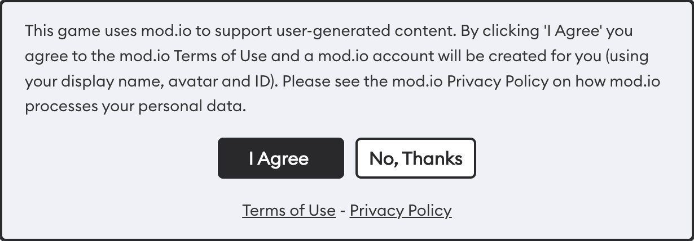

# Terms & User Consent

Before downloading UGC, players need to give consent to both the [mod.io](https://mod.io) Terms of Use as well as any applicable terms from the platform the game is using. The simplest way to ensure this is to use our Unreal Engine or Unity plugins. These include acceptance dialog functionality that meets the required standards. 

Consent is important so users are aware a mod.io account is being created, inline with global privacy laws. It also allows mod.io to set out the Terms of Use of which all users must adhere to, or else their account and access to the service and content available might be revoked.

## Frequency of application

It is a requirement of the [Game Terms](https://mod.io/gameterms) with mod.io, and the platforms mod.io is used on (including but not limited to Steam, PlayStation, Nintendo and Xbox), that users agree to the latest mod.io [Terms of Use](https://mod.io/terms) and [Privacy Policy](https://mod.io/privacy). You only need to collect the users agreement once, and also each time the terms are updated.

## What are the terms?

|    | **Summary** |
|----|-------------|
| **Game Terms** | Applicable only to game studios and publishers using mod.io: https://mod.io/gameterms |
| **Terms of Use** | Applicable to all end users using mod.io: https://mod.io/terms |
| **Privacy Policy** | Applicable to all end users using mod.io: https://mod.io/privacy |
| **Acceptable Use Policy** | Applicable to all end users using mod.io: https://mod.io/aup |
| **Monetization Terms** | Applicable to all game studios, publishers, creators and end users transacting on mod.io: https://mod.io/monetization |

## Platform SSO standard

In addition to following our consent and acceptance process, mod.io also follows the standards set by the SSO provider used to authenticate the player. Example being; a user who is playing a game on Xbox, is signed in with their Xbox ID, which is connected to their mod.io account. During the authentication process with Xbox, mod.io checks the users parental controls and age gate requirements, and processes or denies their authentication accordingly. It is highly recommended you use the applicable Platform SSO standard when authenticating players with mod.io (or your SSO system as explained below), to ensure a seamless and compliant implementation. If you're not using the Platform SSO standard, your implementation will need to ensure it enforces the requirements set by the platform to pass certification.

:::tip 
If you have your own accounts system, mod.io can be set up to use it as the SSO provider, to ensure all users follow any parental controls and age gate requirements you have. This will also connect their mod.io account to your backend, which improves reporting, and means any accounts you block, will also be blocked from engaging with your games on mod.io.
:::

## User Flow

You should prompt players for consent before using any mod.io functionality, such as on startup, or before launching any UGC browsers. Once they have accepted the Terms of Service, you should proceed to authenticate them with your chosen authentication provider, ensuring you pass `terms_agreed=true`.

If the user rejects the TOS, you should exit the authentication process and do not attempt to authenticate them.

The way your terms and authentication flow should be implemented is as follows:
1. At an appropriate time (when the user is opening your UGC browser, on startup, etc), display the Terms of Use.
2. If the user agrees to the Terms of Service, proceed to the next step. Otherwise, halt the process and do not proceed with authentication.
3. Store that the user has accepted the terms of service, such as in local storage or cloud user profile storage.
4. Perform any platform-specific authentication to get the appropriate token to exchange for a mod.io auth token. Visit the Authentication page for each platform you wish to authenticate to for further details.
5. Exchange that platform specific authentication token for a mod.io OAuth token by calling the mod.io Authentication methods
6. On success, you will have a token that can be used for all mod.io calls for that user. All official mod.io plugins will use this OAuth token for all user requests.

## Implementation

If you are using the official mod.io [Unity](/unity/), [Unreal](/unreal/) or [C++ SDK](/cppsdk/), the acceptance dialog functionality is built into those plugins, and should be utilized. Please check those plugins documentation for details using their implementation.

If you are building the acceptance and consent process yourself, you should implement the steps detailed above, paired with a dialog and authentication process following the instructions detailed below.

:::tip
If your game does not authenticate users or only uses the email authentication flow, you do not need to implement this dialog, but you should link to the mod.io Terms of Use and Privacy Policy in your Privacy Policy/EULA.
:::

### Dialog

The implemented dialog should look similar to this:

Instructions for retrieving localized text for the dialog, [can be found here](https://docs.mod.io/restapiref/#terms).

The Terms of Use and Privacy Policy must be clickable from somewhere on the dialog, and should load a web browser with the respective links:
* https://mod.io/terms/widget?no_links=true
* https://mod.io/privacy/widget?no_links=true

:::tip
The **/widget** part of the URL is optional and removes all menus and the **?no_links=true** part of the URL is optional and removes all links.
:::

### Authentication

Once a user has clicked **“I Agree”**, you should indicate to the mod.io backend that this has taken place, when you initiate the authentication process. Acceptance of the TOS should be stored in relevant user settings, for instance a local settings file, or cloud storage file for the user. The mod.io plugins do not provide storage for this field.

All of the [platform authentication flows](https://docs.mod.io/restapiref/#steam) supported by mod.io have a `terms_agreed` field which should be set to `false` by default. If the user has agreed to the latest policies, their authentication will proceed as normal, however if their agreement is required and `terms_agreed` is set to `false` an error `403 Forbidden` (`error_ref 11074`) will be returned. When you receive this error, you must collect the users agreement before resubmitting the authentication flow with `terms_agreed` set to `true`, which will be recorded.

mod.io may update our terms of service, which require users to re-accept the terms of use. If you receive a 403 error from the authentication endpoint, even passing `terms_agreed=true`, then you should re-prompt users to accept the Terms of Service.

### Token lifetimes

When you request an access token for mod.io via our authentication endpoint - the mod.io token is only valid for a limited time. All tokens expire or can be revoked, and your code needs to be ready to handle that. You should not make assumptions for how long a token will be valid for.

In the event that an access token is no longer valid, a 401 Not Authorized HTTP error will be returned. To ensure a smooth user experience, your code **SHOULD** anticipate that whenever you call the mod.io API there is a chance you will encounter this response and when you do that you have code to re-authenticate the user. No refresh tokens exist to exchange for a new access token - if your token expires you need to re-authenticate the user.

mod.io recommends to re-authenticate a user anytime you launch your game, or if you receive any errors from the API or plugins indicating that a user is not authenticated.

## Considerations

You are able to change when, where, and how you present the acceptance dialog (for example same games require acceptance every time a player clicks into the mod menu). If you do make changes to the flow above, be aware that you are responsible for ensuring that the users agreement is properly collected and reported. Failure to do so correctly is a breach of the [mod.io Game Terms](https://mod.io/gameterms). If you have any questions or want mod.io to review your implementation, please [contact us](mailto:developers@mod.io).

:::tip
If you have your own UGC EULA or terms, you can use your discretion as to when you incorporate them.
:::