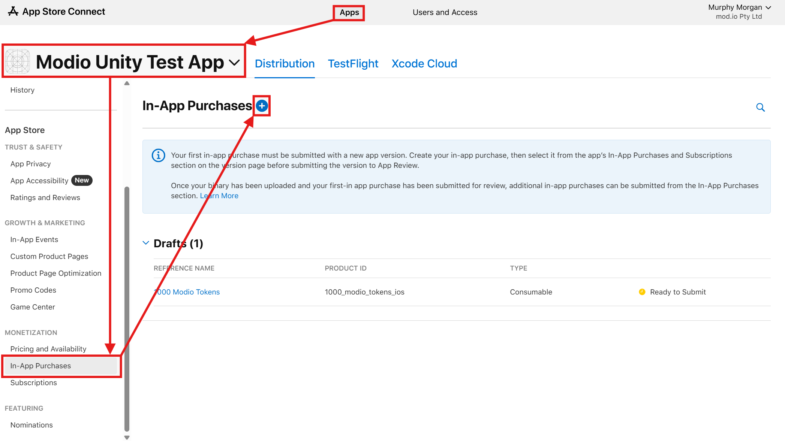
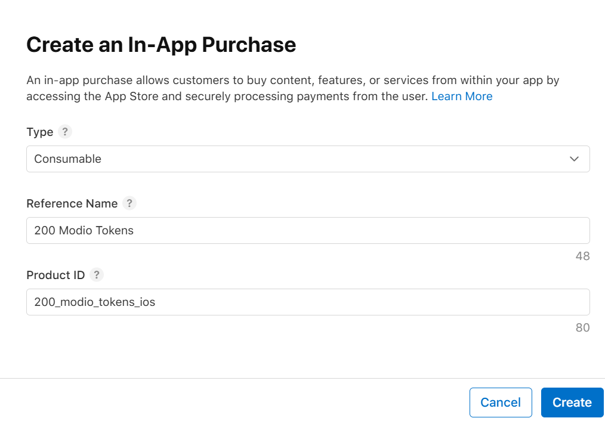
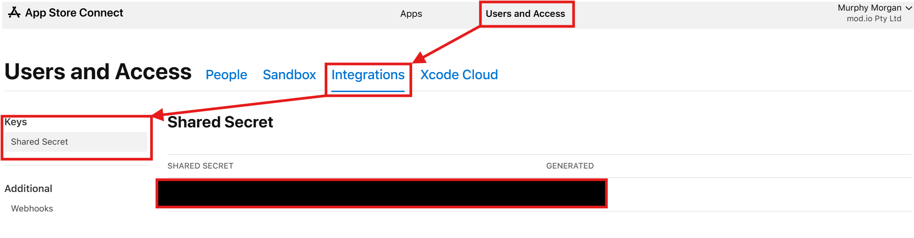
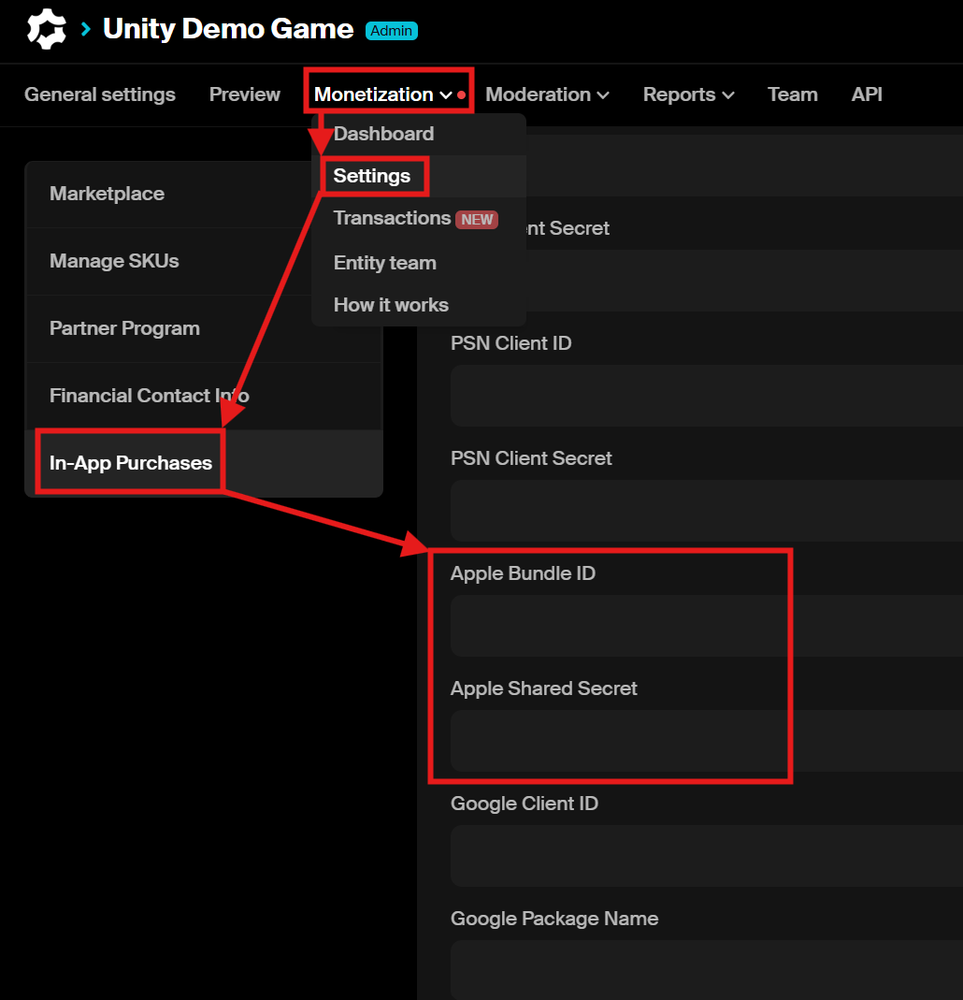
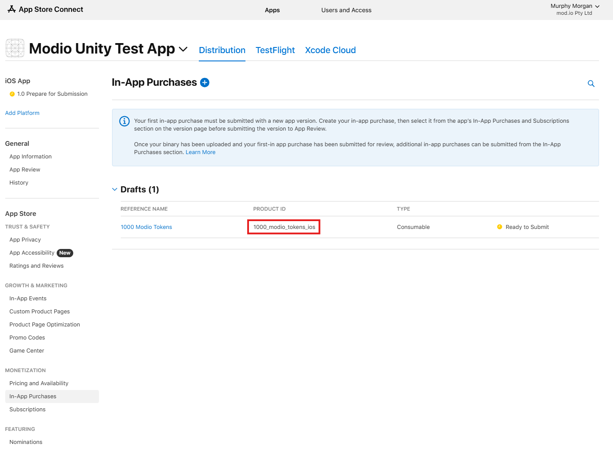
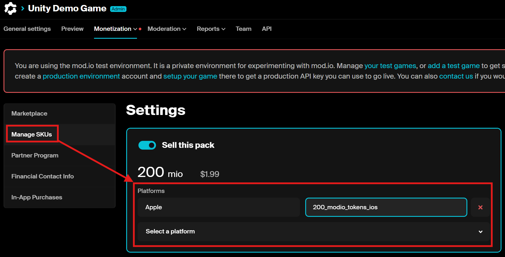

# Apple Entitlements

This guide will show you how to set up your App on App Store Connect for In-App Purchases and how to connect them with mod.io to process the entitlements on your behalf. The mod.io platform will use Apple's Server to Server API to decrypt & validate receipts given to it and grant associated entitlements to users who have purchased creator credits in your game. Conversely, if a user requests a refund, mod.io will revoke the entitlements associated with the refunded purchase.

## Setting up Products for Apple

1. Log into your [App Store Connect](https://appstoreconnect.apple.com) account and select your app. Then, under **Monetization** click **In-App Purchases** and then click on the '+' icon.

2. Select **Consumable** as the type of purchase, enter your reference name & id of choice and then click **Create**.

:::important
Apple requires products on both iOS & MacOS platforms to be distinct, evne if corresponding to the same product. It's recommended you suffix your product ID with "_ios" or something similar.
:::

3. We'll then need to get this new product's status to `Ready to Submit`. To do so, you'll have to fill out:

* Availability
* Price Schedule (see your mod.io's game IAP config page for price references)
* Localization (at least one language)
* Image
* Tax Category
* Review Information (both screenshot & Review Notes)

This will make your product testable with a sandbox account. In order for these to be purchasable on a live production account you must submit your app for review to be published on the Appe Store.

For more information on setting up & using sandbox testing, please follow Apple's [Testing In-App Purchases with Sandbox](https://developer.apple.com/documentation/storekit/testing-in-app-purchases-with-sandbox) guide.

## Configuring your game's IAP Settings & SKUs on mod.io

In order to configure mod.io with your newly created In-App Purchase, we'll need to configure your App's **Shared Secret**, **Bundle ID** and **Product ID** with mod.io.

1. Log into your [App Store Connect](https://appstoreconnect.apple.com) account and select **Users and Access**.

2. Navigate to the **Integrations** tab and select **Shared Secrets** from the **Keys** section. If you can't find any secret here, you'll have to [generate a new shared secret](https://developer.apple.com/help/app-store-connect/configure-in-app-purchase-settings/generate-a-shared-secret-to-verify-receipts/). Once you have this secret, copy it.

3. Navigate to **Apps** and select your app. Under the **Distribution** tab, select **App Information** and copy the **Bundle ID**.

4. On the mod.io website, navigate to [game's admin dashboard](https://mod.io/content) and go to **Monetization** > **Settings**.

5. Under **In-App Purchases**, enter  your **Shared Secret** into the **Apple Shared Secret** field and enter your **Bundle ID** into the **Apple Bundle ID** field.

6. Back in app's App Connect page, still under the **Distribution** tab select **In-App Purchases** and copy the **Product ID** of the product(s) you created earlier.

7. In the mod.io admin dashboard, select **Manage SKUs**. In the currency pack this product represents, click **Select a platform** and select **Apple**. Finally, enter the **Product ID** into the **SKU** field next to **Apple** and click **Save** down the bottom.

You've now configured mod.io to utilize your Apple app's In-App Purchases for Virtual Currency puchases.

## Game Integrations

For a guide on integrating IAPs with your game, please refer to corresponding engine implementation guidelines:

* [Unity Engine](/unity/mobile-iap/)
* [C++/Unreal Engine](/cppsdk/marketplace/)