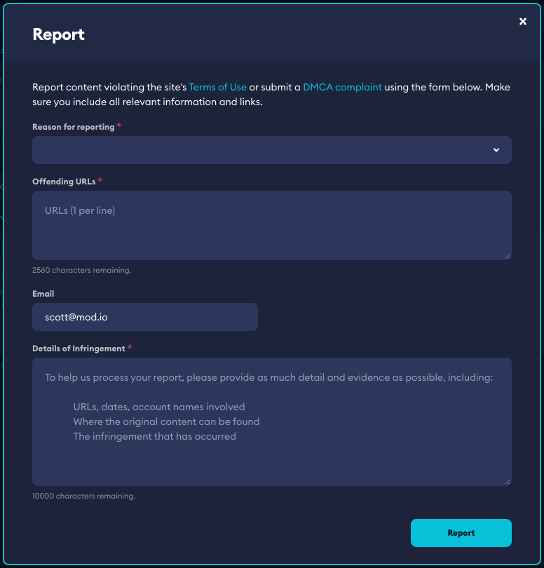

# Moderation and Reporting

Our moderation and reporting systems comply with the content management rules required by *Microsoft, Sony Interactive Entertainment* and *Nintendo*. 

This guide includes:

* [Moderation for consoles](#moderation-for-consoles)
* [Reporting for consoles](#reporting-for-consoles)

## Moderation for consoles

On consoles, only UGC that follow the rules should be made available to download and play. Our moderation tools and web dashboard allow you to control this process and manage the types of UGC available without any additional development required.

The [Moderation Dashboard](/moderation) is fully functional with console UGC, allowing you the choice to allow all content automatically, or require content be approved before being made available.

### Allowing all content automatically

This is the default used by most games, especially those where content creation happens in-game. Other games typically allow all content automatically on PC (with no moderation), but approve content before it appears on console using our per-platform file moderation system. This is our recommended approach as it gives your community maximum flexibility, is the simplest to manage, allows you to adhere to console guidelines, and is proven from a DMCA perspective.

### Moderating all content

If you prefer to control all content prior to going live, you can turn on a full moderation system. This is generally used by games that want to control what is released across all platforms. Speak to us if you would like to experiment with our rules based moderation flow, or community moderation queue as a more automated way of moderating all content.

An [introduction to our moderation flow](https://blog.mod.io/how-to-effectively-moderate-user-generated-content-mods-ceb2a05eeeed) is provided in our blog, and a detailed guide is available in our [Moderation documentation](/moderation). We can provide training for your team or take full responsibility for moderation if that is your preferred approach.

## Reporting for consoles

A requirement of all consoles, and a critical piece for maintaining a safe UGC environment is supporting a reporting process for content. This process must always be running, and pair with the moderation process chosen above. It must allow the community to report content that is “in-compatible, offensive, stolen or false” and also allow IP rights holders to submit DMCA notices.

Users can report content via the mod.io website (see: https://mod.io/report). Games can either link to that report interface, or implement their own in-game which our SDK and engine plugins support if using the UI we provide for Unity and Unreal.

A dashboard interface is available to all game moderators, who are responsible for actioning reports that come in. These reports are also shown to mod.io staff, who will support your team and take action as per our negotiated terms.

You can also set automatic thresholds, which will hide content automatically and hold it for review once a predefined number of reports have been submitted (decided by you).

### Content submission flow

User-generated content can be created either through in-game tools, out-of-game tools that are provided by you, or third-party tools (such as blender). The types of content you wish to support, and how these are created, are at your discretion, as long as they comply with the rules of each platform.
  
Where an in-game editor isn’t provided, content will generally be created on PC using in-house or third-party development software and tools. This content is then submitted into the mod.io system either through your tools interface, or via the mod.io web interface. Content is then moderated and approved for consoles.

