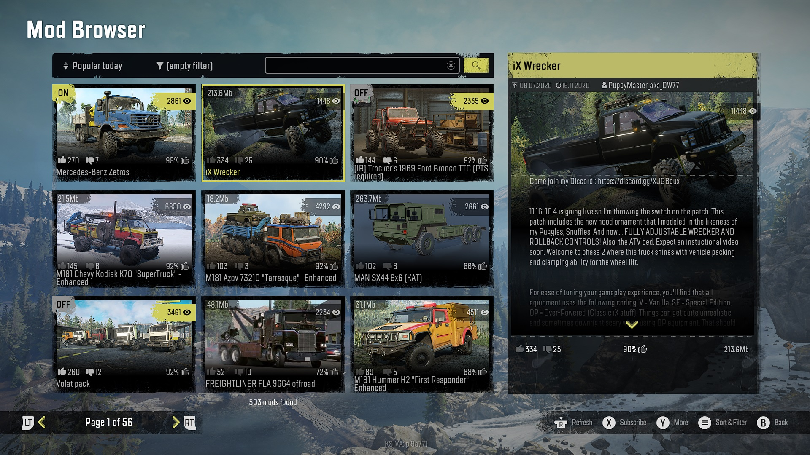

# Console Cross-Platform Support

mod.io is a fully authorized middleware provider for *Xbox One*, *Xbox Series X*, *PlayStation®4*, *PlayStation®5*, *Nintendo Switch* and *Nintendo Switch 2*. 

:::important[Platform Approval]
Adding UGC to consoles requires approval from the corresponding platform in order to gain [SDK Access](/platforms/console-sdks).
:::

## Supported platforms

The following platforms are able to integrate mod.io.

|      | **Service Availability** | **Certification Support** | **Native SDK** | **Single Sign-On** |
|------|:----:|:----:|:----:|:----:|
| **[Xbox One](/platforms/gdk)**       | ✓ | ✓ | ✓ | ✓ |
| **[Xbox Series X](/platforms/gdk)**   | ✓ | ✓ | ✓ | ✓ |
| **[PlayStation®4](/platforms/playstation)**   | ✓ | ✓ | ✓ | ✓ |
| **[PlayStation®5](/platforms/playstation)**   | ✓ | ✓ | ✓ | ✓ |
| **[Nintendo Switch](/platforms/switch)** | ✓ | ✓ | ✓ | ✓ |

## Feature set for consoles

We provide a number of tools and features – built directly into our dashboard, APIs and SDKs – that are designed to make it easy to support UGC on console platforms. 

These include:

* [Console SDKs](/platforms/console-sdks) and [engine plugins](/getting-started#connect-to-modio) for Unity and Unreal that have abstracted networking and data storage layers to allow any platform or future system to be supported with minimal engineering effort required.
* [Moderation](/moderation) that is fully compliant with platform requirements, allowing you to control UGC released on each platform.
* Authentication with each platforms SSO system.
* Ability to upload platform-specific UGC files, helpful if you need to “compile” UGC to work with each respective platform.
* Tagging and metadata systems to manage UGC on a per-platform basis.
* [Platform and portal headers](/restapi/platforms) used to localize content (i.e. display names) and other settings automatically.
* Word filtering, parental controls and safety processes required by each platform.
* Support for onboarding, and certification requirements around UGC.
* [Advanced Metrics](/metrics) and reporting so you can compare the usage of UGC, trending content and other key stats across all platforms your games are released.
* [Rules-Based Moderation](/moderation/rules-engine) flows to streamline and automate moderation depending on the platform(s) targeted.
* [Monetization](/monetization) that is compliant with each platforms rules and supports their payment flows.

_Example Implementation: SnowRunner in-game UGC browser on Xbox_

You can see examples of mod.io running on consoles in the following titles today:
* [Baldur's Gate 3](https://mod.io/g/spaceengineers) - *Xbox Series X/S*, *PlayStation®5*
* [SnowRunner](https://mod.io/g/snowrunner) - *Xbox One*, *Xbox Series X/S*, *PlayStation®4 / PlayStation®5*, *Switch*
* [Skater XL](https://mod.io/g/skaterxl) - *Xbox One*, *Xbox Series X/S*, *PlayStation®4 / PlayStation®5*, *Switch*

If you would like to see more examples of mod.io working in any of these games or other titles, please contact [developers@mod.io](mailto:developers@mod.io) for demonstration keys.

:::tip[Cross-platform UGC]
Want UGC on other platforms? Explore our list of [supported platforms](/getting-started#expand-with-cross-platform-functionality) to integrate mod.io across the board.
:::