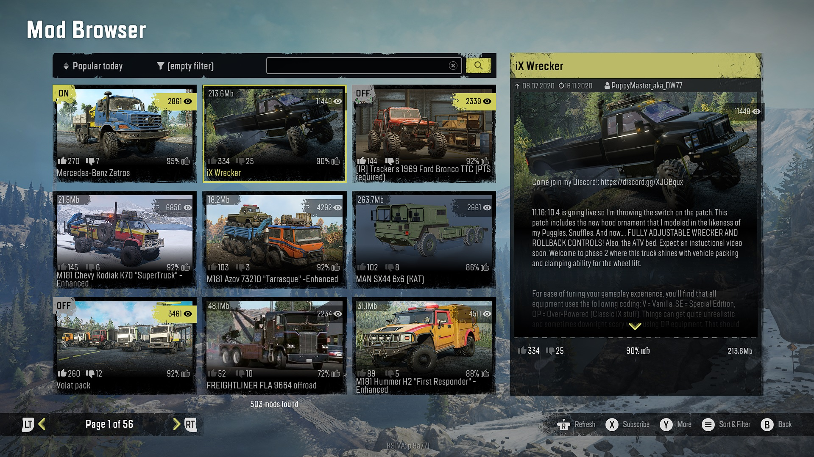

# Console Cross-Platform Support

mod.io is a fully authorized middleware provider for *Xbox One*, *Xbox Series X*, *PlayStation®4*, *PlayStation®5*, *Nintendo Switch* and *Nintendo Switch 2*. 

:::note[Premium Feature]
Console support is a premium feature. Sign up to one of our advanced service tiers and complete the approval process for the corresponding platform to gain [SDK Access](/platforms/console-sdks), or contact us at developers@mod.io for more information.
:::

## Supported platforms

The following platforms are able to integrate mod.io.

|      | **Service Availability** | **Certification Support** | **Native SDK** | **Single Sign-On** | **Monetization** |
|------|:----:|:----:|:----:|:----:|:----:|
| **[Xbox One](/platforms/gdk)**       | ✓ | ✓ | ✓ | ✓ | ✓ |
| **[Xbox Series X](/platforms/gdk)**   | ✓ | ✓ | ✓ | ✓ | ✓ |
| **[PlayStation®4](/platforms/playstation)**   | ✓ | ✓ | ✓ | ✓ | ✓ |
| **[PlayStation®5](/platforms/playstation)**   | ✓ | ✓ | ✓ | ✓ | ✓ |
| **[Nintendo Switch](/platforms/switch)** | ✓ | ✓ | ✓ | ✓ | |
| **[Nintendo Switch 2](/platforms/switch)** | ✓ | ✓ | ✓ | ✓ | |

## Feature set for consoles

We provide a number of tools and features – built directly into our dashboard, APIs and SDKs – that are designed to make it easy to support UGC on console platforms. 

These include:

* [Console SDKs](/platforms/console-sdks) and [engine plugins](/getting-started#connect-to-modio) for Unity and Unreal that have abstracted networking and data storage layers to allow any platform or future system to be supported with minimal engineering effort required.
* [Moderation](/moderation) that is fully compliant with platform requirements, allowing you to control UGC released on each platform.
* [Authentication](/authentication) with each platforms SSO system.
* Ability to upload platform-specific UGC files, helpful if you need to “compile” UGC to work with each respective platform.
* Tagging and metadata systems to manage UGC on a per-platform basis.
* [Platform and portal headers](/restapi/platforms) used to localize content (i.e. display names) and other settings automatically.
* Word filtering, parental controls and safety processes required by each platform.
* Support for onboarding, and certification requirements around UGC.
* [Advanced Metrics](/metrics) and reporting so you can compare the usage of UGC, trending content and other key stats across all platforms your games are released.
* [Rules-Based Moderation](/moderation/rules-engine) flows to streamline and automate moderation depending on the platform(s) targeted.
* [Monetization](/monetization) that is compliant with each platforms rules and supports their payment flows.

_Example Implementation: SnowRunner in-game UGC browser on Xbox_

You can see examples of mod.io running on consoles in the following titles today:
* [Baldur's Gate 3](https://mod.io/g/spaceengineers) - *Xbox Series X/S*, *PlayStation®5*
* [SnowRunner](https://mod.io/g/snowrunner) - *Xbox One*, *Xbox Series X/S*, *PlayStation®4 / PlayStation®5*, *Switch*
* [Skater XL](https://mod.io/g/skaterxl) - *Xbox One*, *Xbox Series X/S*, *PlayStation®4 / PlayStation®5*, *Switch*

If you would like to see more examples of mod.io working in any of these games or other titles, please contact [developers@mod.io](mailto:developers@mod.io) for demonstration keys.

## Getting approval for console documentation and modules

Following approval from the relevant First Party contacts, access to console platform documents and modules is verified.

In order to access these materials, developers require:
- A mod.io Game Hub (on the live environment - mod.io, access to docs and modules is not available on the test environment)
- A mod.io account with Manager or Administrator roles on the Game Hub for your project 
- The same email address used to request and secure verified status from the First Party must also be used for your mod.io account. The user associated with this mod.io account must be on the Game Admin team for the Game Hub, with the Manager or Administrator role.

Once this is setup, please request docs access for the relevant documentation and modules, and a mod.io representative will grant access.

:::tip[Cross-platform UGC]
Want UGC on other platforms? Explore our list of [supported platforms](/getting-started#expand-with-cross-platform-functionality) to integrate mod.io across the board.
:::

## Where to access console documentation and modules

For studios that have gained [platform approval](#gaining-platform-approval) by signing the appropriate NDA, we offer console modules for each SDK and accompanying documentation:  

* [PlayStation®4](https://docs.mod.io/partners/ps4)
* [PlayStation®5](https://docs.mod.io/partners/ps5)
* [Xbox One/Series X GDK](https://docs.mod.io/partners/xbox)
* [Nintendo Switch](https://docs.mod.io/partners/switch)
* [Nintendo Switch 2](https://docs.mod.io/partners/switch2)

:::note[Premium Feature]
Console support is a premium feature. These links will only work for studios who have signed up to one of our advanced service tiers and we have verified as being under the [applicable platform NDA](#gaining-platform-approval).

If you believe you are but cannot access the documentation, [contact us](mailto:developers@mod.io) for assistance.
:::
