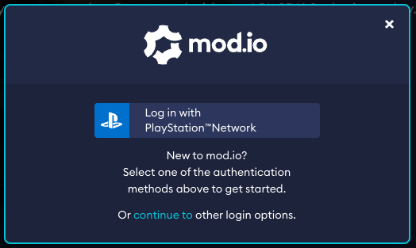

# PlayStation®4 / PlayStation®5 Support

We offer cross-platform UGC support for both the *PlayStation®4 & PlayStation®5*. 

This guide includes:

* [Typical requirements](#typical-requirements)
* [SDK access](#sdk-access)
* [Authentication](#authentication)
* [Networking & storage](#networking--storage)

## Typical requirements

Typical requirements for using mod.io on *PS4™ & PS5®* games include:

* UGC cannot run scripts or execute code, unless sufficient mitigations are demonstrated to be in place (e.g. sandboxing or manual curation of content)
* UGC must work without the need for manual installation
* Titles utilising mod.io must allow users the option of playing without mod.io functionality
* If content is created by a user on *PS4™/PS5®*, the display name of the user must be shown as the creator if available (our system does this automatically if you configure your [platform headers correctly](/restapi/platforms))
* User consent is required the first time before authenticating a user on *PS4/PS5* or accessing data from mod.io. Note: a users consent in one game cannot be used in another, all games must get a users consent individually
* If the user has UGC parental controls disabled, the UGC menu and any UGC installed must be disabled
* Users must be able to play your game without having to create a mod.io account, however UGC should not be made available to users without a mod.io account. This is required to adhere to the TRCs of ensuring consent is collected, and the user has the ability to block content from other users
* All data mod.io provides relating to metrics and usage connected to *PS4/PS5*, are provided at a partner level only, and for private internal use by your team only
* Disclose usage of mod.io when submitting proposals for UGC implementations and approval via DevNet
* All existing Technical Requirements, cross-platform Policy requirements and business policies remain in effect. You need to seek appropriate waivers via standard process if your implementation of mod.io contravene these requirements

### Gaining approval from Sony Interactive Entertainment

All games supporting UGC must be approved individually, and you will be required to go through a dedicated UGC [platform approval](/platforms/console-sdks) process with *Sony Interactive Entertainment* directly once you are ready to launch the functionality. We recommend contacting your *Sony Interactive Entertainment* representative to establish their rules for UGC on *PS4/PS5* and any specific requirements you will need to meet. We can assist you with this process, and introduce you to our contact at *Sony Interactive Entertainment* to get these approvals processed.

## SDK access

Locate mod.io in the *PS4* and/or *PS5* middleware directory, and click the verify button to confirm your developer status:

* [**PlayStation®4**](https://ps4.develop.playstation.net/tm/verify/mod_io) 
* [**PlayStation®5**](https://game.develop.playstation.net/tm/verify/mod_io)

Once verified, your [mod.io contact](mailto:developers@mod.io) will provide access to the [PlayStation support module](/platforms/console-sdks#console-sdks) for your integration solution.

## Authentication

On *PS4/PS5*, you can authenticate the user via our PlayStation™Network authentication flow, or by using their email address. We highly recommend using the authentication flow where possible, as it is instant and accessible vs email which is not, and more importantly synchronizes a user's *PlayStation™Network* blocklist. The ability to be able to block content from users is a TRC requirement, therefore users must be authenticated before they can access your UGC content via mod.io. Detailed instructions can be found in the mod.io [PlayStation®4 SDK](https://docs.mod.io/partners/ps4/authentication/) and [PlayStation®5 SDK](https://docs.mod.io/partners/ps5/authentication/) (to access this documentation you must complete the required [SDK Access step](#sdk-access)).

If your implementation displays the mod.io website or custom web app through a browser overlay, we recommend adding the following query strings to the URL depending on the authentication method you have chosen to support:
* *PlayStation®4 / PlayStation®5* authentication: `?portal=psn&login=auto`
* Email authentication: `?portal=email`

This will provide users with a streamlined login experience tailored to the appropriate login method (example below):

## Consent

If you choose to use *PlayStation™Network* authentication, it is a requirement from Sony Interactive Entertainment that consent is collected before a user is authenticated for the first time. So when a user clicks the “UGC” button in-game, you must display an acceptance dialog similar to the one explained in the [Terms & User Consent](/terms) guide.

## Networking & storage

Storage space available for UGC will be limited, and allocation for space dedicated to UGC will require approval from Sony Interactive Entertainment, who will require you to manage a strict data budget. All games that implement mod.io services will require space for storing cached and downloaded data, as well as space for storing user-specific data.

## More information

Head to our [SDK Access](/platforms/console-sdks) page, for detailed information about using mod.io on the *PlayStation®4 / PlayStation®5*, and access to the relevant console module SDK. Be aware that accessing this information requires completion of the appropriate NDA.