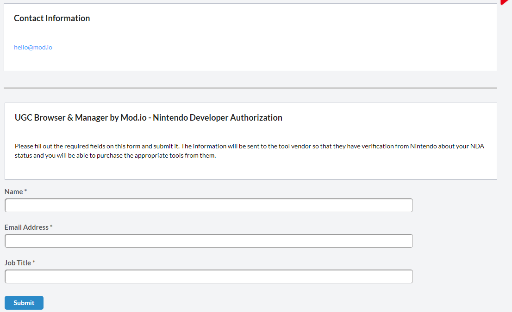

# Nintendo Switch

We offer cross-platform UGC support for both the *Nintendo Switch & Nintendo Switch 2*.

This guide includes:

* [Typical requirements](#typical-requirements)
* [SDK access](#sdk-access)
* [Authentication](#authentication)
* [Consent](#consent)
* [Moderation & Reporting](#moderation--reporting)
* [Networking & storage](#networking--storage)

## Typical requirements

Typical requirements for using mod.io on *Nintendo Switch* games include:

* UGC cannot run scripts or execute code, unless sufficient mitigations are demonstrated to be in place (e.g. sandboxing or manual curation of content)
* Nintendo prefers that UGC is called “UGC”, “Items”, “Content”, “Maps” or something similar, not "Mods"
* UGC must work without the need for manual installation
* If content is created by a Nintendo user, the display name of the Nintendo user must be shown as the creator if available (our system does this automatically if you configure your [platform headers correctly](/restapi/platforms))
* User consent is required the first time before authenticating a Nintendo user
* If the Nintendo user has UGC parental controls disabled, the UGC menu and any UGC installed must be disabled

All games supporting UGC must be approved individually, and you will be required to go through a dedicated UGC approval process with Nintendo directly once you are ready to launch the functionality. We recommend contacting your Nintendo representative early to establish their rules for UGC and any specific requirements you will need to meet. We can assist you with this process, and introduce you to our contact Vincenzo Russo (Developer Relations, Nintendo) if this would be helpful.

## SDK access

For Nintendo Switch access, fill in the verification form at the bottom of the mod.io middleware page:

* [Nintendo Switch](https://developer.nintendo.com/group/development/getting-started/g1kr9vj6/middleware/mod.io)
* [Nintendo Switch 2](https://developer.nintendo.com/group/development/p67qwg2b/middleware/mod.io)

Once verified, your [mod.io contact](mailto:developers@mod.io) will provide access to the [Nintendo Switch support module](/platforms/console-sdks#console-sdks) for your integration solution.

## Authentication

On Nintendo platforms, you can authenticate the user with Nintendo Network ID authentication, or by using their email address. We highly recommend using the authentication flow where possible, as it is instant and accessible vs email which is not. Detailed instructions can be found in the [mod.io Nintendo Switch SDK](https://docs.mod.io/partners/switch/authentication) (to access this documentation you must complete the required [SDK Access step](#sdk-access)).

:::note
We do not currently support login via Nintendo on the mod.io site. Users who are authenticated using a Nintendo Network ID will be limited to only the in-game experience, unless you provide an optional email during the authentication process. As such we recommend using Nintendo Network ID authentication where a full in-game integration has been implemented, and where possible we recommend you give the users the option to provide their email, to offer the most connected UGC user experience in-game and out. We are currently negotiating with Nintendo to support authentication on mod.io website with Nintendo Network ID in a future update.
:::

## Consent

If you choose to use *Nintendo Network ID* authentication, it is a requirement from Nintendo that consent is collected before a user is authenticated for the first time. So when a user clicks the “UGC” button in-game, you must display an acceptance dialog similar to the one explained in the [Terms & User Consent](/terms) guide.

## Moderation & Reporting

On the Nintendo Switch, only UGC that follows the rules you have agreed with the first party should be made available to download and play. Our [moderation tools and web dashboard](/moderation) allow you to control this process and manage the types of UGC available without any additional development required. See [curation rules](/moderation/manual-curation#curation-rules) for how you can control what goes live.

Another requirement, is that users can report UGC, and those reports must be actioned as appropiate. Our plugins have a process for reporting UGC built in. See [reporting](/moderation/community-reports) for details of how mod.io aggregates community reports so they can be easily managed.

## Networking & storage

Storage space available for UGC will be limited, and allocation for space dedicated to UGC will require approval from Nintendo, who will require you to manage a strict data budget. In addition to the aforementioned approval, cache storage and temp storage will require an entry in your NMETA file. All games that implement mod.io services will require space for storing cached and downloaded data.

## More information

Head to our console [SDK Access](/platforms/console-sdks) page, for detailed information about using mod.io on the Nintendo Switch, and access to the relevant console module SDK. Be aware that accessing this information requires completion of the appropriate NDA.