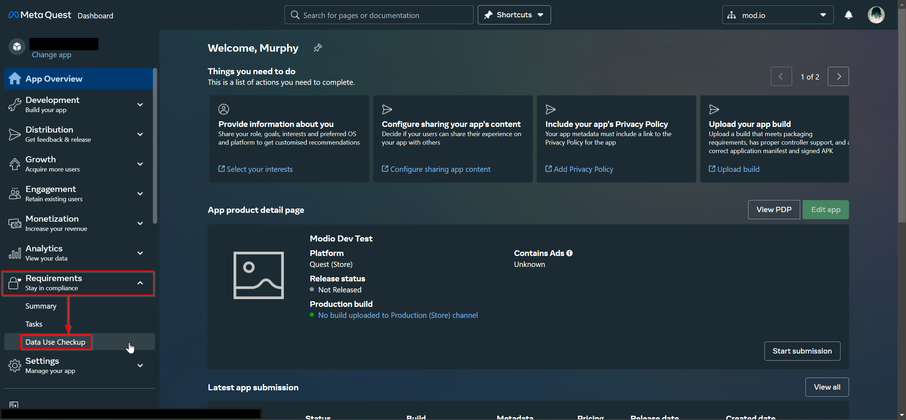
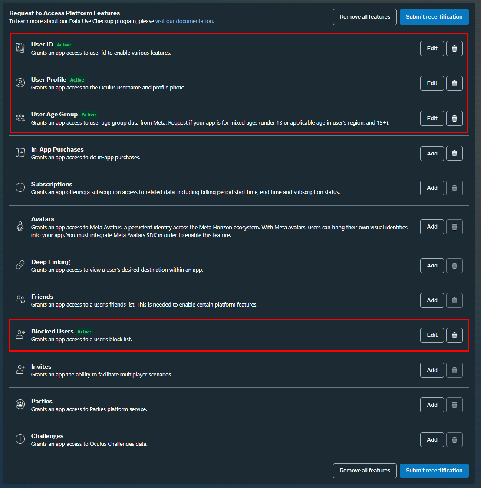
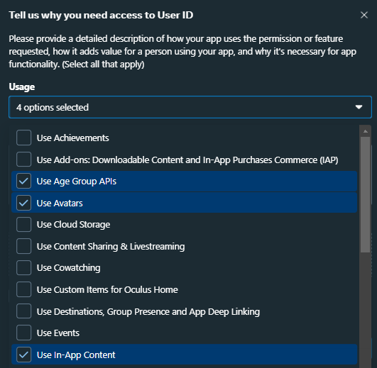
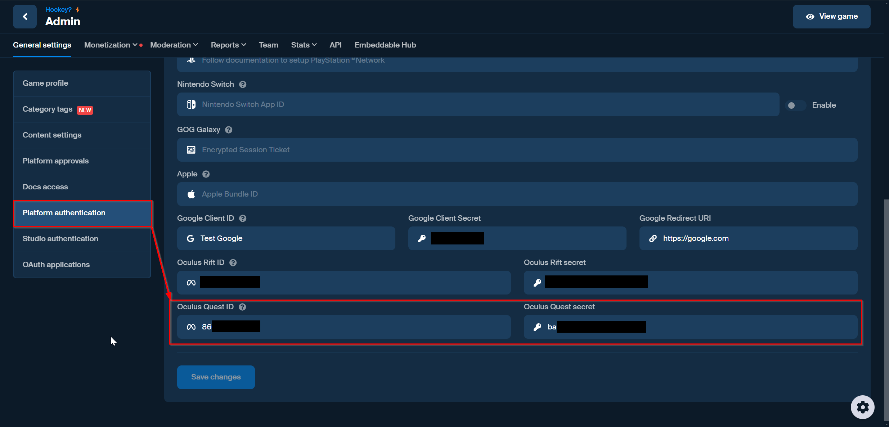

# Meta Quest Authentication

## Data Use Checkups

In order to access any user data from Meta's services, you'll need to complete Data Use Checkups for Meta's team to verify.

Navigate to your game's [Meta Developer Dashboard](https://developers.meta.com/horizon/), go to Requirements > Data Use Checkup:

In order to Authenticate, you will need to get approval for all of these Platform Features:

* User ID
* User Profile
* User Age Group
* Blocked Users

For each option, click Add, tick all the options that apply and write a brief description of your intended usage:

Once complete, click Submit Verification. While waiting for approval, we can configure both Meta & mod.io's services for authentication.

## Configuration

In order to set up Meta Quest Authentication, you must configure your App Id & App Secret in your mod.io game authentication options.

To find these details, navigate to your game's Meta Developer Dashboard, click Development > API.

:::note
Make sure to use the App ID, **NOT** the Federated App ID.
:::

Once you have your App Id & App Secret, go to your game admin page on mod.io. Under General Settings > Platform Authentication, add your App Id & App Secret under Meta Quest ID & Meta Quest Secret.

## Performing Authentication

If your game is using an official mod.io plugin, follow the relevant link below for authenticating players using Meta Quest SSO, or another supported platform authentication method:

* [C++ SDK](/cppsdk/getting-started/#ssoexternal-authentication)
* [Unreal Engine](/unreal/getting-started/user-authentication#single-sign-on-authentication)
* [Unity Engine](/unity/getting-started/#authentication)

If you are building something custom using the mod.io REST API, follow the [instructions provided here](https://docs.mod.io/restapiref/#meta-quest) to authenticate players using Meta Quest SSO, by calling the `/external/oculusauth` endpoint.