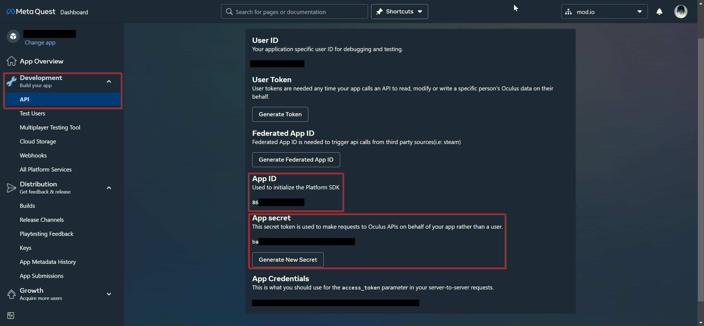

# Meta Quest Marketplace

## Data Use Checkups

In order to access Meta's In-App Purchases, you'll need to complete Data Use Checkups for Meta's team to verify.

Navigate to your game's [Meta Developer Dashboard](https://developers.meta.com/horizon/), go to Requirements > Data Use Checkup:

In order to Authenticate, you will need to get approval for the In-App Purchases Platform Feature:

Click Add, tick 'Use Add-ons' and provide a brief description of what you want to use IAPs for (in this case virtual currency packs with mod.io):

Once complete, click Submit Verification. While waiting for approval, we can configure both Meta & mod.io's services for IAPs.

## Configure SKUs on Meta

Navigate to your game's Meta Developer Dashboard, go to Monetization > Add-ons:

Click Create Add-on:

Enter your desired SKU code and set the Add-on Type to Consumable:

Ensure Show in Store is unticked:

:::note
While we don't recommend it, it is entirely possible for users to purchase through the web store-front. This presents one major inconvenience: user's will have to launch the game in order to sync the purchases between Meta & mod.io. If choosing to allow this, please be sure to communicate this to your users. A user is only able to purchase one of each consumable SKU without syncing.
:::

Choose the price for the Add-on:

Lastly enter a name for the Add-on and click Save Draft:

:::warning
Save draft will only make the SKU available to users within your Meta organization and any test users for your game. In order for players to access them you'll have to click Publish, locking you out of changing the price for at least 30 days. Please make sure that all your SKUs have been drafted up, are finalized and tested before publishing any of them.
:::

## Configure SKUs on mod.io

Firstly we need to configure the App ID & App Secret for In-App Purchases.

To find these details, navigate to your game's Meta Developer Dashboard, click Development > API.

:::note
Make sure to use the App ID, **NOT** the Federated App ID.
:::

Next, navigate to your game's mod.io admin page > Monetization > Settings > In-App Purchases and enter these details into the fields below:

Then, to configure the SKUs, click 'Manage SKUs':

Toggle _Sell this pack_ on the pack you'd like to sell. Once toggled, set the platform to Meta Quest and enter the SKU in the adjacent field:

## Purchasing a virtual currency pack

Once you have completed the above configuration, you can then purchase and redeem a virtual currency pack. If your add-on has been published, it's considered live and any user who's purchased your game will be able to purchase the add-on.

### Testing a purchase

To test a purchase, navigate to your game's Meta Developer Dashboard, go to Development > Test Users:

:::note
If you haven't created a Test User yet, please create one for the purposes of this test.
:::

Click the hamburger menu for the desired test user then Manage Add-on Entitlements.

Choose your game from the drop-down menu of apps then tick the entitlement we made earlier.

### Consuming the entitlements

Once the test user has the entitlement, you can use the mod.io purchase server entitlement consumption functionality to consume them and add the credits to your mod.io wallet. 

Each of our plugins provide built-in functionality for this. Authenticate the test user with the integrated mod.io plugin and the entitlement will automatically be consumed. You can see the virtual currency update both on the mod.io website & in the plugin.

If your game is using an official mod.io plugin, follow the relevant link below for integrating marketplace using Meta Quest, or other supported platform marketplaces:

* [Unreal Engine](/unreal/marketplace/)
* [Unity](/unity/marketplace/)
* [C++ SDK](/cppsdk/marketplace/)