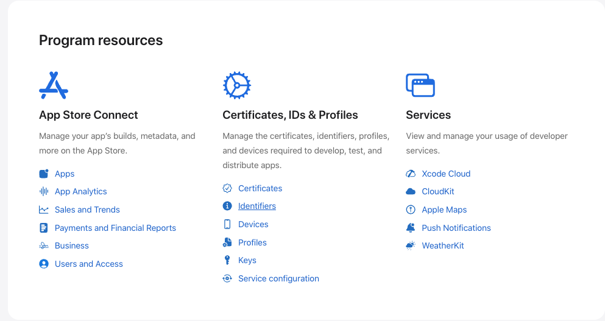
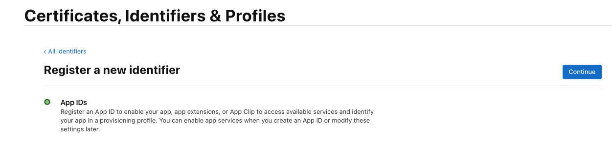
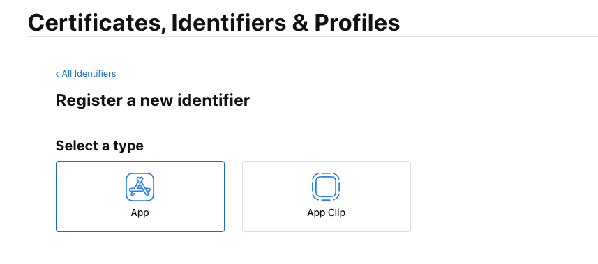
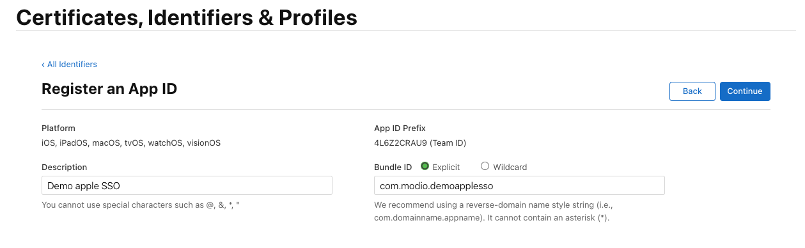
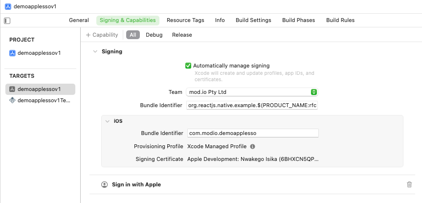
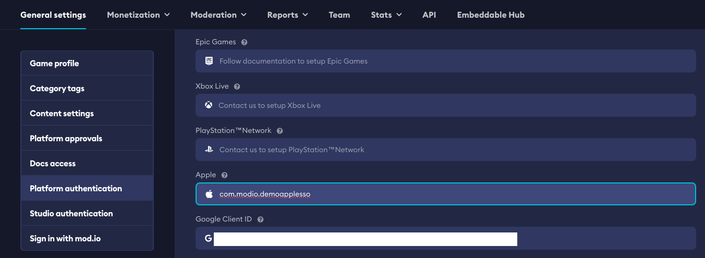

# Apple Authentication

This guide covers:

* [Typical requirements](#typical-requirements)
* [Apple SSO](#apple-sso)
* [Setting up Apple SSO via Apple Developer Account](#setting-up-apple-sso-via-apple-developer-account)
* [Configuring Apple Bundle ID on mod.io](#configuring-apple-bundle-id-on-modio)
* [Sign in players to mod.io using Apple](#sign-in-players-to-modio-using-apple)
* [Apple reference material](#apple-reference-material)
* [Next steps](#next-steps)

## Typical requirements

Typical requirements for using mod.io on Apple games include:

* A method for moderating objectionable material from being made available.
* A mechanism to report offensive content and timely responses to concerns.
* The ability to block abusive users from the service.
* Published contact information so users can easily reach you.
* An Apple developer account.

## Apple SSO

This guide will show you how to setup authentication to mod.io using Apple SSO for their players on Apple devices.

Before you can integrate sign in with Apple on mod.io platform you need a paid Apple developer account. Sign up for one at [developer.apple.com](https://developer.apple.com/).

:::note[Verification Time]
It takes about 48 hours for your Apple developer account to be verified. Once it is verified, you can proceed with the following steps.
:::

## Setting up Apple SSO via Apple Developer Account

1. Sign in to your Apple developer account and click on your [account](https://developer.apple.com/account/).

    

2. In the **Certificates, Identifiers & Profiles** section, click on [Identifiers](https://developer.apple.com/account/resources/identifiers/list). Click on the "+" button to create a new identifier and select the **App IDs** option.

    

3. Under register a new identifier, select **App** type and click on **Continue**.

    

4. Fill in the App ID Description and Bundle ID, then scroll down to the **Capabilities** section. Take note of the **Bundle ID** as you will need to [enter it on mod.io later](#configuring-apple-bundle-id-on-modio). Enable the **Sign in with Apple** capability and click on **Continue**.

    

5. Review the information and click on **Register**. A new App ID will be created, and you should be redirected back to the **identifiers** page.

    

6. Open your Xcode project and follow the [steps here](https://help.apple.com/xcode/mac/11.0/#/devaf282080a) to add your Apple Developer account to Xcode if it's not already connected.

7. Update the **Bundle Identifier** to match the one you created in the Apple Developer account. Update the **Team** to match your Apple Developer account.

    

8. Next, navigate to the **Signing & Capabilities** tab. Select your team and then click on the "+" button to add a new capability.

    

9. Finally, scroll down the list to locate the **Sign in with Apple** capability, and click to add this to your project. Update your App ID in the **Signing & Capabilities** tab.

    

## Configuring Apple Bundle ID on mod.io

1. On the mod.io website, navigate to your [game's admin dashboard](https://mod.io/content) and go to the **Settings** tab.

2. Under **Admin > General Settings** find and click on the **Platform Authentication**.

    

3. Enter the **Bundle ID** of your app in the **Apple** field and **Save Changes**.

## Sign in players to mod.io using Apple

If your game is using the official mod.io SDK, Unreal or Unity plugin, follow the instructions provided with it to authenticate players using Apple SSO, or other supported platform authentication methods.

* [C++ SDK](/cppsdk/user-authentication#ssoexternal-authentication)
* [Unreal Engine](/unreal/user-authentication#single-sign-on-authentication)
* [Unity](/unity/user-authentication#single-sign-on)

If you are building something custom using the mod.io REST API, follow the [Apple iOS API instructions](/restapi/docs/authenticate-via-apple) to authenticate players using Apple SSO, by calling the `/external/appleauth` endpoint.

## Apple reference material

* [Apple Developer Documentation](https://developer.apple.com/documentation/sign_in_with_apple/sign_in_with_apple_rest_api/authenticating_users_with_sign_in_with_apple) - Explains how Apple's SSO works in detail.

## Next steps

If you've set up UGC purchases using our [Marketplace](/monetization/marketplace) feature, the next step is to link this to Apple using our [Apple iOS Marketplace/Entitlements](/platforms/apple/marketplace) guide. This will allow your players to make purchases using Creator Credits. 
