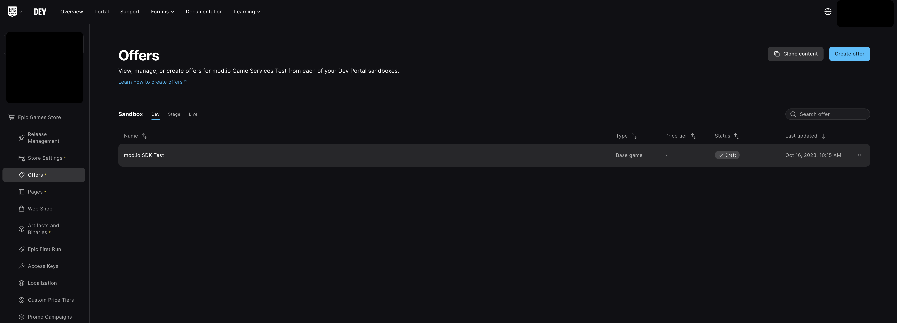
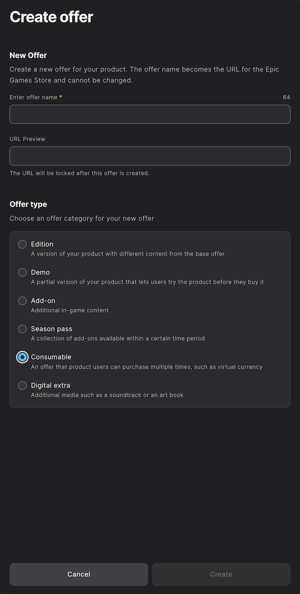
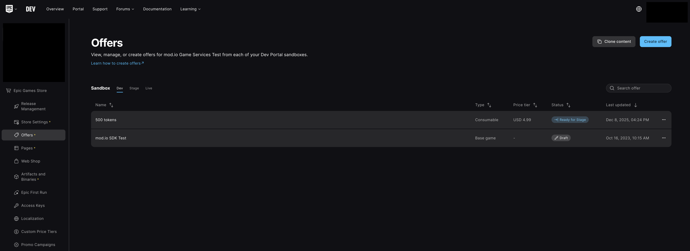
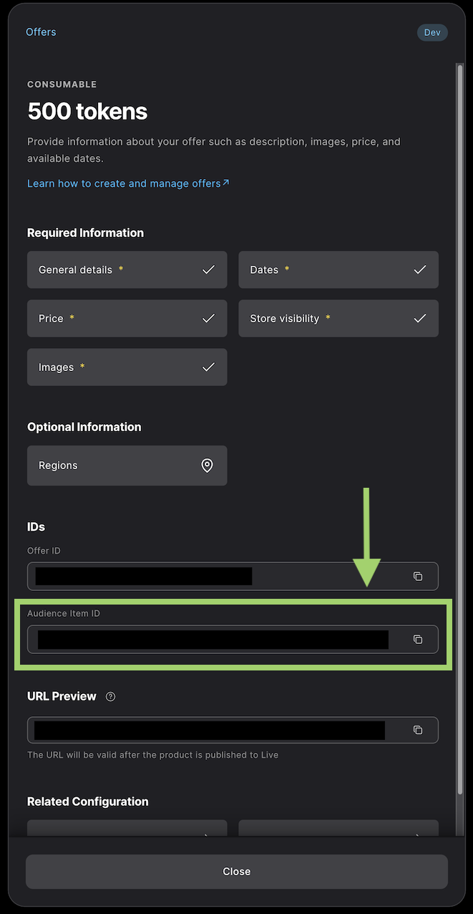
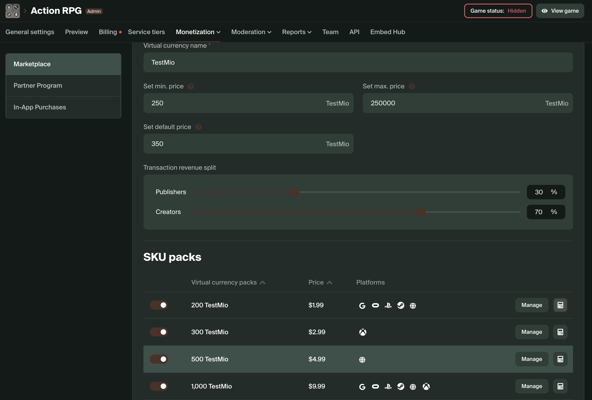
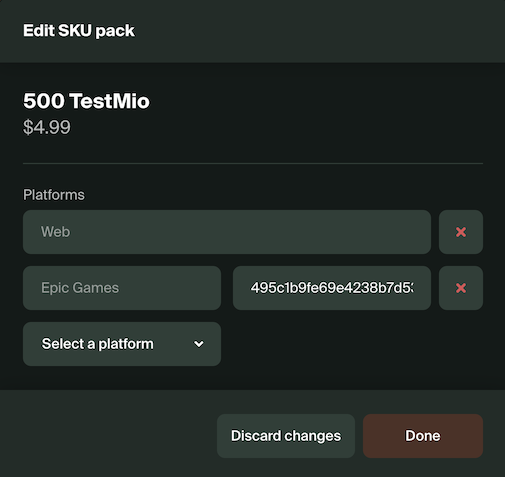

# Epic Games Marketplace

The mod.io [Marketplace](/monetization/marketplace) support for Epic Games utilizes the Epic Game Store for configuring entitlements to be consumed for virtual currency. This allows players to make Virtual Currency Pack purchases via the Epic Game Store, and have the mod.io purchase server exchange them for creator credits.
Entitlements can similarly be configured to faciliate the direct purchase of a mod given you have configured your mod.io marketplace for USD pricing.

## Configuring Entitlements

From the Epic Games developer portal, select your product and navigate to the "Epic Games Store > Offers" screen.
You should see a view similar to this:

Click on the "Create offer" button to open a new modal. Within this modal select the "Consumable" offer type:

Click create and continue to fill out all required details.

After creating your offer, you will see it in the original list, alongside the price you assigned to it:

Clicking on this offer will open a modal with more information. The "Audience Item ID" is the "Entitlement Id" which will need to be mapped to a corresponding SKU pack on mod.io.

Within the mod.io platform, go to your game admin settings and navigate to "Monetization > Settings > Marketplace".
You should see a screen similar to this:

Select the SKU pack which matches the number of tokens you want to allocate or equivalent price of the entitlement.
Select "Epic Games" from the platform dropdown list and use the "Audience Item ID" from the "Offer" created in previous steps.

At this point, the entitlement is now mapped and visible to mod.io.