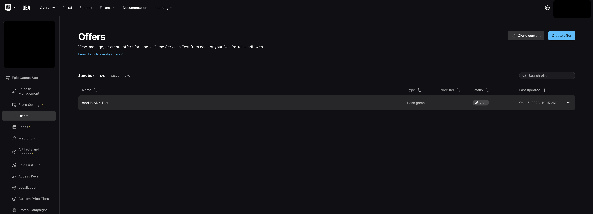
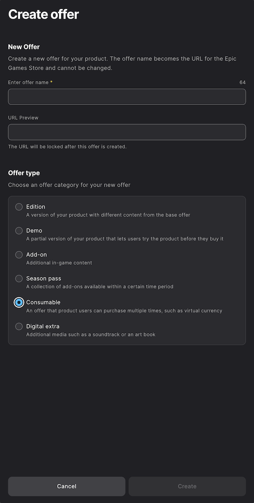
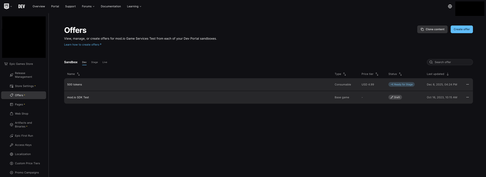
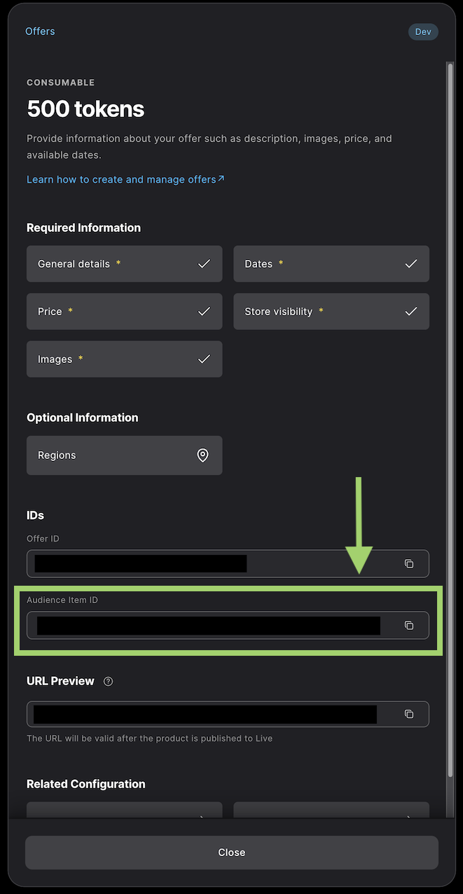
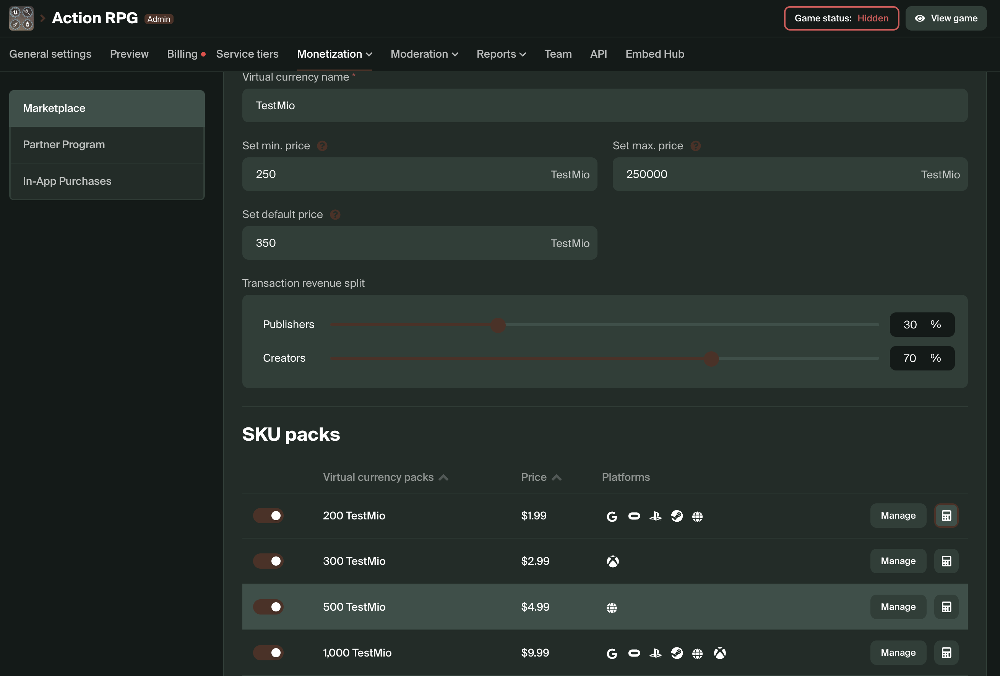
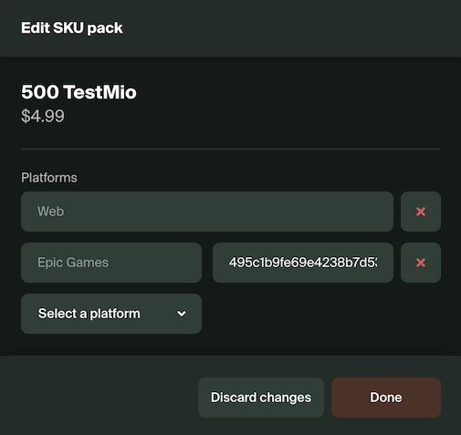
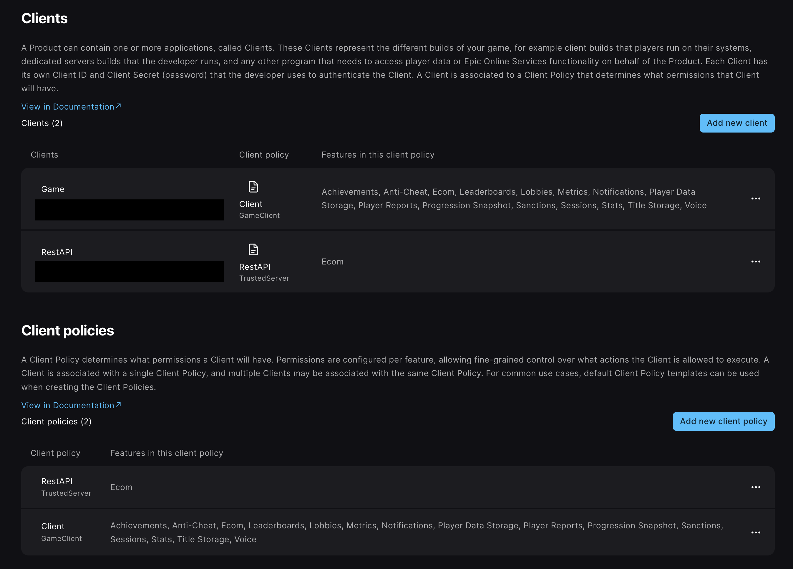
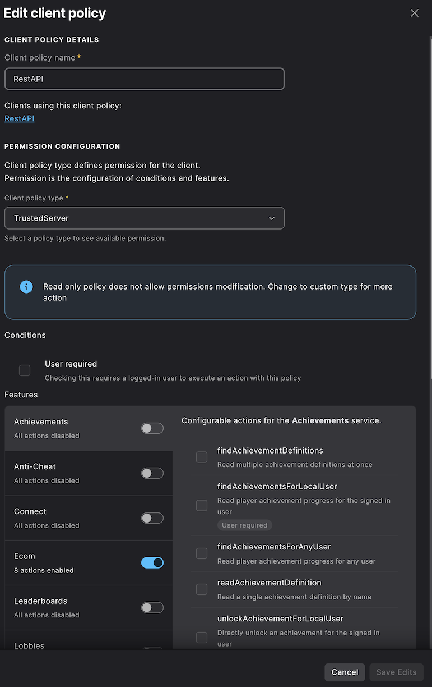
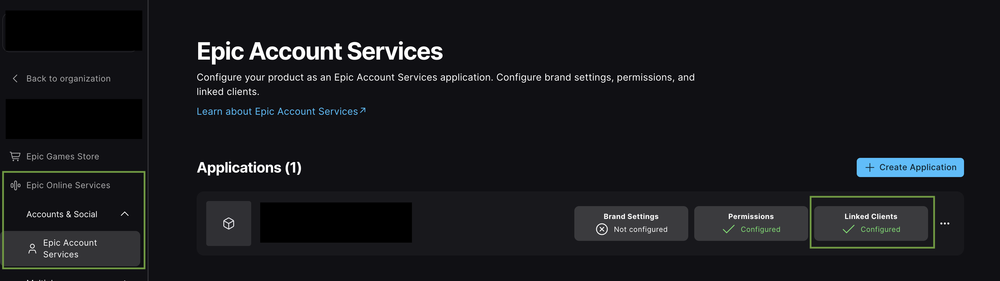
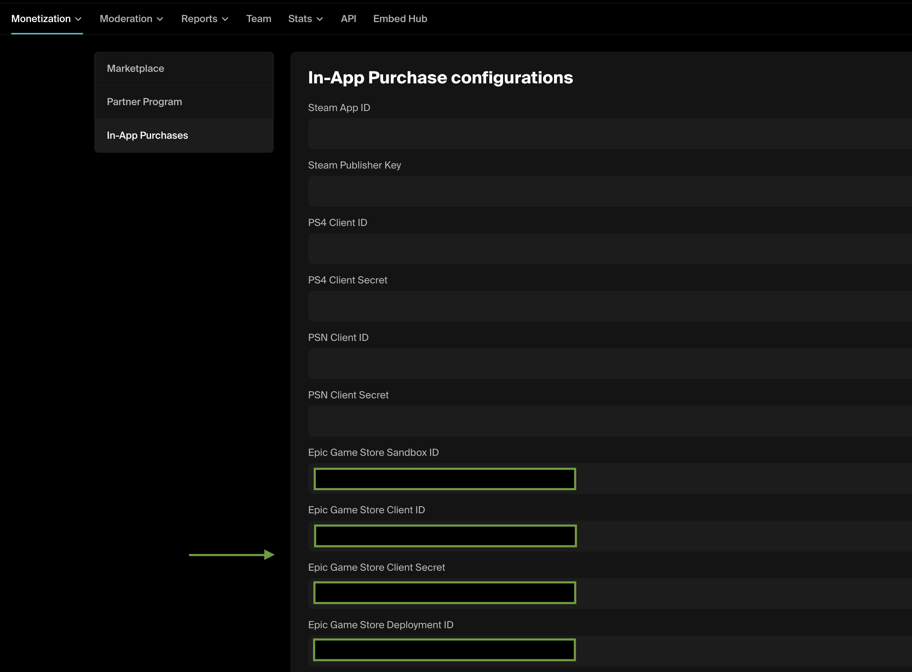

# Epic Games Marketplace

The mod.io [Marketplace](/monetization/marketplace) support for Epic Games utilizes the Epic Game Store for configuring entitlements to be consumed for virtual currency. This allows players to make Virtual Currency Pack purchases via the Epic Game Store, and have the mod.io purchase server exchange them for creator credits.
Entitlements can similarly be configured to faciliate the direct purchase of a mod given you have configured your mod.io marketplace for USD pricing.

## Configuring Entitlements

From the Epic Games developer portal, select your product and navigate to the "Epic Games Store > Offers" screen.
You should see a view similar to this:

Click on the "Create offer" button to open a new modal. Within this modal select the "Consumable" offer type:

Click create and continue to fill out all required details.

After creating your offer, you will see it in the original list, alongside the price you assigned to it:

Clicking on this offer will open a modal with more information. The "Audience Item ID" is the "Entitlement ID" which will need to be mapped to a corresponding SKU pack on mod.io.

Within the mod.io platform, go to your game admin settings and navigate to "Monetization > Settings > Marketplace".
You should see a screen similar to this:

Select the SKU pack which matches the number of tokens you want to allocate or equivalent price of the entitlement.
Select "Epic Games" from the platform dropdown list and use the "Audience Item ID" from the "Offer" created in previous steps.

At this point, the entitlement is now mapped and visible to mod.io.

## Configuring Clawbacks

In order to handle chargebacks which originate between a user and the Epic Game Store, we require you to create a trusted server client and provides us the client details in order to monitor and reconcile these events within mod.io.

From the Epic Games developer portal, navigate to "Product Settings > Clients".

You should see a screen similar to this:

The key piece of information, is that you will need to create a client with a "Trusted Server" client policy.

The default client policy provides many permissions, but you can create a custom one and scope it down to the "Ecom" feature like so:\

The newly created client also needs to be explicitly linked with an application (your game).
To do so, navigate to the "Epic Online Services > Accounts & Social > Epic Account Services" page.
Clicking "Linked Clients" should open a modal which allows you to add the client.

The client ID, client secret, sandbox ID and deployment ID (which can be retrieved from the "Product Settings" page) can then be set in the In-App Purchases section of your game's settings.

With this set, the mod.io API will be able to track chargebacks and revoke tokens / mods purchased to prevent malicious user abuse of your in-game economy.