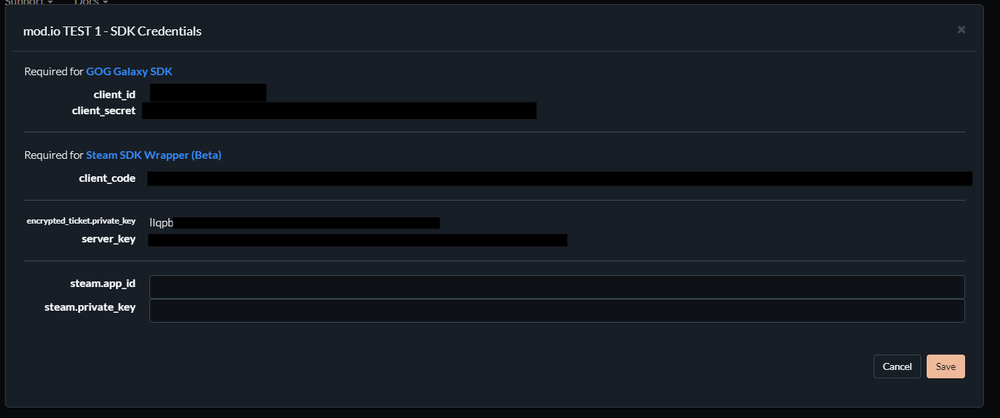

# GOG Galaxy Authentication

If your game is available on *GOG Galaxy*, the below guide will help you integrate mod.io to include UGC. 

This guide covers:

* [Configuration](#configuration)
* [Performing authentication](#performing-authentication)

## Configuration

In order to set up GOG Authentication, you must configure your Encrypted App Ticket Key in your mod.io game authentication options.

To find your Encrypted App Ticket Key, navigate to your [GOG Game Portal](https://devportal.gog.com/panel/games). Find your title and click SDK Credentials. The value you are looking for is encrypted_ticket.private_key.

Once you have your encrypted app ticket key, go to your game admin page on mod.io. Under General Settings > Platform Authentication, add your Encrypted App Ticket Key value under GOG Galaxy.

## Performing authentication

Now that you have configured your game for GOG SSO, you can call the GOG Authentication endpoint using a URL encoded Encrypted App Ticket, obtained from `galaxy::api::User()->RequestEncryptedAppTicket` and `galaxy::api::User()->GetEncryptedAppTicket()` using the GOG SDK. Each of our SDKs provide samples and documentation for how to perform GOG SSO. Note that you do not need to Base64 encode the encrypted app ticket.

* [C++ SDK](/cppsdk/user-authentication#ssoexternal-authentication)
* [Unreal Engine](/unreal/user-authentication#single-sign-on-authentication)
* [Unity](/unity/user-authentication#single-sign-on)

If you are building something custom using the mod.io REST API, follow the [GOG Galaxy API instructions](/restapi/docs/authenticate-via-gog-galaxy) to authenticate players using GOG SSO, by calling the `/external/galaxyauth` endpoint.