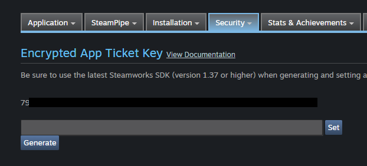
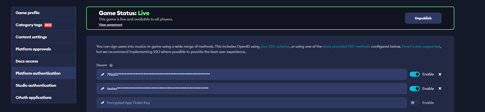

# Steam Authentication

If your game is available on *Steam*, the below guide will help you integrate mod.io to include UGC. 

This guide covers:

* [Configuration](#configuration)
* [Performing authentication](#performing-authentication)

## Configuration

In order to set up Steam Authentication, you must configure your Encrypted App Ticket Key in your mod.io game authentication options.

To find your Encrypted App Ticket Key, navigate to your Steamworks App Admin page > Security > SDK Auth.

If you have not generated an Encrypted App Ticket Key yet, do so here.

Once you have your encrypted app ticket key, go to your game admin page on mod.io. Under General Settings > Platform Authentication, add your Encrypted App Ticket Key value under Steam. Note that mod.io supports multiple Steam Encrypted App Ticket Keys. This allows you to use different Steam App IDs against the same game on mod.io, for instance if you have a Test/Development AppID and a Public AppID.

## Performing authentication

Now that you have configured your game for Steam SSO, you can call the Steam Authentication endpoint using a Base64, URL encoded Encrypted App Ticket, obtained from `ISteamUser::GetEncryptedAppTicket()` using the Steamworks SDK. Each of our SDKs provide samples and documentation for how to perform Steam SSO.

* [Unreal Engine](/unreal/user-authentication#single-sign-on-authentication)
* [C++ SDK](/cppsdk/user-authentication#ssoexternal-authentication)
* [Unity](/unity/user-authentication#single-sign-on)

If you are building something custom using the mod.io REST API, follow the [Steam API instructions](/restapi/docs/authenticate-via-steam) to authenticate players using Steam SSO, by calling the `/external/steamauth` endpoint.

## Next steps

If you've set up UGC purchases using our Marketplace feature, the next step is to link this to [Steam Marketplace](/platforms/steam/marketplace), allowing your players to make purchases via Steam's microtransaction system.