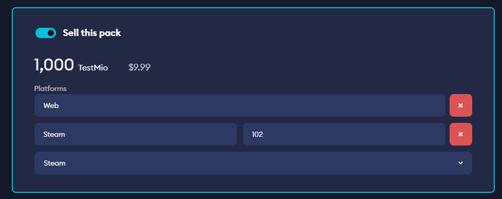

# Steam Marketplace

The mod.io marketplace support for Steam utilizes the Steam Inventory System for configuring entitlements to be consumed for virtual currency. This allows players to make Virtual Currency Pack purchases via Steam's microtransaction system, and have the mod.io purchase server exchange them for creator credits.

## Configure a Web API Key

To enable the Steam Inventory Service, you need to start be ensuring that you have a Web API key set up for your game. If you have appropriate Steam account permissions, you can set up a new group and API Key from Users & Permissions > Manage Groups. Create a new group called "mod.io API Access".

In this group, create a new Web API Key and grant it access to your game. Once you have selected the application, create a Web API key and note down this value - it will be required for other steps.

## Enable the Inventory Service

If you have not yet enabled the Steam Inventory Service for your title, you can do this by going to your game's App Admin page > Community > Inventory Service and checking "Enable Inventory Service". 
Once that is enabled, go to Community > Economy, and populate your Asset Server Key to be the Web API Key that you just created.

Ensure that you Publish these configuration changes.

## Configuring Item Definitions

Once you have enabled the Inventory Service, you have to configure item definitions for the virtual currency packs that you wish to sell via Steam. You need to configure one item definition for each virtual currency pack that you wish you sell. An example item definition for selling the 1000 credits currency pack is below. Ensure that you update your AppID, descriptions etc as appropriate.

When defining your prices, ensure that you do not use Valve's pricing categories and instead define regional prices. Suggested retail prices for each virtual currency pack can be found on your Manage SKUs page on the mod.io game dashboard. Please note these prices do not include local taxes so will need to be adjusted to take that into consideration.

:::note
Ensure that you set tradable and marketable to be false, otherwise these virtual currency packs will be able to be traded between players and re-sold on the Steam marketplace.
:::

```
{
	"appid": 1550360,
	"items": [
	{
		"itemdefid": 102,
		"type":  "item",
		"name": "1000 Creator Credits",
		"description": "1000 creator credits to be used for purchasing UGC on the mod.io marketplace",
		"price": "1;USD999",
		"icon_url": "https://mod.io/images/branding/modio-cog-blue.png",
		"icon_url_large": "https://mod.io/images/branding/modio-cog-blue.png"
	}
	]
}
```

You do not need to publish your changes.

## Configuring your Steam AppID and Key

In order for the mod.io purchase server to consume purchased virtual currency packs, you need to configure your game's Steam App ID and Publisher Key. In your Game's admin page, navigate to Monetization > In-App Purchases and populate "Steam AppID" and "Steam Publisher Key" with your game's AppID, and the key you have defined for your economy server.

## Mapping the Item Definitions in your mod.io game

Once you have configured all of your item definitions, you have to map each of the mod.io virtual currency packs to the inventory service item definition. In your mod.io Game Admin, navigate to `Monetization > Settings > Manage SKUs`. For each virtual currency pack that you have configured, you need to toggle "Sell this pack" to true, select Steam from the dropdown, and enter the item definition id in the SKU textbox.



## Purchasing a virtual currency pack

Once you have finalized this configuration, you can then purchase and redeem a virtual currency pack.

:::note
While your item store is not public, you must be a game admin to have access to purchase and consume entitlements. For developers, these Steam purchases occur in a sandbox environment.
:::

To make a purchase, navigate to your game's Item Store page by visiting `https://store.steampowered.com/itemstore/<appid>/browse/?filter=all` (replacing `<appid>` with your Steam AppID). You can then make purchases of your virtual currency packs and see them in your Steam Inventory.

### Consuming the entitlements

Once you have some virtual currency packs in your Steam inventory, you can use the mod.io purchase server entitlement consumption functionality to consume them and add the credits to your mod.io wallet. Each of our plugins provide built-in functionality for this.

### Going Live

You need to liaise with your Steam representative for setting your Item Store and Inventories live.