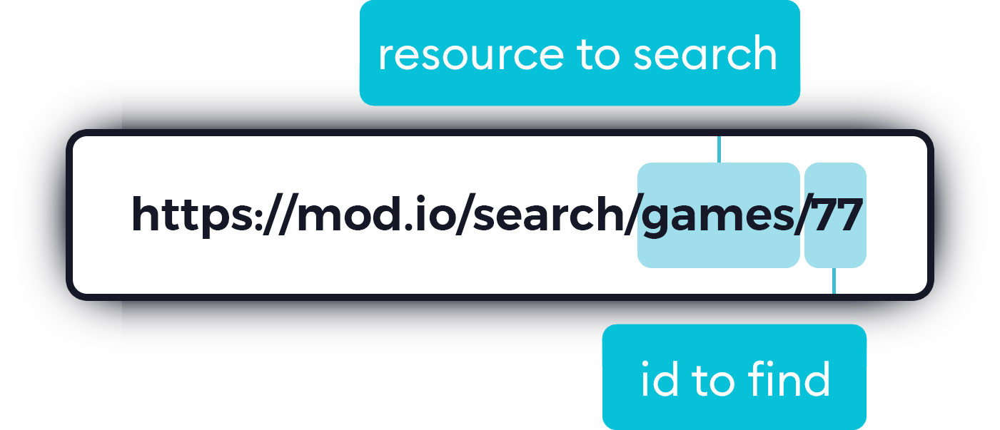

# Search by id

If you are using the mod.io API, you are likely querying and debugging games, mods, files and other content by id. Finding those ids on the web can be challenging because our URLs are descriptive, there is no easy way to load the contents profile without knowing it's full URL. Today we are changing that by adding a helper URL that redirects ids to its corresponding URL on the web.

The URL structure to lookup an id is as follows: `https://mod.io/search/RESOURCE/ID`

`RESOURCE` can be any of the following:

- games
- mods
- users
- files

`ID` is the id of the content you want to locate. For example game 306 on mod.io is [SnowRunner](https://mod.io/g/snowrunner). I can locate SnowRunner using it's ID via the following URL:

https://mod.io/search/games/306

:::tip
This shortcut should only be used for quick translation of IDs. You should always link to the real URL for content if you can, to save a redirect. It also will not work for hidden content.
:::